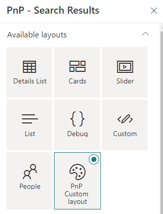
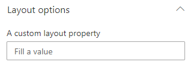

# Create a custom layout

{: .center}

> Custom layouts are only supported for the 'Search Results' Web Part. You can't add custom layout for the 'Search Filters' Web Part.

## Layout creation process

Same as data source, the layout creation process comes in three distinct steps:

1. [Create the layout class (i.e. define the property pane options)](#create-the-layout).
2. [Create the HTML template associated to that layout](#create-the-html-template-file).
2. [Register the layout information for discovery](#register-layout-information).

### Create the layout

* In your extensibility library project, create a new `MyLayout.ts` TypeScript file.
* Create an interface for your layout properties, typically the ones you want to persist in the Web Part property bag. Layout properties are isolated from the other general Web Part properties under the property `layoutProperties` in the property bag object.
```typescript
    export interface ICustomLayoutProperties {
        myTextProperty: string;
    }
```

{: .center}

* Implement the `BaseLayout` abstract class using your properties interface:
```typescript
    export class Customlayout extends BaseLayout<ICustomLayoutProperties> {
        ...
    }
```

* Implement your layout logic according to the available methods and properties.

#### BaseLayout - Methods

| Method | Description |
| --------- | ---------- |
| `onInit()`| The initialization method of your layout (ex: initialize your properties, etc.). You can perform asynchronous calls here. This method will be called when the layout is instanciated by the main Web Part.
| `getPropertyPaneGroupsConfiguration()` | Returns the property pane fields to display when your layout is selected. These are regular SPFx property fields and groups. Layout properties are isolated from the other general Web Part properties under the property `layoutProperties`. It means you must include that path in your property pane controls get the value persisted (same thing as custom data source). Defining fields or groups is not mandatory for a layout. If you don't want to expose any option, just return an empty array.
| `onPropertyUpdate()` | The method will be called when a property pane value is updated. The main Web Part in `Reactive` mode for property pane fields.

#### BaseLayout - Properties

| Property | Description |
| --------- | ---------- |
| `properties`    | The Web Part properties in the property bag. Corresponds to the isolated `layoutProperties` property in the global property bag. You won't be able to access any other general properties of the Web Part.


### Create the HTML template file (Handlebars)

In your extensibility library project, create a new `custom-layout.html` HTML file. A layout template is split into two distinct parts:

A `template` part, containing the HTML markup to display your data **once fetched**. This part is mandatory to display your data.

```html
    <content id="template">
        <!-- Your template content here -->
    </content>
```

A `placeholder` part, containing the HTML markup to display as placeholder **while the data are getting fetched**. This part is optional.

```html
    <content id="placeholder">
        <!-- Your placeholder content here -->
    </content>
```

> In a template, you must use Handlebars expressions to access and display your data.

**Example: iterating through all items**

```handlebars
{{#each data.items as |item|}}
    <!-- Access 'item' data source fields from here (ex: item.Title)-->
{{/each}}
```

### Register layout information

The next step is to fill information about your new layout. In the library main entry point (i.e. the class implementing the `IExtensibilityLibrary` in interface) return a new `ILayoutDefinition` object in the `getCustomLayouts()` method using these properties: 

| Property | Description |
| --------- | ---------- |
| `name` | The friendly name of your layout that will show up in tiles.
| `iconName` | An Office UI Fabric icon for your layout.
| `key` | An unique internal key for your layout.
| `type` | The layout type (`LayoutType.Results` is for the 'Data Visualizer' Web Part, `LayoutType.Filter` for the 'Data Filter' Web Part). Only **`LayoutType.Results`** is supported for now. You can't add custom layout for the 'Data Filter' Web Part.
| `templateContent` | The template HTML content as string. Use a `require` statement to get the string content from your HTML file. If you reference a JSON file, you must use the stringified value (ex: `JSON.stringify(require('../custom-layout.json'), null, "\t")`)
| `serviceKey` | A service key used to instanciate your layout class. Builtin or custom data layouts are instanciated dynamically using [SPFx service scopes](https://docs.microsoft.com/en-us/javascript/api/sp-core-library/servicescope?view=sp-typescript-latest).

```typescript
public getCustomLayouts(): ILayoutDefinition[] {
    return [
        {
            name: 'My custom layout',
            iconName: 'Color',
            key: 'CustomLayout',
            type: LayoutType.Results,
            templateContent: require('../custom-layout.html'),
            serviceKey: ServiceKey.create<ILayout>('MyCompany:CustomLayout', Customlayout)
        }
    ];
}
```