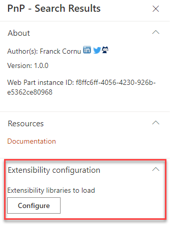
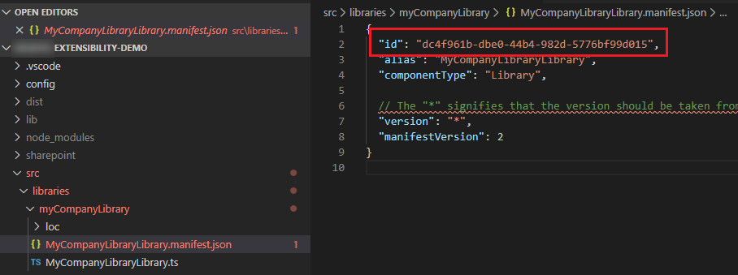
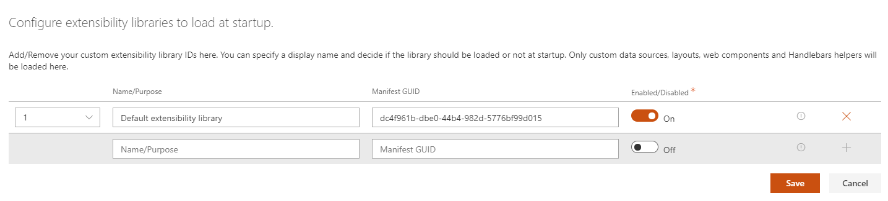
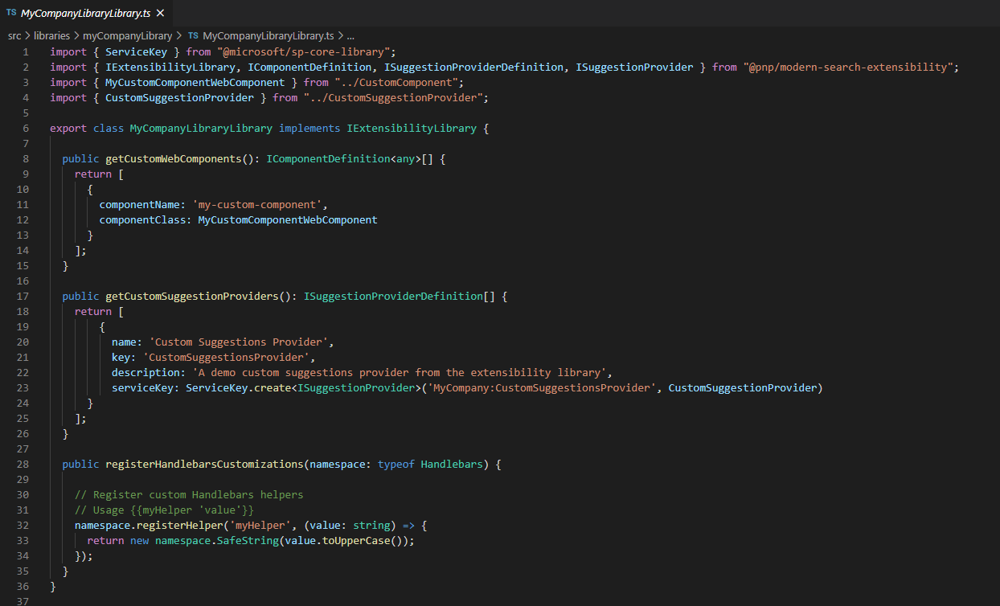

# Extensibility possibilities

This solution supports different levels of customizations depending your requirements:

- **'Basic' customizations**: these include custom settings for data sources, search box, verticals and filters Web Parts + minor updates to existing layouts by adding custom HTML markup (ex: add a custom field in the UI from a data source), updates to builtin layouts fields ('Cards','Details List' and 'People'), etc. **They only require HTML, CSS and Handlebars skills to be done**. Typically a super user or a webmaster could do that.
- **'Advanced' customizations**: these include major updates like adding a new data source, layout, component or suggestions provider. **These are build from scratch and require SharePoint Framework development skills to be done**. Typically, a front-end/SharePoint developer could do that.

!!! note
    Extensibility samples are centralized in a dedicated repository: [https://github.com/microsoft-search/pnp-modern-search-extensibility-samples/tree/main](https://github.com/microsoft-search/pnp-modern-search-extensibility-samples/tree/main)

## Basic customizations

'Basic' customizations cover the layout templates updates with HTML, CSS and Handlebars. Refer to the templating [documentation](./templating.md) to know more.

## Advanced customizations

The solution uses the concept of **'extensibility libraries'**. Basically, these are [SharePoint Framework library components](https://docs.microsoft.com/en-us/sharepoint/dev/spfx/library-component-tutorial) you put in the global or site collection app catalog that will be loaded automatically by Web Parts to enhance the experience and options (ex: new data source with new options, custom layout, etc.). Simple as that!

> As a demonstration of capabilities, all builtin data sources, layouts, web components or suggestions providers are built using **the same exact interfaces and methods** that are publicly available in the `@pnp/modern-search-extensibility` SPFx library project.

> All documentation procedures for extensions are based on the demo extensibility library available in the same repository that you can use as reference.

### Prerequistes

For your project to be a valid extensibility library, you must have the following prerequisites:

- Your project must be an [SPFx library component](https://docs.microsoft.com/en-us/sharepoint/dev/spfx/library-component-overview).
- The main entry point of your library must implement the `IExtensibilityLibrary` interface from the `@pnp/modern-search-extensibility` library.
- You library **manifest ID** must be registered in the Web Part where you want to use the extension.

!!! important "SPFx version"
    The SPFx library project must use the same SPFx version as the main solution (check [compatibility matrix](./extensibility_compatibility_matrix.md)). Otherwise you may face issues at build time. See [GitHub issue #1893](https://github.com/microsoft-search/pnp-modern-search/issues/1893). Starting with PnP Modern Search v4.21.0, the solution uses SPFx v1.22.2 with the **Heft-based toolchain**. Your extensibility library must also use the Heft toolchain if targeting this version.

!!! note "Extensibility package v2.0.0+"
    Starting with `@pnp/modern-search-extensibility` v2.0.0, the npm package has **zero SPFx runtime dependencies**. SPFx types like `WebPartContext` and `ServiceScope` are typed as `any` in the base classes. **No code changes are required when upgrading** — existing extensions compile as-is since they already import SPFx types directly from `@microsoft/sp-*`. Optionally, you can pass your own SPFx types as a second generic parameter for improved intellisense (e.g., `extends BaseDataSource<IMyProps, WebPartContext>`). See the [custom data source](./custom_data_sources.md) or [custom layout](./custom_layout.md) documentation for examples.

### Supported extensions

Each Web Part type in the solution supports several extensions or no extension at all. It means even your extensibility library contains all possible extensions, they won't be loaded if the Web Part does not support them.

| Web Part type | Supported extensions |
| ------------- | -------------------- |
| **Search Results** | <ul><li>Custom web components.</li><li>Custom Handlebars [customizations](https://handlebarsjs.com/api-reference/runtime.html) (ex: helpers, partials ,etc.).</li><li>Custom event handlers for adaptive cards actions</li><li>Custom Data Sources</li><li>Custom query modifier</li></ul>
| **Search Filters** |  <ul><li>Custom web components (_not directly but via the 'Search Results' Web Part extensibility library registration_).</li></ul>
| **Search box** | <ul><li>Custom suggestions providers.</li></ul>
| **Search Verticals** | None.

### Context and data available to each extension type

Different extension types receive different runtime context. This table summarises **what each extension can access** so you don't have to dig through each individual doc page.

| Extension type | Base class | Runtime context exposed | How to access SPFx context |
|---|---|---|---|
| **Custom Data Source** | `BaseDataSource<TProps, TContext>` | `this.context` (TContext), `this.properties` (TProps), `this.serviceScope` (any), `this.editMode`, `this.serviceKeys`, `this.render()`. Plus `IDataContext` argument on every `getData(dataContext)` call (paging, filters, query text, sort, verticals). | `this.serviceScope.consume(<ServiceKey>)` or cast `TContext` to `WebPartContext`. |
| **Custom Layout** | `BaseLayout<TProps, TContext>` | `this.context`, `this.properties`, `this.serviceScope`, `this.editMode`. | Same as above. |
| **Custom Query Modifier** | `BaseQueryModifier<TProps, TContext>` | `this.context`, `this.properties`, `this.serviceScope`, `this.endWhenSuccessfull`. Receives `queryText: string` argument on every `modifyQuery(queryText)` call. | Same as above. |
| **Custom Suggestion Provider** | `BaseSuggestionProvider<TProps, TContext>` | `this.context`, `this.properties`, `this.serviceScope`, `this.isZeroTermSuggestionsEnabled`. Receives `queryText` on `getSuggestions(queryText)`. | Same as above. |
| **Custom Web Component** | `BaseWebComponent` (extends `HTMLElement`) | `this._serviceScope` (root scope, any), `this._webPartServiceScopes: Map<webPartId, scope>` (per-WP scopes), `this._webPartServiceKeys: Map<webPartId, keys>`, HTML attributes via `this.resolveAttributes()`, optional theme via overriding `getThemeVariant()`. | `this._serviceScope.consume(PageContext.serviceKey)`, etc. Web components do not auto-receive a TContext. |
| **Handlebars helper / partial** | n/a — registered on the per-WP namespace | Only what the template explicitly passes via hash args (`{{myHelper x theme=@root.theme}}`) and what your closure captured at `registerHandlebarsCustomizations` time. | Capture `serviceScope` in your library's constructor and reference it inside the helper closure. See [Handlebars customizations](./handlebars_customizations.md) for the full `@root` reference. |
| **Adaptive Card action handler** | `IExtensibilityLibrary.invokeCardAction(action)` | The `IAdaptiveCardAction` argument: `type`, `title`, `url`, `data`. | Capture `serviceScope` in your library's constructor (see example below). |

#### Generic TContext pattern (v2.0.0+)

Starting with `@pnp/modern-search-extensibility` v2.0.0, every base class accepts an optional second generic for typing `context`:

```typescript
import { BaseDataSource } from '@pnp/modern-search-extensibility';
import { WebPartContext } from '@microsoft/sp-webpart-base';

export class MyDataSource extends BaseDataSource<IMyProps, WebPartContext> {
    public async getData() {
        const url = this.context.pageContext.web.absoluteUrl;
        // ... fully typed!
    }
}
```

You can use any context shape: `WebPartContext`, `BaseComponentContext`, or your own typed alias. The base class typings stay `any` if you don't specify, so no migration is required.

#### Quick reference — what's where

- **Per-WP runtime context** (PageContext, etc.) → `serviceScope.consume(ServiceKey)` in any base class, or `_serviceScope.consume(ServiceKey)` in a web component.
- **Web Part property bag** → `this.properties` (typed as `TProps` you pass to the generic).
- **Selected filters / paging / query / sort / vertical** at fetch time → `IDataContext` argument on `BaseDataSource.getData()`.
- **Theme** → React layouts/components: pass `themeVariant` through props. Web components: override `getThemeVariant()` (slim package) or pass `data-theme-variant` in the template. Helpers: read `options.hash.theme` from a `theme=@root.theme` hash arg.
- **Template root data** for Handlebars → `@root.<field>`. The exact shape is built by each web part's `getTemplateContext()` method — see [`SearchResultsContainer.getTemplateContext()`](https://github.com/microsoft-search/pnp-modern-search/blob/develop/search-parts/src/webparts/searchResults/components/SearchResultsContainer.tsx) and [`SearchFiltersContainer.getTemplateContext()`](https://github.com/microsoft-search/pnp-modern-search/blob/develop/search-parts/src/webparts/searchFilters/components/SearchFiltersContainer.tsx) for the verified field list, or the [`ISearchResultsTemplateContext`](https://github.com/microsoft-search/pnp-modern-search/blob/develop/search-parts/src/models/common/ITemplateContext.ts) / [`ISearchFiltersTemplateContext`](https://github.com/microsoft-search/pnp-modern-search/blob/develop/search-parts/src/models/common/ITemplateContext.ts) interface definitions. Common fields: `theme`, `properties`, `context.{site,web,user,list,listItem,cultureInfo}`, `data`, `slots`, `inputQueryText`, `instanceId`.

### Register your extensibility library with a Web Part

When a Web Part type supports one or multiple extensions, you can register them going to the last property pane confguration page in the _'Extensibility configuration'_ section:

[{: .center}](../assets/extensibility/extensibility_configuration.png)

From here, you can add the manifest IDs of your libraries and decide to enable or disabled certain libraries. The manifest ID can be found in the `<your_library_name>.manifest.json` file:

[{: .center}](../assets/extensibility/library_manifest_id.png)

[{: .center}](../assets/extensibility/extensibility_configuration_manifest.png)

> Multiple librairies can be registered for a single Web Part instance allowing you to split your extensions into multiple projects (in the end, they will be all concatenated). For instance, this could be convenient when extensions come from different IT providers.

### Create an extensibility library

To create an extensibility library, you have the choice to reuse the one provided in the GitHub repository or start from scratch. In this case:

!!! important "Toolchain"
    Starting with **SPFx v1.22**, the SharePoint Framework uses a new **Heft-based** build toolchain, replacing the previous Gulp-based toolchain. New projects generated with the SPFx v1.22+ Yeoman generator will use Heft by default. If you are working with SPFx v1.21.1 or earlier, continue using the Gulp-based instructions. See [SharePoint Framework Toolchain: Heft & Webpack](https://learn.microsoft.com/en-us/sharepoint/dev/spfx/toolchain/sharepoint-framework-toolchain-rushstack-heft) for details.

#### Common steps (both toolchains)

1. Create a new SharePoint Framework project of type 'Library' with `yo @microsoft/sharepoint`.
2. Add an npm reference to `@pnp/modern-search-extensibility` library using `npm i @pnp/modern-search-extensibility --save`.
3. Install npm-package `html-loader` as a dev-dependency using `npm i html-loader@4.2.0 --save-dev`.

#### Configure the html-loader

The extensibility library requires `html-loader` to load Handlebars templates from `.html` files without minification. The configuration differs depending on which toolchain you are using.

=== "Heft (SPFx v1.22+)"

    With the Heft-based toolchain, webpack customizations are done through **patch files** registered in a `config/webpack-patch.json` file, instead of `gulpfile.js`. No `gulpfile.js` is needed.

    **Step 1.** Create the file `config/webpack-patch.json` in your project:

    ```json
    {
      "$schema": "https://developer.microsoft.com/en-us/json-schemas/spfx-build/webpack-patch.schema.json",
      "patchFiles": [
        "./config/webpack-patch/html-loader.js"
      ]
    }
    ```

    **Step 2.** Create the folder `config/webpack-patch/` and add the file `config/webpack-patch/html-loader.js`:

    ```js
    'use strict';

    module.exports = function (webpackConfig) {

        // Remove the default html rule
        webpackConfig.module.rules = webpackConfig.module.rules.filter(rule => {
            return rule.test.toString() !== '/\\.html$/';
        });

        // Add html-loader without minimize so that we can use it for handlebars templates
        webpackConfig.module.rules.push({
            test: /\.html$/,
            loader: 'html-loader',
            options: {
                minimize: false
            }
        });

        return webpackConfig;
    };
    ```

    !!! tip
        For more information on customizing webpack with Heft, see [Customize webpack with the Heft Webpack Patch plugin](https://learn.microsoft.com/en-us/sharepoint/dev/spfx/toolchain/customize-heft-toolchain-customize-webpack-config) and [Andrew Connell's walkthrough](https://www.voitanos.io/blog/sharepoint-framework-customize-heft-toolchain-plugins-scripts-webpack/#register-the-patch-file-with-the-webpack-patch-plugin).

=== "Gulp (SPFx v1.21.1 and earlier)"

    Insert the following lines of code into `gulpfile.js` of your SPFx-project:

    ```js
    const envCheck = build.subTask('environmentCheck', (gulp, config, done) => {

      build.configureWebpack.mergeConfig({
          additionalConfiguration: (generatedConfiguration) => {

              // Remove the default html rule
              generatedConfiguration.module.rules = generatedConfiguration.module.rules.filter(rule => {
                  return rule.test.toString() !== '/\\.html$/';
              });
              // Add html loader without minimize so that we can use it for handlebars templates
              generatedConfiguration.module.rules.push({
                test: /\.html$/,
                loader: 'html-loader',
                options: {
                  minimize: false
                }
              });
              return generatedConfiguration;
          }
      });
      done();
    });

    build.rig.addPreBuildTask(envCheck);
    ```

#### Implement the extensibility interface

5. In the main entry point, implement the `IExtensibilityLibrary` interface. Provide all method implementations (return empty arrays if you don't implement specific extensions).
    {: .center}
6. Implement your extension(s) depending of the type:
    - [Layout](./custom_layout.md)
    - [Web component](./custom_web_component.md)
    - [Suggestions providers](./custom_suggestions_provider.md)
    - [Handlebars customizations](./handlebars_customizations.md)    
    - [Adaptive Cards Actions handlers](./adaptivecards_customizations.md)
    - [Query modifier](./custom_query_modifications.md)
    - [Data Sources](./custom_data_sources.md)

    Creation process always follows more or less the same pattern:

    1. Create the extension data logic or render logic.
    2. Register the information about the extension to be discovered and instanciated by the target Web Part by implementing the corresponding method according to the `IExtensibilityLibrary` interface.

#### Build and deploy

=== "Heft (SPFx v1.22+)"

    Bundle and package your solution:

    ```console
    heft build --production
    heft package-solution --production
    ```

    Add the resulting `.sppkg` from the `sharepoint/solution` folder to the global or site collection app catalog (for the latter, it must be the same site collection where the Web Part loading the extension(s) is present).

=== "Gulp (SPFx v1.21.1 and earlier)"

    Bundle and package your solution:

    ```console
    gulp bundle --ship
    gulp package-solution --ship
    ```

    Add the resulting `.sppkg` from the `sharepoint/solution` folder to the global or site collection app catalog (for the latter, it must be the same site collection where the Web Part loading the extension(s) is present).

8. [Register your manifest ID in the target Web Part instance](#register-your-extensibility-library-with-a-web-part).
9.  Enjoy!

#### Debug a library component

Debugging a library component is exactly the same as debugging an SPFx Web Part. Put a _'Search Results'_, _'Search Filters'_ or _'Search Box'_ Web Part on the hosted workbench depending on the extension you want to test. If registered correctly, your breakpoints will be triggered by the main Web Part loading your extension.

=== "Heft (SPFx v1.22+)"

    ```console
    heft start
    ```

=== "Gulp (SPFx v1.21.1 and earlier)"

    ```console
    gulp serve
    ```

#### Accessing the SharePoint Framework context and services in a library component

In case you need to access the SharePoint Framework context and services, within your custom library component, you can easily do that by relying on the Service Locator pattern available in SPFx.
You simply need to declare a public static property with name `serviceKey` in your library component and provide a constructor that accepts a `ServiceScope` instance as input argument.

!!! note "Extensibility package v2.0.0+"
    With v2.0.0+, the `serviceScope` constructor parameter is typed as `any` in the base classes. You can cast it to `ServiceScope` from your own SPFx dependencies for full type safety.

For example, here you can see a code excerpt of such a library component that handles custom actions for Adaptive Cards rendering:

```typescript
import { IAdaptiveCardAction, IComponentDefinition, IExtensibilityLibrary, ILayoutDefinition, ISuggestionProviderDefinition, IQueryModifierDefinition, IDataSourceDefinition, IDataSource } from '@pnp/modern-search-extensibility';
import { ServiceKey, ServiceScope } from '@microsoft/sp-core-library';
import { SPHttpClient, SPHttpClientResponse } from '@microsoft/sp-http';
import { PageContext } from '@microsoft/sp-page-context';

export class MyCustomLibraryComponent implements IExtensibilityLibrary {

  public static readonly serviceKey: ServiceKey<MyCustomLibraryComponent> =
    ServiceKey.create<MyCustomLibraryComponent>('SPFx:MyCustomLibraryComponent', MyCustomLibraryComponent);

  private _spHttpClient: SPHttpClient;
  private _pageContext: PageContext;
  private _currentWebUrl: string;

  constructor(serviceScope: ServiceScope) {
    serviceScope.whenFinished(() => {
      this._spHttpClient = serviceScope.consume(SPHttpClient.serviceKey);

      this._pageContext = serviceScope.consume(PageContext.serviceKey);
      this._currentWebUrl = this._pageContext.web.absoluteUrl;
    });
  }

  public getCustomLayouts(): ILayoutDefinition[] {
    return [];
  }

  public getCustomWebComponents(): IComponentDefinition<any>[] {
    return [];
  }

  public getCustomSuggestionProviders(): ISuggestionProviderDefinition[] {
    return [];
  }

  public registerHandlebarsCustomizations?(handlebarsNamespace: typeof Handlebars): void {
  }

  public getCustomQueryModifiers?(): IQueryModifierDefinition[]{

  }

  public invokeCardAction(action: IAdaptiveCardAction): void {
    
    // Process the action based on type
    if (action.type == "Action.OpenUrl") {
      window.open(action.url, "_blank");
    } else if (action.type == "Action.Submit") {
      // Process the Submit action based on title
      switch (action.title.toLowerCase()) {
        case "user":

          // Invoke the currentUser endpoint
          this._spHttpClient.get(
            `${this._currentWebUrl}/_api/web/currentUser`,
            SPHttpClient.configurations.v1, 
            null).then((response: SPHttpClientResponse) => {
              return response.json();
            });

          break;
        default:
          console.log('Action not supported!');
          break;
      }
    }
  }

  public getCustomDataSources(): IDataSourceDefinition[]
  {
    return [
      {
          name: 'Custom Data Source',
          iconName: 'Database',
          key: 'CustomDataSource',
          serviceKey: ServiceKey.create<IDataSource>('CustomDataSource', CustomDataSource)
      }
    ];
  }

  public name(): string {
    return 'MyCustomLibraryComponent';
  }
}
```

In order to run the above sample code, you will need to import in your library the following npm packages: `@microsoft/sp-component-base`, `@microsoft/sp-core-library`, and `@microsoft/sp-webpart-base`.  
