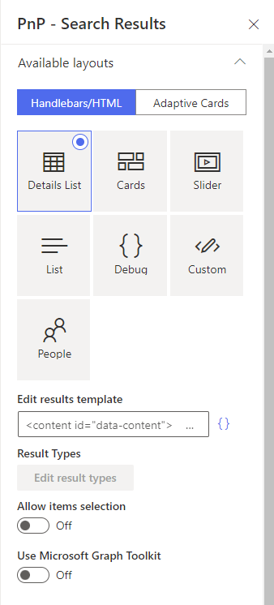
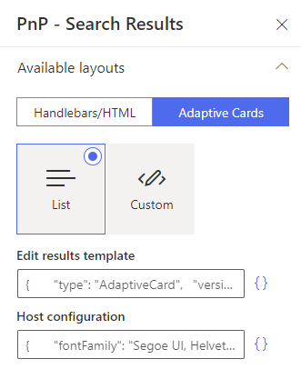

# Customize layout templates 

In a basic customization scenario, super users and webmasters can customize existing templates or start from a blank template to adapt the UI to their requirements. Templates can use either [Handlebars](https://handlebarsjs.com/) or [Adaptive cards](https://adaptivecards.io/) templates to display data retrieved from the data source. Depdending of the template type, there are several options to customize a template:

- **Handlebars**
    - Use regular HTML markup, Handlebars syntax and [helpers](#handlebars-helpers).
    - [Write custom CSS styles](#custom-css-styles).
- **Adaptive cards**
    - Use declarative [Adaptive Cards](#adaptive-cards-customizations) JSON templates with data.
- **Both techniques**
    - Use data sources [slots](../usage/data-visualizer/slots.md) 
    - Use default [web components](#using-builtin-web-components) provided by the solution.
    - Use [Microsoft Graph Toolkit components](#microsoft-graph-toolkit).

## Handlebars, HTML and CSS customizations

{: .center}

> The templates and fields HTML markup is sanitized automatically preventing XSS attacks. We used [`DOMPurify`](https://github.com/cure53/DOMPurify) to do so. It means for instance, you cannot add your own `<script>` tags or inline JavaScript.
### Template structure

A layout template is always split into two distinct parts:

```html
    <content id="template">
        <!-- Your template content here -->
    </content>

    <content id="placeholder">
        <!-- Your placeholder content here -->
    </content>
```
- A `template` part, containing the HTML markup to display your data **once fetched**. This part is mandatory to display your data.

- A `placeholder` part, containing the HTML markup to display as placeholder **while the data are getting fetched**. This part is optional.

Both can use Handlebars and web components (Microsoft Graph Toolkit included).

### Handlebars helpers

The following custom helpers are available in addition to the [handlebars-helpers](https://github.com/helpers/handlebars-helpers). If those don't do the job for you, you can still write your own using the [extensibility library](./handlebars_customizations.md).

> The `markdown` and `logging` helpers are not available. For `times` use `multiply` as `times` is a custom iterator.

| Helper | Description | Example |
| ------ | ----------- | -------- |
| `{{getGraphPreviewUrl "<absolute_URL>"` | Try to determine the preview URL based on an absolute URL using the unified Microsoft Graph URL syntax. For instance, _https://contoso.sharepoint.com/sites/dev/Shared%20Documents/MyDocument.pdf_ becomes _https://contoso.sharepoint.com/sites/dev/Shared%20Documents/?id=/sites/dev/Shared%20Documents/MyDocument.pdf&parent=/sites/dev/Shared%20Documents_  | `{{getGraphPreviewUrl 'https://contoso.sharepoint.com/sites/dev/Shared%20Documents/MyDocument.pdf'}}`
`{{getCountMessage <total items count> <keywords>}}` | Display a friendly message displaying the result and the entered keywords. | `{{getCountMessage 5 'contoso'}}` will display _'5 results for 'contoso'_.
| `{{getSummary "<value>"}}` | _Use with SharePoint Search data source and the HitHighlightedSummary SharePoint search managed property_. Returns the formatted value for rendering. | `{{getSummary HitHighlightedSummary}}`
| `{{getTagName "<value>"}}` | _Use with tag fields_. Returns the name of the tag, omitting the ID in the tag string (`L0\|#000000000-0000-0000-0000-000000000000\|…`). | `{{getTagName Tag}}`
| `{{getDate <data_value> "<format>" "<time handling>"}}` | Format the date with [Moment.js](https://momentjs.com/docs/#/parsing/string-format/) according to the current language. Date in the managed property should be on the form `2018-09-10T06:29:25.0000000Z` for the function to work.<p>&lt;time handling&gt; is optional and takes <ul><li>0 = format to browsers time zone (default)</li><li>1 = ignore Z time and handle as browsers local time zone</li><li>2 = strip time and set to 00:00:00 in browsers local time zone</li><li>3 = display in the time zone for the current web</li><li>4 = display in the time zone from the uers profile</li> | `{{getDate 2018-09-10T06:29:25.0000000Z 'LL'}}`
| `{{getUrlField <managed_propertyOWSURLH> "URL|Title"}}` | _Use with SharePoint Search data source_. Returns the URL or Title part of a URL autocreated managed property | `{{getUrlField MyPropertyOWSURLH "Title"}}`
`{{getUniqueCount items "<property>"}}` or  `{{getUniqueCount array}}`| Get the unique count of a property over the result set (or another array) or get the unique count of objects in an array. Example: [1,1,1,2,2,4] would return `3`. | `{{getUniqueCount [1,1,1,2,2,4]}}`
`{{getUnique items "<property>"}}` | Return the unique values as a new array based on an array or property of an object in the array. | `{{getUnique items "NewsCategory"}}`
`{{#group items by="<property>"}}` | Group items by a specific results property. See [https://github.com/shannonmoeller/handlebars-group-by](https://github.com/shannonmoeller/handlebars-group-by) for usage.
| `{{slot item <property_name>}}` | Return the `<property_name>` value for the `item` object. Supports deep property paths. | `{{slot item "property.subproperty"}}`
| `{{getUserEmail <value>}}` | Extract the user email in a string based on a email regex  (ex: a claim). Returns the first match.| `{{getUserEmail "franck.cornu@contoso.onmicrosoft.com | Franck Cornu | 693A30232E667C6D656D626572736869707C6672616E636B2E636F726E7540616571756F736465762E6F6E6D6963726F736F66742E636F6D i:0#.f|membership|franck.cornu@contoso.onmicrosoft.com"}}`
| `{{#times <number>}}` | Iterate the block `<number>` times. | `{{#times 5}} some mark up  {{/times}}`
| `{{regex <expression> <string>}}` | Run a regular expression and return the match. Return `-` if not match. | `{{regex '\d+' 'digit 15 is a number'}}` will return `15`.
| `{{getPageContext "<SPFx page property>"}}` | Retrieve a property from the SPFx context object. | `{{getPageContext "user.displayName"}}` or `{{getPageContext "cultureInfo.currentUICultureName"}}`
| `{{getAttachments}}`| Return object structure for list item attachments. | `{{#getAttachments LinkOfficeChild}}<a href="{{url}}">{{index}} - {{fileName}}</href>{{/getAttachments}}`
| `{{dayDiff <date1> <date2>}}`| Return the number of days between two dates, eg. show an icon for files created within the last 30 days. | `{{#compare (dayDiff (getDate Created 'YYYY-MMM-DD' ) (getDate timestamp 'YYYY-MMM-DD' )) "<=" 30 }} {{/compare}}`
| `{{urlParse <url>}}` | Same as Handlebar Helpers. Omitting the optional url parameter uses the current browser URL. | `{{get "query" (urlParse)}}` return the query part of a URL
| `{{getUrlParameter <parameter> <url>}}` | Return the query parameter value from a URL. Omitting the optional url parameter uses the current browser URL. | `{{getUrlParameter "k"}}` return the value of the `k` query parameter from the browser URL.<br><br>`{{getUrlParameter "k" "https://foo?k=test"}}` return the value of the `k` query parameter from the provided URL.


> Need any other helper? Let us know [here](https://github.com/aequos-solutions/modern-search-results/issues)!

### Using builtin web components

By default, several components are available ([see the complete list](./web_components_list.md)). If these does not fit your requirement, you can still create your own using the [extensibility library](./custom_web_component.md).

### Custom CSS styles

Inside an HTML template (or layout field), you can write your own CSS styles using a &lt;style&gt; tag. Even better, you can inject Handlebars variables, helpers, conditional blocks, etc. right inside it and get dynamic classes or attributes

```html
<content id="data-content">
    <style>
        .example-themePrimary a {
            color: {{@root.theme.palette.themePrimary}};
        }
        ...
    </style>

    <div class="template">
        ...
    ...
```

However, all CSS rules (including `@media` rules) will be all prefixed automatically by an unique ID (**pnp-template_&lt;Web Part instance ID&gt;**) to make sure styles are isolated from other Web Parts on the page. We do this to avoid conflicts between classes in the global context.

### Hide error message using CSS
By default the web parts will output an error message if something goes wrong on for example API calls.

If you want to hide the error message you can add the following CSS in your custom template.

```html
<content id="data-content">

    <style>
        .pnpSearchResultsErrorMessage { display:none; }
        ...
    </style>

    <div class="template">
        ...
    ...
```

### Use SharePoint theme in your templates

If you need to use current site theme colors, fonts and so on you can use the `theme` property available in the `@root` Handlebars context like this:

```html
<content id="data-content">

        <style>
            .example-themePrimary {
                color: {{@root.theme.palette.themePrimary}};
            }
            ...
        </styles>

        ...

        <span class="example-themePrimary">{{Title}}</span>

        ...

</content>
```

> You can also use this variable in the 'Details List' and 'Cards' layouts in field expresions.


A good way to see all available values for the current theme is to switch to the debug layout and inspect these values:


### Work with placeholders

To indicate the data are loading, you can create placeholders (shimmers) using the `<content id="placeholder-content">` section of your HTML template:
The placeholder is only loaded during first data load. For subsequent requests, a overlay will be displayed.

```html
<content id="placeholder-content">

    <style>

        .placeholder .icon {
            width: 20px;
            height: 16px;
            margin-right: 5px;
        }

        .placeholder ul {
            list-style: none;
        }

        .placeholder ul li {
            display: flex;
            align-items: center;
            padding: 8px;
        }

    </style>

    <div class="placeholder">
        <ul>
            {{#times 5}}
                <li>
                    <div class="icon placeholder--shimmer"></div>
                    <span class="placeholder--shimmer placeholder--line" style="width: 60%"></span>
                </li>
            {{/times}}
        </ul>
    </div>
</content>
```

Use CSS classes `placeholder--shimmer` and `placeholder--line` to build your placeholders. Basically, you can reuse the same HTML structure as your template content markup, but using these these classes instead to fill areas.

If no placeholder is present in the template, a default one will be loaded.

### Microsoft Graph Toolkit

> The Microsoft Graph Toolkit is a collection of reusable, framework-agnostic web components and helpers for accessing and working with Microsoft Graph. The components are fully functional right of out of the box, with built in providers that authenticate with and fetch data from Microsoft Graph.

In the solution, you can use Graph Tookit components whitout the need to re-authenticate against Microsoft Graph because the Web Parts already use the [SharePoint provider](https://docs.microsoft.com/en-us/graph/toolkit/providers/sharepoint).

Refer to the official documentation to see [all available components](https://docs.microsoft.com/en-us/graph/toolkit/components/login). For instance, we use the Microsoft Graph Toolkit for the [people layout](../usage/search-results/layouts/people.md) via `<mgt-person>`.

### Build templates with item selection

If your template requires items selection for dynamic filtering, you can follow these guidelines to design your template structure. The item selection feature is based on the Office Fluent UI [**Selection**](https://developer.microsoft.com/en-us/fluentui#/controls/web/selection) component and custom `data` attributes.

The available data attributes you can use in your HTML template are:

- `data-selection-index`: the index of the item being represented. This would go on the root of the tile/row.

- `data-selection-toggle`: this boolean flag would be set on the element which should handle toggles.This could be a checkbox or a div.

- `data-selection-toggle-all`: this boolean flag indicates that clicking it should toggle all selection.

- `data-selection-disabled`: allows a branch of the DOM to be marked to ignore input events that alter selections.

- `data-selection-select`: allows a branch of the DOM to ensure that the current item is selected upon interaction.

As item key you must use the builtin Handlebars `{{@index}}` property in the `{{#each}}` loop. Also because state managed is internaly managed by the Web Part, we provide you an Handlebars helper `isItemSelected` to help to apply styles depending of the selection (ex: apply a CSS class or not). To use this helper correctly, you must pass the current selected keys and current index to get the selected state for an item:

```
(isItemSelected @root.selectedKeys @index)
```

**Template example with item selection**

```html
<style>

    .selected {
        background-color: {{@root.theme.palette.themeLighter}};
        border: 1px solid {{@root.theme.palette.themePrimary}};
        color: {{@root.theme.palette.themePrimary}};
    }
    ...

</style>
...
{{#each data.items as |item|}}
    <div class="{{#if (isItemSelected @root.selectedKeys @index)}}selected{{/if}}" data-is-focusable data-selection-index="{{@index}}" data-selection-toggle>
        <span>{{slot item @root.slots.Title}}</span>
    </div>
{{/each}}
```

!!! note
    - If you allowed multi items selection, you must use `CTRL` + `Left click` to select multiple elements. You can also select a range of elements using `SHIFT` + `Left click`.


## Adaptive cards customizations

{: .center}

As defined by Microsoft:

_"Adaptive Cards are platform-agnostic snippets of UI, authored in JSON, that apps and services can openly exchange. When delivered to a specific app, the JSON is transformed into native UI that automatically adapts to its surroundings. It helps design and integrate light-weight UI for all major platforms and frameworks."_

This new way of displaying data can be used in the Modern Data Visualizer solution as well.

> You can use the adaptive cards builder to create your template [https://www.adaptivecards.io/designer/](https://www.adaptivecards.io/designer/).
> Adaptive cards can be used for SharePoint Search and Micrososft Search data sources.

### Use web components and HTML markup in adaptive cards

Web components and HTML are supported in adaptive cards through markdown processing. To use it simply, add your HTML markup in the text property. Example:

```json
...
{
    "type": "Column",
    "items": [
        {
            "type": "TextBlock",
            "wrap": true,
            "text": "<aequos-iconfile class='icon' data-extension='${string(jPath($data, concat('.',$root.slots['FileType']))[0])}'></aequos-iconfile>"
        }
    ],
    "width": "auto"
}
...
```

> HTML in adaptive cards will be sanitized.

### Reference a slot in a adaptive card

Since it is not possible to create custom functions with adaptive cards templates right now, slots values can only be accessed using the builtin [`jPath` function](https://docs.microsoft.com/en-us/azure/bot-service/adaptive-expressions/adaptive-expressions-prebuilt-functions?view=azure-bot-service-4.0#jPath) and the following syntax:

```json
"items": [
    {
        "type": "TextBlock",
        "wrap": true,
        "text": "${string(jPath($data, concat('.',$root.slots['<your_slot_name>']))[0])}""
    }
],
```

To reference a field without a slot, just use its name:

```json
"items": [
    {
        "type": "TextBlock",
        "wrap": true,
        "text": "${Title}""
    }
],
```

**Explanation**

- `string()` is here to make sure the result of the jPath expression will always be a string. **If omitted, if the slot provided (i.e. the object path) doesn't exist, it will return `null` causing a render error**. The `jPath` function always returns an array.
- `jPath(<data>, concat('.', $root.slots['<your_slot_name>']))` where `<data>` is the JSON object used to resolve the slot. When looping through `items`, use the `$data` token representing the current item with properties. The expression `concat('.', $root.slots['<your_slot_name>']))` is to comply with the jPath syntax: every property path should be begin with a '.' (See the official jPath [documentation](https://www.npmjs.com/package/jspath)).

### Styling your adaptive cards

When selecting the adaptive cards mode, you can also setup styles through the [host configuration](https://docs.microsoft.com/en-us/adaptive-cards/rendering-cards/host-config). 

From the official Microsoft documentation: 

_"HostConfig is a cross-platform configuration object that specifies how an Adaptive Card Renderer generates UI."_.
