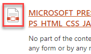
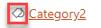
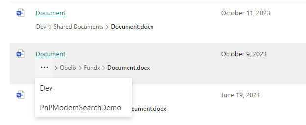

# Builtin web components

Here are the list of all **reusable** web components you can use to customize your templates. 

- [Builtin web components](#builtin-web-components)
  - [`<pnp-iconfile>`](#pnp-iconfile)
  - [`<pnp-documentcard>`](#pnp-documentcard)
  - [`<pnp-filepreview>`](#pnp-filepreview)
  - [`<pnp-icon>`](#pnp-icon)
  - [`<pnp-panel>`](#pnp-panel)
  - [`<pnp-collapsible>`](#pnp-collapsible)
  - [`<pnp-persona>`](#pnp-persona)
  - [`<pnp-img>`](#pnp-img)
  - [`<pnp-breadcrumb>`](#pnp-breadcrumb)

> All other web components you will see in builtin layout templates are considered **internal** and are not supported for custom use.

> All components have an optional `data-theme-variant` attribute used to set the theme for your internal React components (for instance using Office UI Fabric). This value is typically retrieved from the root Handlebars context and reflect the current **section theme** where the Web Part belongs. **If not set, the theme of current site will be used as fallback and may not corespond to the current section theme**.

## `<pnp-iconfile>`

- **Description**: Render a file icon according to an extension. 

{: .center}
- **Usage**
```html
<pnp-iconfile 
    data-extension="docx" 
    data-is-container="false" 
    data-size="32">
</pnp-iconfile>
```

| Parameter | Description |
| --------- | ----------- |
|**data-extension**|The file extension to render.
|**data-is-container**|If `true` or `1`, the icon will be a folder.
|**data-size**|The size of the icon to display.

## `<pnp-documentcard>`
- **Description**: Render a document card.

{: .center}

- **Usage**
```html
<pnp-documentcard 
    data-location="&lt;a href=\&quot;https://...\&quot;&gt;Title&lt;/a&gt;"
    data-title="Title"
    data-preview-image="https://..." 
    data-preview-url="https://..." 
    data-date="01/01/2020" 
    data-href="https://..." 
    data-author="David Lopez" 
    data-profile-image="/_layouts/15/userphoto.aspx?size=L&username=david.lopez@contoso.com" 
    data-file-extension="docx"
    data-enable-preview="true" 
    data-is-container="false"
    data-show-file-icon="true">`
</pnp-documentcard>
```

| Parameter | Description |
| --------- | ----------- |
|**data-location**|The document card location. HTML is allowed here. You must encode the string for this scenario.
|**data-title**|The document card title.
|**data-preview-image**|The preview image URL for the card.
|**data-preview-url**|The preview URL for the card.
|**data-href**|The URL for the card title.
|**data-author**|The author to display.
|**data-profile-image**|The profile image URL for the author if any.
|**data-file-extension**|The document card file extension if any.
|**data-enable-preview**|If the card supports preview. If `true`, a preview URL + preview image URL should be set.
|**data-is-container**|If `true` or `1`, the file icon will be a folder icon.
|**show-file-icon**|If `true` or `1`, the file icon will be hidden/displayed.

## `<pnp-filepreview>`

- **Description**: Render file preview in a callout when the wrapped element **is clicked**. The wrapped element can be anything (text, image, etc.)

{: .center}

- **Usage**
```html
<pnp-filepreview 
    data-preview-url="https://..." 
    data-preview-image-url="https://...">
    <span>Wrapped element</span>
</pnp-filepreview>
```

| Parameter | Description |
| --------- | ----------- |
|**data-preview-image**|The preview image URL for the callout displayed while the preview is loading in a iframe (optional).
|**data-preview-url**|The preview URL for the element in the callout.
    
## `<pnp-icon>` 
- **Description**: Display an [Office UI Fabric icon](https://developer.microsoft.com/en-us/fluentui#/styles/web/icons).

{: .center}

- **Usage**
```html
<pnp-icon data-name="Tag" aria-hidden="true"></pnp-icon>
```

| Parameter | Description |
| --------- | ----------- |
|**data-name**|The Office UI Fabric icon name to display (case sensitive).
    
## `<pnp-panel>`

- **Description**: display a panel with (`panel-content`) content when the associated outer `panel-open` element is clicked.

{: .center}

- **Usage**
```html
<pnp-panel   
    data-is-open="false" 
    data-is-light-dismiss="true"
    data-is-blocking="true"
    data-size="2"
    data-panel-header-text="Panel header!">

    <template id="panel-open">
        <!-- All the content here will be wrapped with an onclick event opening/hiding the panel -->

        Click me!
    </template>

    <template id="panel-content">
        <!-- Panel content goes here -->
    
        Panel content!
    </template>
    
</pnp-panel>
```

## `<pnp-collapsible>`

- **Description**: expand/collapse the `collapsible-content` contetn when the text with `data-group-name` is clicked.

{: .center}


- **Usage**
```html
<pnp-collapsible 
    data-group-name="Collapsible content" 
    data-default-collapsed="true">

    <template id="collapsible-header">
        <div>
            My Header!
        </div>
    </template> 

    <template id="collapsible-content">
        <div>
            My Content!
        </div>
    </template>

    <template id="collapsible-footer">
        <div>
            My Footer!
        </div>
    </template>

</pnp-collapsible>
```

| Parameter | Description |
| --------- | ----------- |
|**data-default-collapsed**|If the content should be collapsed by default `true/false`.
|**data-group-name** |The header group name for expand/collapse.

## `<pnp-persona>`

- **Description**: display a persona item with relevant information.

{: .center}

- **Usage**
```html
<pnp-persona
    data-image-url="/_layouts/15/userphoto.aspx?size=L&username=david.lopez@contoso.com"
    data-primary-text="David Lopez"
    data-secondary-text="Unknown"
    data-tertiary-text=""
    data-optional-text="514 928 0000"
    data-persona-size=""
    data-native-lpc=true
    data-show-presence=true
    data-user-object-id="[GUID]">
</pnp-persona>
```

| Parameter | Description |
| --------- | ----------- |
|**data-image-url**|The persona image URL.
|**data-primary-text**|The primary text (ex: person display name).
|**data-secondary-text**|The secondary text to display (ex: job title).
|**data-tertiary-text**|The tertiary text to display (ex: work phone).
|**data-optional-text**|The optional text to display.
|**data-persona-size**|The size of the persona **item** to display (no only the picture). Valid values are <ul><li>tiny = 0</li><li>extraExtraSmall = 1</li><li>extraSmall = 2</li><li>small = 3</li><li>regular = 4</li><li>large = 5</li><li>extraLarge = 6</li></ul>
|**data-native-lpc**|Enable SharePoint native Live Persona Card on hover.
|**data-show-presence**|Show the user's presence-information.
|**data-user-object-id**|The person's Entra ID Object-ID (a GUID normally provided by the default-slot "PersonQuery" which is mapped to managed property "AADObjectID")

## `<pnp-img>` 
- **Description**: Display an image with support for fallback behavior.

- **Usage**
```html
<pnp-img loading="lazy" src="https://someimage.png" data-error-image="https://fallbackimage.png" /> 
<pnp-img src="https://someimage.png" hideOnError/> 
```

| Parameter | Description |
| --------- | ----------- |
|**errorImage**|URL to the fallback image
|**hideOnError**|Hide image on error

## `<pnp-breadcrumb>` 
- **Description**: Render a breadcrumb path of a SharePoint entity (file, item, folder, document library etc.).

{: .center}

- **Usage**:

Get started with:
```html
<pnp-breadcrumb 
    data-path="{{OriginalPath}}"
    data-site-url="{{SPSiteURL}}"
    data-web-url="{{SPWebUrl}}"
    data-entity-title="{{Title}}"
    data-entity-file-type="{{FileType}}"
/>
```
Use all properties:
```html
<pnp-breadcrumb 
    data-path="{{OriginalPath}}"
    data-site-url="{{SPSiteURL}}"
    data-web-url="{{SPWebUrl}}"
    data-entity-title="{{Title}}"
    data-entity-file-type="{{FileType}}"
    data-include-site-name="false" 
    data-include-entity-name="true"
    data-breadcrumb-items-as-links="true"
    data-max-displayed-items="3"
    data-overflow-index="0"
    data-font-size="12"
/>
```
|Parameter|Description|
|--|--|
|data-path|Used for creating the breadcrumb path. Component is designed to receive `OriginalPath` or `Path` property. Property is required for rendering the breadcrumb path. `String`|
|data-site-url|Used for creating the breadcrumb path. Component is designed to receive `SPSiteURL` property. Property is required for rendering the breadcrumb path. `String`|
|data-web-url|Used for creating the breadcrumb path. Component is designed to receive `SPWebUrl` property. Property is required for rendering the breadcrumb path. `String`|
|data-entity-title|Used for creating the breadcrumb path. Component is designed to receive `Title` property. Property is required for rendering the breadcrumb path. `String`|
|data-entity-file-type|Used for creating the breadcrumb path. Component is designed to receive `FileType` property. Property is required for rendering the breadcrumb path. `String`|
|data-include-site-name|If the site name should be included in the breadcrumb items. Optional, default value `true`. `Boolean`|
|data-include-entity-name|If the entity name should be included in the breadcrumb items. If the value is set to `false`, not only is the entity name excluded from the breadcrumb path, but also the last item in the breadcrumb path is not highlighted in bold. Optional, default value `true`. `Boolean`|
|data-breadcrumb-items-as-links|If the breadcrumb items should be clickable links to the path they represent. Optional, default value `true`. `Boolean`|
|data-max-displayed-items|The maximum number of breadcrumb items to display before coalescing. If not specified, all breadcrumbs will be rendered. Optional, default value `3`. `Int`|
|data-overflow-index| Index where overflow items will be collapsed. Optional, default value `0`. `Int`|
|data-font-size|Font size of breadcrumb items. Optional, default value `12`. `Int`|