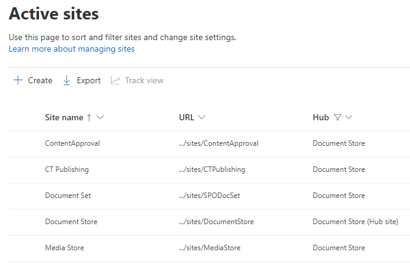
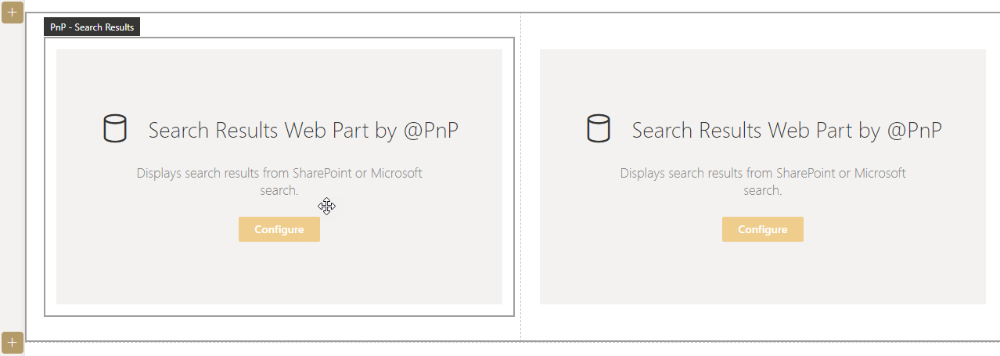
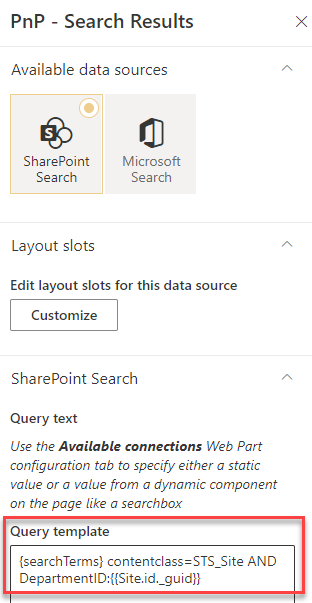
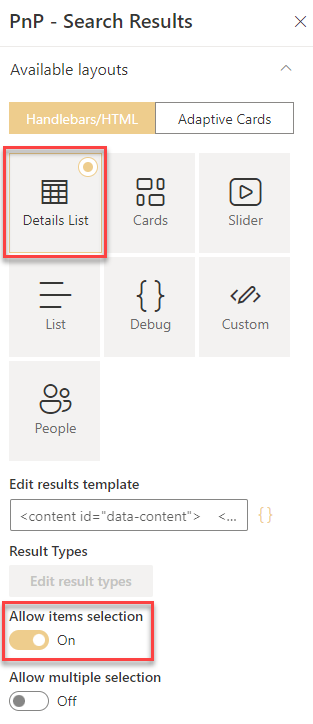
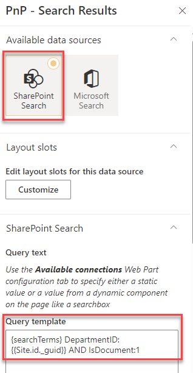
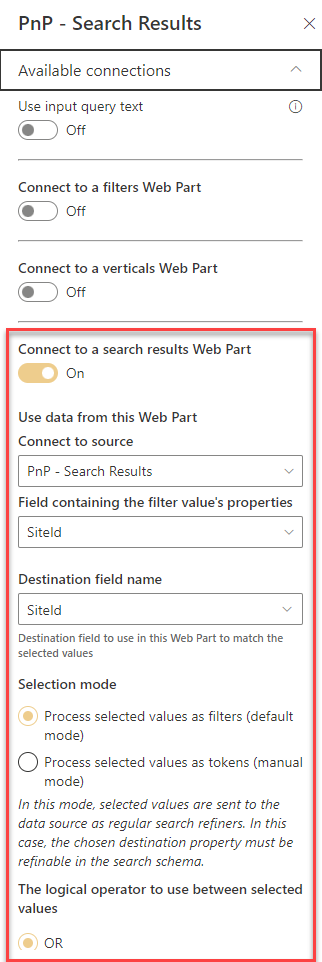
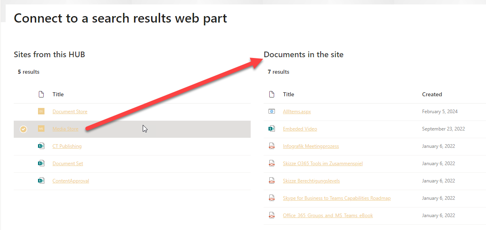

# Connect to a search results webpart

!!! note
The PnP Modern Search Web Parts must be deployed to your App Catalog and activated on your site. See the [installation documentation](../installation.md) for details.

This scenario describes how to connect more then one results Web Part together. One results Web Part will view the sites, connected with the current HUB site, the other, connected results Web Part, will show the documents from the selected site.

## SharePoitn HUB site structure
As basic architecture we need a SharePoint HUB site and sites associated to the HUB site.

## Create a simple search page
We need a SharePoint page configured with the PnP Modern Search Web Parts. See the scenario how you can [create a simple search page](create-simple-search-page.md)

Add two PnP Results Web Part, we will configure this web parts later:

## Configure first results Web Part with current HUB site and associated sites
In the first PnP Results Web Part add the query to show the current HUB site and the associated sites to the HUB. 

Query template:
{searchTerms} contentclass=STS_Site AND DepartmentID:{{Site.id._guid}}

Table with HUB properties with detail information: https://learn.microsoft.com/en-us/sharepoint/crawled-and-managed-properties-overview

Activate the details list layout and activate the option "Allow items selection" in the results Web Part. 
You can display only the title column, we don't need the other columns.

## Configure second results Web Part connected to the first
The second PnP Search Results Web Part on the same page need the query that will show the documents from the selected site in the first results web part.

Query template:
{searchTerms} DepartmentID:{{Site.id._guid}} AND IsDocument:1 

Activate the details list layout. You can display only the title and created column, we don't need the other columns.

You need to configure the chapter "Use data from this Web Part" under Available connections!

Save the page.

## Solution and test your Web Part connections
After the configuration you can select a site and the documents will be show up for the selected site.

