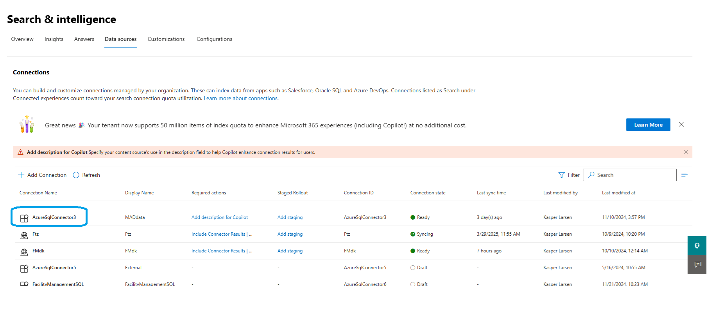
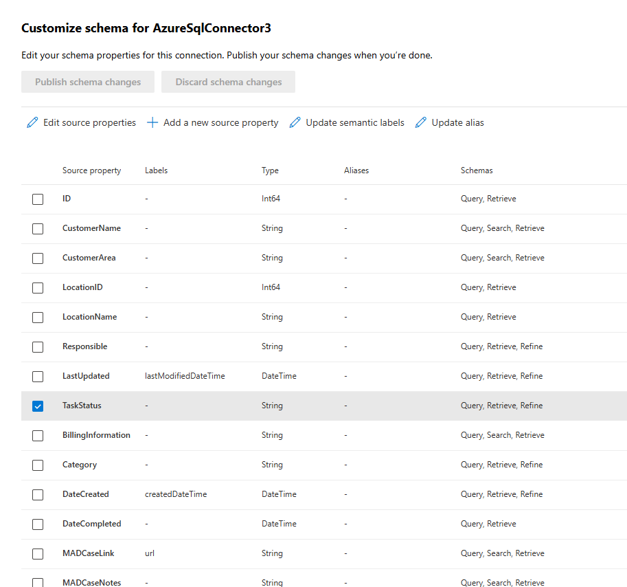
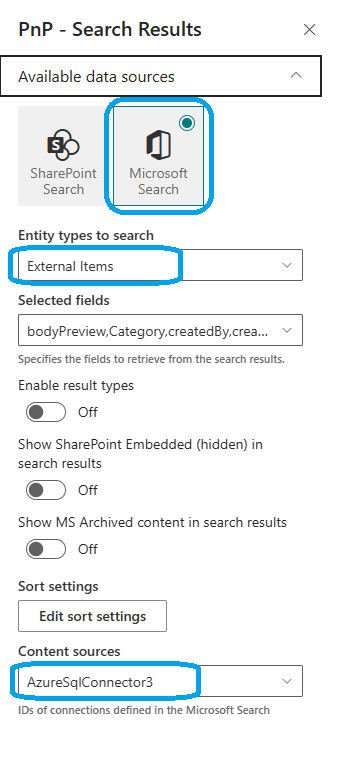
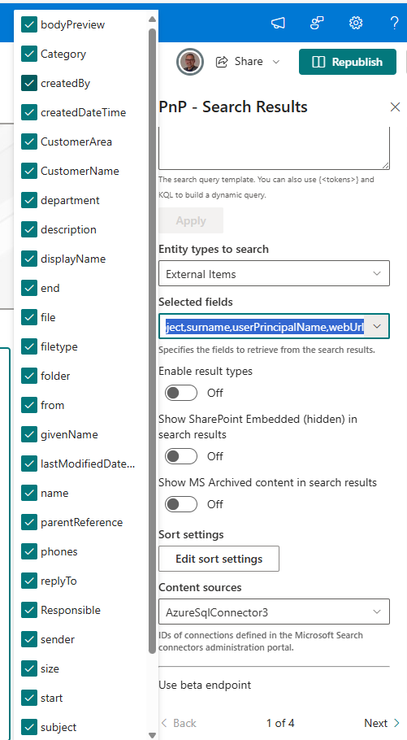
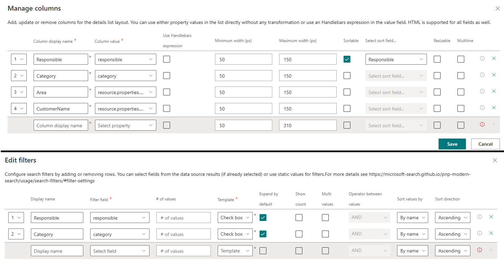

# Create a search page showing graph connector data

!!! note
    The PnP Modern Search Web Parts must be deployed to your App Catalog and activated on your site. See the [installation documentation](../installation.md) for details.

What is a Graph Connector?
A [Graph Connector](https://learn.microsoft.com/en-us/graph/connecting-external-content-connectors-overview) is a way to connect external data sources to Microsoft Search. It allows you to index and search for content from these sources alongside your Microsoft 365 content.

With Graph Connectors, you can bring in data from various sources such as databases, file systems, and other applications. This enables you to create a unified search experience across all your content, regardless of where it resides.

## Set up a Graph Connector
You must have access to the Search and Intelligence admin center in the Microsoft 365 admin center. You can find it at [https://admin.microsoft.com](https://admin.microsoft.com) under **Admin centers** > **Microsoft Search**.
This is where you can create and manage your Graph Connectors. 

## Know your data before you start

Once you have set up your Graph Connector, you can use the PnP Modern Search Web Parts to display the data in your search results.
In this scenario, we will use the AzureSQLConnector as an example.

IN order to use this connector we need to know the schema of the data we are going to show.

Please note that some of the properties are refineable, and some are not. This is important to know when you are setting up your sort and refiners.

## Setting up a Search Result web part to show Graph Connector data

In most cases we are using SharePoint as the source of our data. But in this case we are using a Graph Connector and wherefore we need to use the Microsoft Search data source.

Set the Entity type to External Items and set the Content sources to the name of the Graph Connector you are using. In this case we are using the AzureSqlConnector3.

Unfortunately we are unable to read the Properties from the Graph Connector, so you will have to type ( or copy and paste) from the schema.

From here, it is just a matter of setting up the web part as you would do with any other data source. You can set up the layout, sorting and refiners as you like.

In this case the final result is a simple list of items from the Graph Connector. You can see that we have set up the refiners to show the properties that are refineable.

