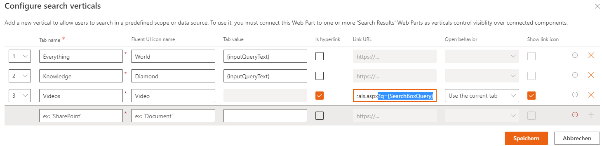

# Scenario 9 - Create a search page with verticals (on different pages)

!!! note
    The PnP Modern Search Web Parts must be deployed to your App Catalog and activated on your site. See the [installation documentation](../installation.md) for details.

This scenario describes how to configure multiple Search Verticals on different pages and how you can pass the search query to the linked search page. When you use a lot Verticals, it's recommended, to split the Search Results Web Parts to different page.

## Create two new SharePoint pages
For the scenario, to add the Search Web Parts, you must first create two new modern SharePoint pages. We will be configure this new pages as search pages with the PnP Modern Search Web Parts.

## Add PnP Search Web Parts
On the newly created pages, add the PnP Modern Search Web Part Search Box, Search Verticals and Search Results. You can use the same initial configuration for both pages.

The WebParts can be arranged and configured on the page as desired.

## Configure first Search page
### Configure Search Box
You need to configure the "Available Connections" in the PnP Search Box Web Part. Use dynamic data source as default input, to connect to the page environment. This is require for a dynamic search experience when you switch between the different search pages.

### Configure Search Vertical
In the Search Verticals Web Part, the verticals (tabs) must be configured.

Insert the tab name and a fluent icon for e better visualization. When the results are on the same page, you don't need an Link URL (Verticals Everything and Knowledge in the screen below). But for our Scenario, we need an other search page. Activate the option "Is Hyperlink" and add the URL to the search page, very important, add the parameter q at the end of the URL, with this parameter, you will transfer your search query to the second search page.

Example URL:
https://{tenant}/{site}/{page}?{parameter}

Looks like:
https://{tenant}/sites/ModernSearchCenter/SitePages/Modern-Search-V4-Verticals.aspx?q={SearchBoxQuery}

### Configure Search Results
The Results WebPart displays all results. Select the data source SharePoint and the result source "LocalSharePointResults".

In the "Available Connections" section, the connection to the Search Box and the Search Vertical must be configured. 

## Configure second Search page
As next, you will be configure the second search page, it's the page, that you referred above in the verticals from the first page.

### Configure Search Box
You need the same configuration like in the first Search Page. Use dynamic data source as default input, to connect to the page environment. This configuration received the same query as started into the Search Box in the first Search page.

### Configure Search Vertical
In the Search Verticals Web Part, the verticals (tabs) must be configured.

Insert the tab name and a fluent icon for e better visualization. In this page, the "Videos" vertical is connected to the same page, the other two's vertical refer to the first search page, also with the +q= parameter.

### Configure Search Results
The Results WebPart displays all Video results. Select the data source SharePoint and the result source "LocalVideoResults".

In the "Available Connections" section, the connection to the Search Box and the Search Vertical must be configured.

Both pages are configured, the query will be transfered from one page to the other and the results will show us the informations from the result sourcen, what we have configured.

## Test your configuration
The query from the Search Box is sent to the Search Results. When you switch to an other Search Page, that are configured in the Vertical, the new page is open in the same tab an the query input will be transferred to the Search Results and Verticals on the second page.
