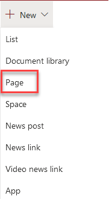
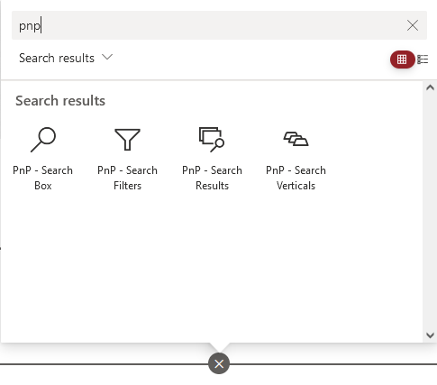
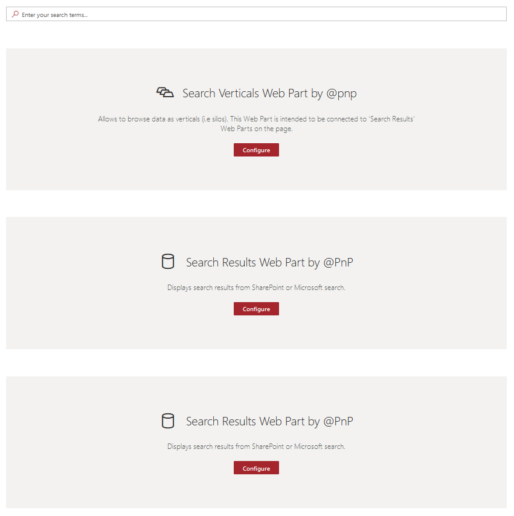
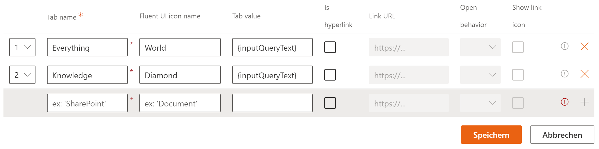
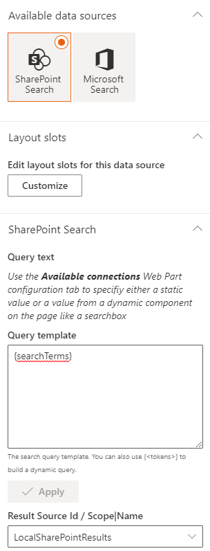
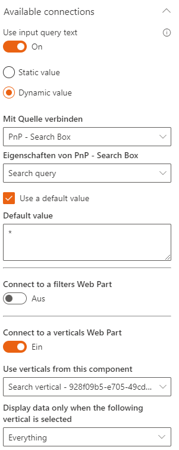
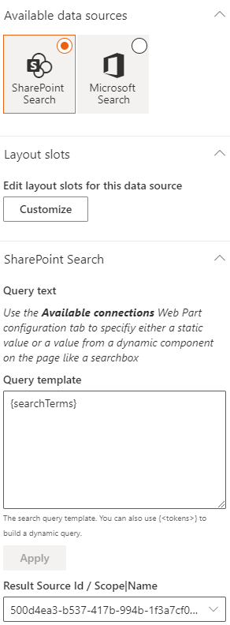
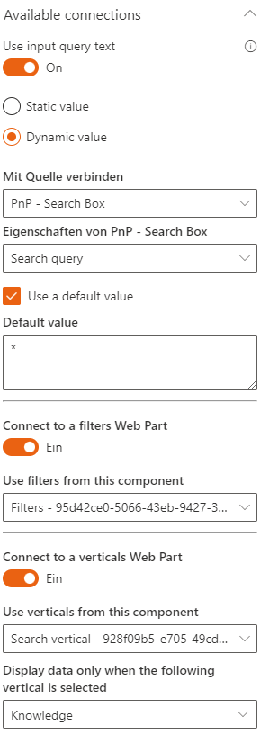
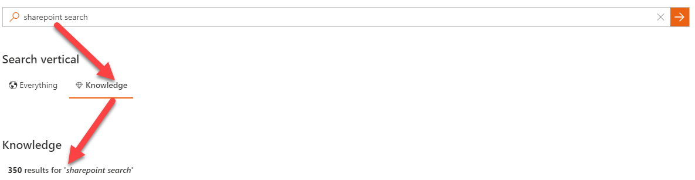

# Scenario 8 - Create a search page with verticals (within the same page)

!!! note
    The PnP Modern Search Web Parts must be deployed to your App Catalog and activated on your site. See the [installation documentation](../installation.md) for details.

This scenario describes how to configure multiple Search Verticals on the same page.

## Create a new sharepoint page

To add the Search Web Parts, you must first create a new modern SharePoint page. We will be configure this new page as a search page with the PnP Modern Search Web Parts.

## Add PnP Search Web Parts

On the newly created page, add the PnP Modern Search Web Part Search Box, Search Verticals, and Search Results, twice.

The Web Parts can be arranged and configured on the page as desired.

## Configure Search Box

You can leave the default configuration.

## Configure Search Vertical

In the Search Verticals Web Part, the verticals (tabs) must be configured.

Insert the tab name and a fluent icon for e better visualization. The results are on the same page, so a link URL are not necessary.

## Configure first Search Result Web Part

The first Results Web Part displays all results. Select the data source SharePoint and the result source &quot;LocalSharePointResults&quot;.

In the &quot;available connections&quot; section, the connection to the Search Box and the Search Vertical must be configured. The results web part should only be displayed if the vertical &quot;Everything&quot; is active.

## Configure second Search Result Web Part

The second results web part displays results from the predefined result source knowledge, configures the result source in the SharePoint admin center, and the GUID must be added to the Web Part.

In the &quot;available connections&quot; section, the connection to the Search Box and the Search Vertical must be configured again. The Results Web Part should only be displayed if the vertical &quot;Knowledge&quot; is selected.

After that, the minimum configuration is complete and the search page must be saved and published. The configuration can be customized, and a different layout can be used for the search results per Results WebPart.

## Testing your configuration

Now the query from the Search Box is sent to the verticals, depending on the choice of the verticals, the results are then displayed in the search result.

