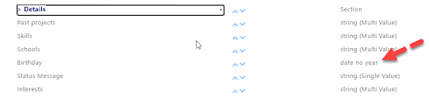

A common requirement for intranets is to show birthdays of employees and as the SharePoint User Profile Application has a property for birthdays, it is a natural choice to use search to show birthdays of employees. In addition, at the time of writing (2023), the Graph API does not have a property for birthdays, so we can't use the Graph API to get the information.

The tricky part is that in the User profile application the birthday value is store is a rather unusual datatype: "date no year"

In my tenant the SPS-Birthday property was mapped to RefinableDate00 and the actual value in the property is 2000-[the date]:

(use the magnificent [SP Editor tool](https://chrome.google.com/webstore/detail/sp-editor/ecblfcmjnbbgaojblcpmjoamegpbodhd) or [SP Search Query Tool](https://github.com/pnp/PnP-Tools/blob/master/Solutions/SharePoint.Search.QueryTool/README.md) to inspect the managed properties)

So, the query had to be something like "those accounts where RefinableDate00 = 2000 + the value of today's date

In KQL we have the token "today" that will give us today's date, but as far as I know, we can't get the components the date consist of, like Month and Day.

Luckily, the PnP Modern search provides additional Tokens, see [Tokens](https://microsoft-search.github.io/pnp-modern-search/usage/search-results/tokens/)

So the final query is:

**RefinableDate00=2000-{CurrentMonth}-{CurrentDate}T00:00:00Z**

( and of cause a criteria to exclude former employees, like SPS-HideFromAddressLists<>1) 

