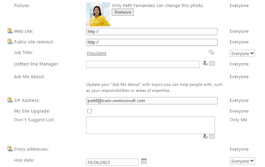
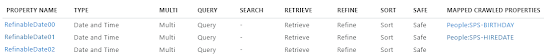

Getting PnP Modern Search to show work anniversaries should be easy enoght, right? Just add a couple of managed properties and a couple of web parts and you are done. Well, not quite.

The problem is that date manipulation in KQL is hard at best and sometimes impossible. In order to find a work anniversary you must compare Today and the Hiredate managed property, but ONLY the day and month part.

Calculating how many years the employee has been with the company is also required and it seems like there is no way to get that using KQL.

## Objective 

We want to be able to display two options: 
- Employees having a work anniversary today, and also how many years they have been with the company
- Employees having a work anniversary within the next 7 days + number of years.

## How to cheat
In order to achieve the objectives, I had to get:
- The account 
- The hiredate, but with the year segment being the current year
- The number of years the employee has been with company at the next anniversary

Lets add birthdayThisYear while I was at it, in order to be able to show upcoming birthdays.

The basic idea is that we want to change the hiredate from eg. 10/26/2005 to 10/26/2023 as that allows us to compare Today with this value 😀
(RefinableDate12 is mapped to the HiredateThisYear property)

Who is having a work anniversary today?

  *RefinableDate12=Today*

Anniversary within the next x days is also a piece of cake:

 *RefinableDate12<{Today+7} AND RefinableDate12>{Today}*

## Implementation
Asking the intern to keep the list above in sync would be a cruel and unusual punishment, and hence actually forbidden in the USA, something to do with a constitution or something like that.

The list should of course be synced with the source, in this case the User Profile Application, at least once each month. The reason I am not using Graph is that birthday is not in the schema.

**Prereq: Map SPS-Birthday and SPS-Hiredate to RefinableDate00/01 or similar**

Once data is showing up in those RefinableDate properties you should be ready to create the list.
Grab the script here . It will create a few Site Columns and a Content type on the site collection of your choosing. The list is then created, and the Content type added to the list.
The Add-UserDataToList function will query the UPA for accounts and write the data we need to the list.
 
Hit the Reindex site in the site collections Search and Offline Availability section for the site columns to be picked up by search.

Map the crawled properties to a couple of RefinableDates. If possible it is recommended to make this mapping on the tenant level as it ensures that you can use them in your entire tenant. 

Find the Content Type ID of the Content type created by the script.

Add a Results web part, name it "Todays work anniversaries"

Set the Query template to: 

*Contenttypeid:0x01009290F0FA40E7CB42B55D6D96F897262B\* RefinableDate12=Today*

*(replace 0x01009290F0FA40E7CB42B55D6D96F897262B with the value for the your content type)* 

Add a Results web part, name it "Upcoming anniversaries (7 days)"

Set the Query template to: 

*Contenttypeid:0x01009290F0FA40E7CB42B55D6D96F897262B\* RefinableDate12<{Today+7} AND RefinableDate12>{Today}*

*(replace 0x01009290F0FA40E7CB42B55D6D96F897262B with the value for your content type)* 

Add the managed properties birthdayhiredateAccountOWSUSER, nextWorkAnniversaryInYearsOWSTNMBR, RefinableDate10, RefinableDate12 to the Selected Properties in both web parts.

Enter Layout slots

Change UserEmail to use the  birthdayhiredateAccountOWSUSER property

Change Date from Created to RefinableDate12

For both web parts you can select the People layout on "page 2" in the web part configuration.

Set Secondary text to: 

{{{Title}}} has been with us {{{nextWorkAnniversaryInYearsOWSTNMBR}}} years

(remember to click Use Handlebars expression)

Set Tertiary text to:

{{getDate (slot item @root.slots.Date) "MMMM-D"}}

(remember to click Use Handlebars expression)

Set the sorting on the Upcoming Anniversaries to RefinableDate12 asc

Run the Add-UserDataToList  function in a runbook or similar once a month and you should be done😊 Near the end of the year you might need to run is once per day.

