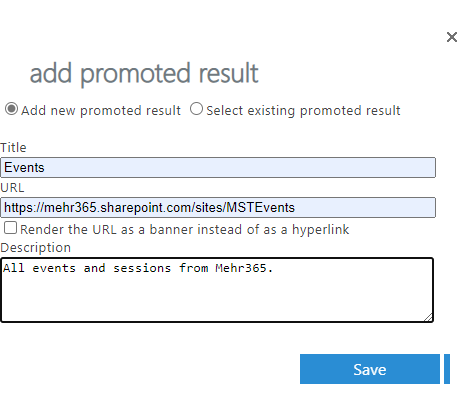
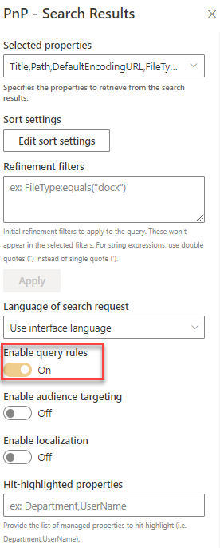
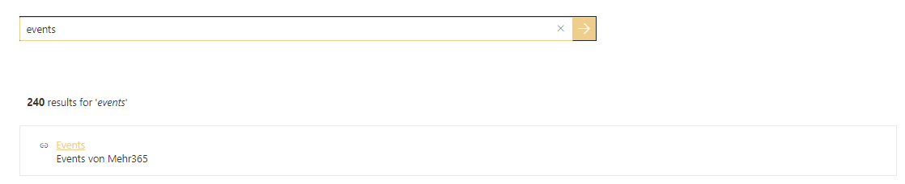

# Use query rules for promoted links

!!! note
    The PnP Modern Search Web Parts must be deployed to your App Catalog and activated on your site. See the [installation documentation](../installation.md) for details.
    
This scenario describes how to configure query rules for promoted links and how they show in the PnP Modern Search Web Parts. As Admin you will be configure query rules in the SharePoint Search Admin Center. After that you can activate query rules in PnP Search Results Web Part. When a search query matches with predefined terms, a promoted link will show in the Search Result Web Part.

## Create a query rule (in SharePoint Admin Center)
As Global or SharePoint Admin in M365 you can configure query rules in the M365 SharePoint Admin Center for Tenant level. Under More features you can find Search, in there you find the point Manage Query Rules.

You need to choice the results source, for which you want to configure a rule. As second step you can create a new query rule.

### Configure a query condition
Add a rule name, use the query condition "Query Matches Keyword Exactly" and add your terms semi-colon separated into the field.

### Add an Action
Now an action must be added for something to happen. Add a Promoted Result to show important information in search results. Save your promoted result.

### Configured query rule
Default the query rule is active under publishing, if you don't want to see this role in the search results, you can uncheck it.

That was the last work in the SharePoint Admin Center, now it's time to configure the search web parts.

## Create a new sharepoint page
To add the Search Web Parts, you must first create a new modern SharePoint page. We will be configure this new page as a search page with the PnP Modern Search Web Parts.

### Add PnP Search Web Parts
On the newly created page, add the PnP Modern Search Web Part Search Box and Search Results. 
The WebParts can be arranged and configured on the page as desired.

### Configure Search Results
Use the SharePoint Search as source. Choose the existing default result source LocalSharePointResults, it's the same, that we have configured for the query rule before. 

On the same web part configuration step, but more down, you will check enable query rules. No more 

As the last step, activate the connections. Use the query from your configured Search Box, you can also configure a default value. 

## Show your promoted links
If you now search for a defined term, promoted links will be displayed on top of the results. It's a default template integrated in the solution, feel free to customize your own visual in a custom result template.

