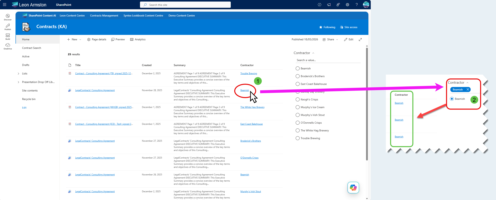
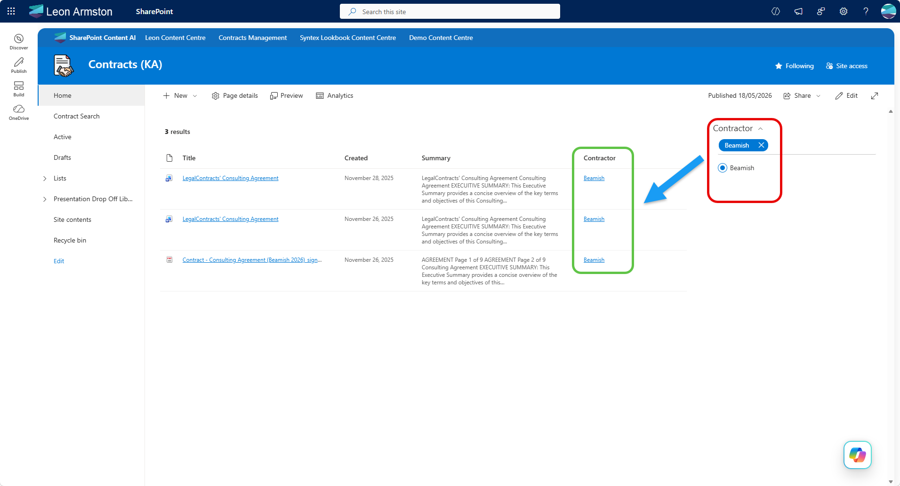

!!! note
The PnP Modern Search Web Parts must be deployed to your App Catalog and activated on your site. See the [installation documentation](../installation.md) for details.

By default, metadata values in a search results column are plain text. This scenario makes a column value a clickable link that reloads the same page with a matching filter pre-applied — so clicking "Trouble Brewing" in a Contractor column instantly filters the results to show only items where Contractor equals "Trouble Brewing", without the user having to find and click the filter manually. Contractor is used as the example throughout this scenario - you can swap it for any metadata field as long as it is mapped to a refinable managed property in your SharePoint Search Schema.



## Prerequisites

You need a SharePoint page with both a **PnP Search Results** Web Part and a **PnP Search Filters** Web Part already added. If you haven't done that yet, follow the [Create a simple search page](create-simple-search-page.md) scenario first.

The filter link works by encoding the filter state into the page URL, which the Filters web part reads on load to pre-apply the selection. Both web parts need to be configured and connected to each other for this to work, which this scenario walks through end to end.

## How it works

When a user clicks the link, the page reloads with a filter parameter appended to the query string, for example:

```
https://yourtenant.sharepoint.com/sites/YourSite?f_4b43307b-8891-42d5-9a62-7bfb83c11de9=%5B%7B%22filterName%22%3A%22RefinableString109%22%2C%22values%22%3A%5B%7B%22name%22%3A%22Trouble%20Brewing%22%2C%22value%22%3A%22%5C%22%C7%82%C7%8254726f75626c652042726577696e67%5C%22%22%2C%22operator%22%3A0%2C%22disabled%22%3Afalse%7D%5D%2C%22operator%22%3A%22or%22%7D%5D#
```

This is the same URL format that PnP Search writes when a user manually clicks a filter - the Filters web part on the page reads it on load and applies the selection automatically.

The Handlebars template builds this URL dynamically using the item's slot value, so it works for any result row without hardcoding individual values.

---

## Part 1: Configure the Search Results Web Part

### Step 1: Switch the layout to DetailsList

The filter link column is added as a column in the **Details List** layout. If your Search Results web part is not already using this layout:

1. Edit the web part and open the property pane
2. Under **Available layouts**, select **Details List**

### Step 2: Update the query template

Under **SharePoint Search**, find the **Query template** field and replace the existing value with:

```
Path:{Site} IsDocument:true contentclass:"STS_ListItem_DocumentLibrary"
```

This restricts results to document library items only, scoped to the current site.

### Step 3: Add the required managed property

Under **SharePoint Search**, find the **Selected properties** field and add the refinable managed property you want to filter on. In this example:

- `RefinableString109`

!!! tip
    The example uses `RefinableString109` mapped to a Contractor column, but you can use any refinable managed property (e.g. `RefinableString00` through `RefinableString199`). The key requirement is that the managed property is refinable — plain crawled properties won't work. See [Set up Managed Properties](set-up-managed-properties.md) for details on finding the correct property for your tenant.

### Step 4: Add the required template slot

Under **Layouts → Slots**, add the following slot:

| Slot name | Slot field |
|---|---|
| `Contractor` | `RefinableString109` |

!!! warning
    The slot name must match exactly as shown — it is referenced directly in the column template in Step 5. A typo or different casing will result in the column showing blank.

### Step 5: Add the filter link column

Under **Layouts → Columns**, add a new column and configure it as follows:

- **Column display name:** `Contractor`
- **Use Handlebar expression:** checked

Paste the following as the column value:

```handlebars
{{!-- Set the slot name to match your slot defined in Step 4 --}}
{{#with "Contractor" as |varSlotName|}}
  {{!-- Get the display value for this item from the slot --}}
  {{#with (slot item (lookup @root.slots varSlotName)) as |varValueText|}}
    {{#with (lookup @root.slots varSlotName) as |varRefinableString|}}
    {{#if varValueText}}
<a href="?f_{{@root.filters.instanceId}}=%5B%7B%22filterName%22%3A%22{{varRefinableString}}%22%2C%22values%22%3A%5B%7B%22name%22%3A%22{{varValueText}}%22%2C%22value%22%3A%22%5C%22%C7%82%C7%82{{stringToHex (varValueText)}}%5C%22%22%2C%22operator%22%3A0%2C%22disabled%22%3Afalse%7D%5D%2C%22operator%22%3A%22or%22%7D%5D#" target="_blank" data-interception="off" title="{{varSlotName}} = {{varValueText}}" style="color: {{@root.theme.semanticColors.link}}">{{varValueText}}</a>
    {{/if}}
    {{/with}}
  {{/with}}
{{/with}}
```

To use this for a different field, change `"Contractor"` on line 2 to match the slot name you defined in Step 4. Everything else in the template is dynamic and does not need to change.

---


## Part 2: Configure the Search Filters Web Part

### Step 6: Connect the Filters web part to the Search Results web part

Edit the **PnP Search Filters** web part and open the property pane. Find the **Connect to a Search Results web part** setting and select your Search Results web part from the list.

!!! tip
    If your Search Results web part does not appear in the list, make sure it is on the same page and has been saved at least once.

### Step 7: Add and configure the Contractor filter

Still in the Filters web part property pane, under **Filters**, add a new filter and configure it as follows:

- **Display name:** `Contractor`
- **Filter name (managed property):** `RefinableString109`
- **Template:** `CheckboxFilterTemplate`

---

## Part 3: Publish and test

### Step 8: Publish and test

Save and publish the page. Each result row will show the Contractor value as a clickable link. Click a value and verify that:

- The page reloads
- The Filters web part shows the matching Contractor filter as selected
- The results are scoped to items matching that contractor



!!! tip
    If the link appears but clicking it does not apply the filter, check that the slot field in Step 4 matches the exact managed property name configured in the Filters web part in Step 6.
