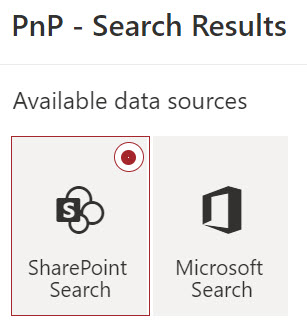

# Scenario 1: Create a simple search page

!!! note
    The PnP Modern Search Web Parts must be deployed to your App Catalog and activated on your site. See the [installation documentation](../installation.md) for details.

## Create a new SharePoint page

Any page can contain the PnP Modern Search Web Parts. For simple Search Results only, we may embed the Web Part in a page with other content, but generally we create a new page.

From the home page of you site (you must be a Site Owner), click on + New / Page.

{: .center}

Configure the page as you would any other, adding a page name.

## Add the Web Parts to the page

Click on the + where you would like to add a PnP Modern Search Web Part and type "PnP" to filter to the Web Parts.

{: .center}

Select the **PnP Search Box**.

Below the PnP Search Box, add **PnP Search Results**.

{: .center}

## Connect the Web Parts

Now you need to connect the Web Parts in their properties panes. For this simple scenario, you don't need to change any properties for the **PnP Search Box**. Click on the Configure button in the middle of the **PnP Search Results** Web Part. This will open the property pane for the Web Part.

Again, keeping things simple, click the **SharePoint Search** button.

{: .center}

At the bottom of the property pane, click Next to go to the third property panel. Turn on the **Use input query text** toggle and set the options as shown.

{: .center}

Publish the page.

At this point, you have a fully functional search page with a PnP Search Box and PnP Search Results. While this isn't all that different than what you can do with the Microsoft Search box at the top of every screen, you've laid the ground work for a more robust and customized search experience.
