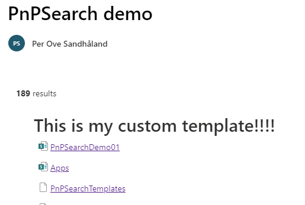

# Create your first custom template

You can make the results from a search, look like you want to by using a custom template.
This article will get you started by creating a simple custom template.

## Steps

1. Create a file
1. Add content to the file
1. Do a small change to the content.
1. Store your file in SharePoint

### Create a file

On your computer, create a file with the name: mycustomtemplate.html
!!! note
    Make sure you name the file with the extension html

Open this file in a text editor, like Notepad, VS Code or whatnot.


The file is empty, so we need to add some basic needed html code.

Copy the code below and paste it into the file and save.

```html
<content id="data-content">
  <style>
    /* Insert your CSS overrides here */
    .example-themePrimary a {
      color: {
         {
          @root.theme.palette.themeprimary
        }
      }
    }

    .myfirstcss{
        font-size: 30px;
        font-weight: 600;
    }

    .icon {
      width: 20px;
      height: 16px;
    }

    ul {
      list-style: none;
      display: flex;
      flex-wrap: wrap;
    }

    ul li {
      display: flex;
      padding: 8px;

      flex: 1 1 100%;
    }
  </style>

  <div class="template">
    {{#if @root.properties.showSelectedFilters}}
    <pnp-selectedfilters
      data-filters="{{JSONstringify filters.selectedFilters 2}}"
      data-filters-configuration="{{JSONstringify filters.filtersConfiguration 2}}"
      data-instance-id="{{filters.instanceId}}"
      data-operator="{{filters.filterOperator}}"
      data-theme-variant="{{JSONstringify @root.theme}}"
    ></pnp-selectedfilters>
    {{/if}} {{#if @root.properties.showResultsCount}}
    <div class="template--resultCount">
      <label class="ms-fontWeight-semibold"
        >{{getCountMessage @root.data.totalItemsCount
        @root.inputQueryText}}</label
      >
    </div>
    {{/if}}

    <ul class="template--custom">
      {{!-- This div below can be deleted. it is just for showing that is is
      your first template.--}}
      <div class="myfirstcss">This is my custom template!!!!</div>

      {{#each data.items as |item|}} {{#> resultTypes item=item}} {{!-- The
      block below will be used as default item template if no result types
      matched --}}

      <li>
        <pnp-iconfile
          class="icon"
          data-extension="{{slot item @root.slots.FileType}}"
          data-theme-variant="{{JSONstringify @root.theme}}"
        ></pnp-iconfile>
        <span class="example-themePrimary"
          ><a href="{{slot item @root.slots.Path}}"
            >{{slot item @root.slots.Title}}</a
          ></span
        >
      </li>

      {{/resultTypes}} {{/each}}
    </ul>
  </div>
</content>

```

You now have your first custom template!!

## Change the content of your new template file

You are going to make a small change to your template so you can check if it is working.
Find the line where the text says: `<div class="myfirstcss">This is my custom template!!!!</div>`

Change the text "This is my custom template!!!!" to "This is my first awesome custom template that rocks!!!!". Maybe you want to add your name to?

## Upload the custom template to a SharePoint library

1. Open a SharePoint site you use for development. Or create one.
2. Open Shared Documents
3. Create a folder called "PnPSearchTemplates"
4. Upload the file to this folder.

The URL to this template is:

`<siteurl>/Shared Documents/PnPSearchTemplates/mycustomtemplate.html`

Change `<siteurl>` with the URL of the site you created/are using.

Will be something like this: `https://contoso.sharepoint.com/sites/mydevsite`

You will need this when you are configuring the PnP Search Template web part.

## Test the custom template

1. Open a SharePoint site you use for development.
2. Create a new page, call it what you want and use whatever template you want (Blank is fine)
3. In a section add the *"PnP Search Results"* web part
4. Choose to configure the web part
5. Select SharePoint search
6. Make sure you get some results by typing in a search term in the Query template, like "{searchTerms} *"
7. Go to page 2
8. Select "Custom" layout
9. Under "Use an external template URL", type in the URL for the custom template file. You cannot type in a URL that does not exist, if so you get an error message.
10. Click outside the URL text box.
11. Publish the page

Did the results change layout?

**If so you have succeeded!**

### Troubleshooting

If not, check if you copied all the text into the file, and that you did not change anything else than the text.

## Pictures

Insert the URL in "Use an external template URL"


What the custom search result looks like

