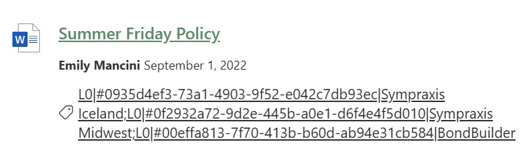
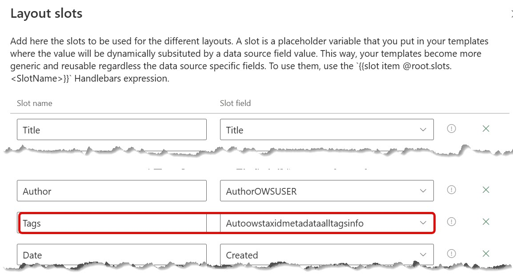

# Display managed metadata as tags

!!! note
    The PnP Modern Search Web Parts must be deployed to your App Catalog and activated on your site. See the [installation documentation](../installation.md) for details.

Displaying each result's tags in the PnP Modern [Search Results Web Part](../usage/search-results/) can enhance your search-driven experience by showing your end users which Managed Metadata values have been applied to each result. In this context, tags include _all_ the Managed Metadata values applied to the item. For this to work, those Managed Metadata columns must be:

- mapped to a Managed Property
- included in the Selected properties

An example might be a Policy Center page where you're displaying all documents which have the Policy Content Type. For those Policies, if you have Managed Metadata columns for `Applies To` and `Contact Person`, you can display those values at the bottom of each result. (If you want to display these values in a more complex way, you can also customize the layout.)

By default, no tags will be displayed unless you have selected a Ma

Here are the steps to most directly display the tags in your results.

## Select the appropriate properties

## Set the slot to enable localization

In the [Data sources](/usage/search-results/data-sources/) property panel, 

## Turn on localization

## Next steps

From here, you can customize the display, should you so desire. These steps will enable you to display Managed Metadata values without needing to alter the out of the box layout templates, which requires and additional set of skills.
