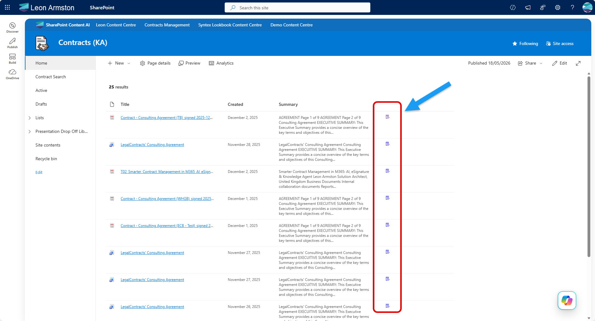
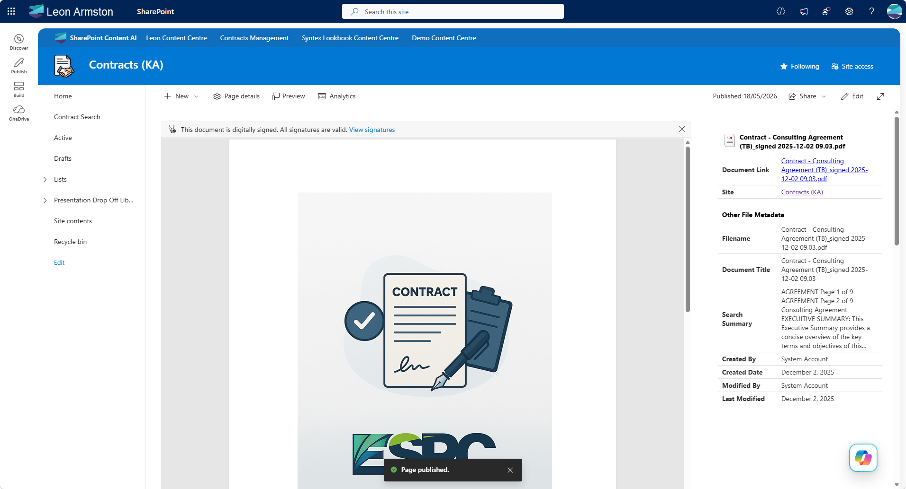

!!! note
The PnP Modern Search Web Parts must be deployed to your App Catalog and activated on your site. See the [installation documentation](../installation.md) for details.

This scenario builds a dedicated document viewer page in SharePoint that opens when a user clicks a view icon in a search results list. The viewer page displays the document in an embedded iframe alongside a metadata panel, giving users a rich in-context viewing experience without leaving SharePoint.





The solution involves two pages:

- **Document-Viewer.aspx** — a SharePoint site page hosting the Advanced IFrame web part and a PnP Search Results web part
- **Your search results page** — which gets a small view icon column added that links through to the viewer page

## Prerequisites

- The **PnP Modern Search Web Parts** must be deployed to your App Catalog and activated on your site
- The **Advanced IFrame web part** ([react-advanced-iframe](https://github.com/pnp/sp-dev-fx-webparts/tree/main/samples/react-advanced-iframe)) by [Sven Sieverding (365knoten)](https://github.com/365knoten) must be deployed to your App Catalog
- You need an existing search results page using the **DetailsList** layout. If you haven't set one up yet, follow the [Create a simple search page](create-simple-search-page.md) scenario first

---

## Part 1: Create the Document Viewer page

### Step 1: Copy the Home page

The viewer page needs to be full width without the standard modern page chrome restricting the content area. The most reliable way to achieve this is to copy your site's Home page, which already has the correct layout, and clear it out.

1. Navigate to **Site Contents → Site Pages**
2. Find your **Home.aspx** page, click the three dots next to it and select **Copy to**
3. Copy it to the same **Site Pages** library
4. Rename the copied page to `Document-Viewer.aspx`

### Step 2: Clear the page

1. Open `Document-Viewer.aspx` and click **Edit**
2. Delete all existing web parts and content from the page, leaving a clean blank canvas
3. Do not publish yet

### Step 3: Set up the page layout

The viewer page uses two sections:

1. A **single column section** for the main content area — this is where the Advanced IFrame web part will go
2. A **Vertical section** on the right hand side that spans the full page height — this is where the PnP Search Results web part will go

To set this up:

1. Add a **single column** section to the page
2. Enable the **Vertical section** on the right by clicking **+** on the right edge of the page and selecting **Add a vertical section**

### Step 4: Add the Advanced IFrame web part

In the **single column section**, add the **Advanced IFrame** web part and in the web part properties set the **IFrame URL** to:

```
{{query.ServerRedirectedEmbedURL}}
```

This tells the web part to read the `ServerRedirectedEmbedURL` value from the page query string and load it in the iframe — so each time the page is opened with a different document URL, the correct file is displayed.

### Step 5: Add the PnP Search Results web part

In the **vertical section on the right**, add a **PnP Search Results** web part and configure it as follows.

**Data Source — Query template:**

```
NormUniqueID:"{QueryString.NormUniqueID}"
```

This queries for the specific document whose `NormUniqueID` matches the value passed in the query string, so the metadata panel always shows details for the document currently open in the iframe.

**Data Source — Selected properties:**

Ensure the following managed properties are included in addition to the default managed propeties included by default when adding the web part.

- `EditorOWSUSER`
- `Filename`
- `LastModifiedTimeForRetention`

**Layouts — Layout type:**

Select **Custom** and paste the following as the inline template:

```html
<content id="data-content">

    {{#each data.items as |item|}}

        <div class="docMetadata">
            <div style="display: flex; flex-wrap: wrap; gap: 0; margin-top: 16px; border-collapse: collapse; width: 100%;">
                <!-- Header Row -->
                <div style="display: flex; flex-direction: row; flex: 1 1 100%; padding: 8px 9px; border-bottom: none; align-items: center; font-weight: bold; color: black; text-align: left;">
                    <pnp-iconfile data-extension="{{slot item @root.slots.FileType}}" data-is-container="false" data-size="32" style="margin-right: 5px;"></pnp-iconfile> {{slot item @root.slots.Filename}}
                </div>

                <!-- Data Rows -->
                <div style="display: flex; flex-direction: row; flex: 1 1 100%; padding: 4px 9px; border-bottom: 1px solid #ddd; align-items: center;">
                    <span style="font-weight: bold; padding-right: 15px; flex: 0 0 110px; text-align: left; word-wrap: break-word; white-space: normal;">Document Link</span>
                    <span style="flex: 1; color: #333; text-align: left;"><a href="{{slot item @root.slots.PreviewUrl}}" target="_blank">{{slot item @root.slots.Filename}}</a></span>
                </div>
                <div style="display: flex; flex-direction: row; flex: 1 1 100%; padding: 4px 9px; border-bottom: 1px solid #ddd; align-items: center;">
                    <span style="font-weight: bold; padding-right: 15px; flex: 0 0 110px; text-align: left; word-wrap: break-word; white-space: normal;">Site</span>
                    <span style="flex: 1; color: #333; text-align: left;"><a href="{{slot item @root.slots.SPWebURL}}" target="_blank" data-interception="off">{{slot item @root.slots.SiteTitle}}</a></span>
                </div>
            </div>
        </div>

        <div class="docMetadata">
            <div style="display: flex; flex-wrap: wrap; gap: 0; margin-top: 16px; border-collapse: collapse; width: 100%;">
                <!-- Header Row -->
                <div style="display: flex; flex-direction: row; flex: 1 1 100%; padding: 8px 9px; border-bottom: none; align-items: center; font-weight: bold; color: black; text-align: left;">
                    Other File Metadata
                </div>

                <!-- Data Rows -->
                <div style="display: flex; flex-direction: row; flex: 1 1 100%; padding: 4px 9px; border-bottom: 1px solid #ddd; align-items: center;">
                    <span style="font-weight: bold; padding-right: 15px; flex: 0 0 110px; text-align: left; word-wrap: break-word; white-space: normal;">Filename</span>
                    <span style="flex: 1; color: #333; text-align: left;">{{#if (slot item @root.slots.Filename)}}{{slot item @root.slots.Filename}}{{else}}<span style="color: #999;">No Filename detected.</span>{{/if}}</span>
                </div>
                <div style="display: flex; flex-direction: row; flex: 1 1 100%; padding: 4px 9px; border-bottom: 1px solid #ddd; align-items: center;">
                    <span style="font-weight: bold; padding-right: 15px; flex: 0 0 110px; text-align: left; word-wrap: break-word; white-space: normal;">Document Title</span>
                    <span style="flex: 1; color: #333; text-align: left;">{{slot item @root.slots.Title}}</span>
                </div>
                <div style="display: flex; flex-direction: row; flex: 1 1 100%; padding: 4px 9px; border-bottom: 1px solid #ddd; align-items: center;">
                    <span style="font-weight: bold; padding-right: 15px; flex: 0 0 110px; text-align: left; word-wrap: break-word; white-space: normal;">Search Summary</span>
                    <span style="flex: 1; color: #333; text-align: left;">{{#if (slot item @root.slots.Summary)}}{{getSummary (slot item @root.slots.Summary)}}{{else}}<span style="color: #999;">No Summary detected.</span>{{/if}}</span>
                </div>
                <div style="display: flex; flex-direction: row; flex: 1 1 100%; padding: 4px 9px; border-bottom: 1px solid #ddd; align-items: center;">
                    <span style="font-weight: bold; padding-right: 15px; flex: 0 0 110px; text-align: left; word-wrap: break-word; white-space: normal;">Created By</span>
                    <span style="flex: 1; color: #333; text-align: left;">{{#with (split (slot item @root.slots.Author) '|') as |values|}}{{values.[1]}}{{/with}}</span>
                </div>
                <div style="display: flex; flex-direction: row; flex: 1 1 100%; padding: 4px 9px; border-bottom: 1px solid #ddd; align-items: center;">
                    <span style="font-weight: bold; padding-right: 15px; flex: 0 0 110px; text-align: left; word-wrap: break-word; white-space: normal;">Created Date</span>
                    <span style="flex: 1; color: #333; text-align: left;">{{getDate (slot item @root.slots.Date) "LL"}}</span>
                </div>
                <div style="display: flex; flex-direction: row; flex: 1 1 100%; padding: 4px 9px; border-bottom: 1px solid #ddd; align-items: center;">
                    <span style="font-weight: bold; padding-right: 15px; flex: 0 0 110px; text-align: left; word-wrap: break-word; white-space: normal;">Modified By</span>
                    <span style="flex: 1; color: #333; text-align: left;">{{#with (split (slot item @root.slots.Editor) '|') as |values|}}{{values.[1]}}{{/with}}</span>
                </div>
                <div style="display: flex; flex-direction: row; flex: 1 1 100%; padding: 4px 9px; border-bottom: 1px solid #ddd; align-items: center;">
                    <span style="font-weight: bold; padding-right: 15px; flex: 0 0 110px; text-align: left; word-wrap: break-word; white-space: normal;">Last Modified</span>
                    <span style="flex: 1; color: #333; text-align: left;">{{getDate (slot item @root.slots.LastModifiedTimeForRetention) "LL"}}</span>
                </div>
            </div>
        </div>

    {{/each}}

</content>
```

**Layouts — Template slots:**

Add the following three slots in addition to the standard set:

| Slot name | Slot field |
|---|---|
| `Filename` | `Filename` |
| `Editor` | `EditorOWSUSER` |
| `LastModifiedTimeForRetention` | `LastModifiedTimeForRetention` |

### Step 6: Publish the Document Viewer page

Save and publish `Document-Viewer.aspx`. Note the full URL of the page — you will need it in Part 2.

---

## Part 2: Add the view icon column to the Search Results page

### Step 7: Add the required managed properties

On your search results page, edit the **PnP Search Results** web part. Under **SharePoint Search**, find the **Selected properties** field and ensure the following are included in addition to any you already have:

- `ServerRedirectedEmbedURL`

### Step 8: Add the view icon column

Under **Layouts → Columns**, add a new column at the end of your existing columns and configure it as follows:

- **Column display name:** enter a single space (leaving it visually blank)
- **Use Handlebar expression:** checked
- **Minimum width:** `5`
- **Maximum width:** `5`

Paste the following as the column value:

```handlebars
{{#if (eq FileType "pdf")}}
<a href="{{replace @root.context.site.absoluteUrl @root.context.site.serverRelativeUrl ''}}{{@root.context.site.serverRelativeUrl}}/SitePages/Document-Viewer.aspx?ServerRedirectedEmbedURL={{encodeURI DefaultEncodingURL}}%23toolbar%3D0&NormUniqueID={{NormUniqueID}}" style="text-decoration: none" data-interception="off" target="_blank">
    <pnp-icon data-name="EntryView" aria-hidden="true"></pnp-icon>
</a>
{{else}}
<a href="{{replace @root.context.site.absoluteUrl @root.context.site.serverRelativeUrl ''}}{{@root.context.site.serverRelativeUrl}}/SitePages/Document-Viewer.aspx?ServerRedirectedEmbedURL={{encodeURI ServerRedirectedEmbedURL}}&NormUniqueID={{NormUniqueID}}" style="text-decoration: none" data-interception="off" target="_blank">
    <pnp-icon data-name="EntryView" aria-hidden="true"></pnp-icon>
</a>
{{/if}}
```

!!! tip
    The template handles PDFs and non-PDFs differently. For PDFs it uses `DefaultEncodingURL` with `%23toolbar%3D0` appended to hide the browser PDF toolbar in the iframe. For all other file types it uses `ServerRedirectedEmbedURL` which provides the Office Online viewer URL.


---

## Part 3: Publish and test

### Step 9: Publish and test

Save and publish your search results page. Each result row will show the view icon. Click it and verify that:

- `Document-Viewer.aspx` opens in a new tab
- The document loads in the iframe on the left
- The metadata panel on the right shows the correct details for that document


!!! tip
    If the iframe shows blank, check that `ServerRedirectedEmbedURL` is included in the **Selected Properties** of your search results web part. If the metadata panel shows blank, check that `NormUniqueID` is being passed correctly in the URL and that the PnP Search Results web part on the viewer page is configured to read from the query string.

