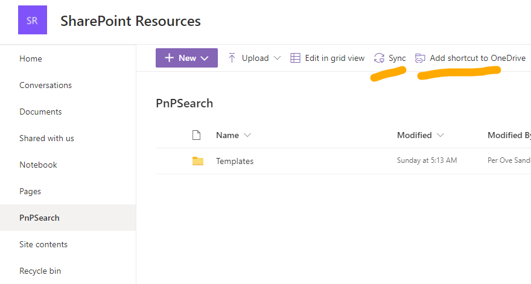

# Edit custom templates using Visual Studio Code and OneDrive

If you want to achieve the following list, dont't stop reading.

- You have a local development environment for editing you templates.
- You can see your changes as fast as you can hit the refresh button in your browser.
- You can see how the template looks in your SharePoint environment.
- You can use real search results as data.
- You can use Extensions in VSCode to make it easier to edit html files.

We are going to use Visual Studio Code (VSCode) and OneDrive to reach our goal.
You do NOT have to use VSCode, you can use any text editor you want.

If you need to install VSCode, you can get it here:

- [Visual Studio Code](https://code.visualstudio.com/download)

I guess you already have OneDrive, if not, here is the instructions to get started.

- [Sync files with OneDrive (Windows)](https://support.microsoft.com/en-us/office/sync-files-with-onedrive-in-windows-615391c4-2bd3-4aae-a42a-858262e42a49)
- [Sync files with OneDrive on Mac OS X](https://support.microsoft.com/en-us/office/sync-files-with-onedrive-on-mac-os-x-d11b9f29-00bb-4172-be39-997da46f913f)

## Steps

### Create the SharePoint environment for developing templates.

1. Setup a SharePoint site, where you want to store your templates. [Store custom templates in SahrePoint](howto-store-custom-templates-in-sharepoint.md)
2. Create a page using PnP Search Results. [Create a simple search page](create-simple-search-page.md)
3. Create a custom template and store it in SharePoint. [Create your first custom template](create-your-first-custom-template.md)
4. Configure your search web part to use the new template. (See article in step 3)

### Sync the template locally and edit using a local editor

5. Open the SharePoint site and library where you have stored your template.
6. Choose "Sync" or "Add Shortcut to OneDrive", whatever you prefer.
   
7. Open VSCode (or any other editor you prefer)
8. Open the synced folder in your OneDrive.
   1. File - Open Folder
   1. Select the folder you just synced
   1. You will now see all your templates in this folder.

9. Edit a template.
10. Save a template.
11. Wait a moment till OneDrive is finished syncing. (Should be almost instant)
12. Refresh the Browser window where you have the search web part that is using your template.

13. You should now see the change you made

14. Repeat 9 - 12, until you are happy with your awesome custom template.

### Troubleshoot

You cannot see any changes on the webpage

- Check the sync status in OneDrive
- Make a change that is noticeable
- Check if the custom template has been set as the template for the search part you are looking at.
- Did you refresh the page?
- Is your file-extension .html?
- Check the code in the template.

## Tips
In VS Code you can format the code by selecting the language mode for the document you are editing. For files with extension .HTML, they are automatically formatted by a rule set for HTML.
Since you are going to use Handlebar you should change the language mode to "Handlebars".

