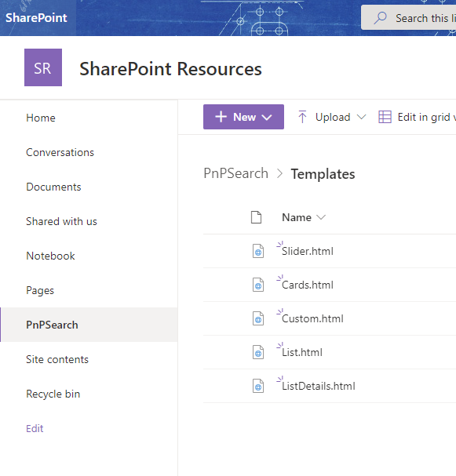

# Store custom templates in SharePoint

You can create your own custom templates. If you store them in a central repository, they can be used across PnP Search Result web parts across sites in your tenant.

Requirements for using a custom template, referenced by URL are:

- All users of the PnP Search Result web part, must be able to read those templates.
- Templates need to have their own URL.

A SharePoint site within your tenant is perfect for this scenario, because you get some additional features:

- Central repository
- Version control
- No public access
- Secure change access
- Share to others outside of your company
- Use OneDrive for sync
- Approval flows (if you want)

## 5 steps to create a central repository in SharePoint

1. Create a SharePoint site
2. Give "Everyone except externals" read access to the site
3. Create a Library
4. Create a Templates Folder
5. Add your custom templates to this folder.

Now you can reference these templates using the URL to the file.

`https://<tenantname>.sharepoint.com/sites/<sitetitle>/<libraryname>/<foldername>/<templatename>.html`

### Example for the a tenant named Contoso

| Site title          | Library name | Folder name | Template names                    |
| :------------------ | ------------ | ----------- | --------------------------------- |
| SharePointResources | PnPSearch    | Templates   | mytemplate.html, mytemplate2.html |

URLs for the templates in this example:

mytemplate.html: `https://contoso.sharepoint.com/sites/SharePointResources/PnPSearch/Templates/mytemplate.html`

mytemplate2.html: `https://contoso.sharepoint.com/sites/SharePointResources/PnPSearch/Templates/mytemplate2.html`

## Use the links in a PnP Search Results web part

1. Edit the settings for the PnP Search Results web part.
2. On page 2, under Available Layouts, choose Custom.
3. Type the URL to your custom template in "Use an external template URL.
4. Republish the page

When you edit the custom template, you just have to refresh the page where the web part is embedded to see the changes you made.

