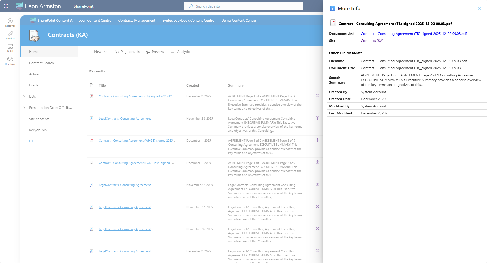

!!! note
    The PnP Modern Search Web Parts must be deployed to your App Catalog and activated on your site. See the [installation documentation](../installation.md) for details.

Search results pages are always fighting for screen (width) real estate — you want to show useful metadata but you can't add endless columns. By adding a single small icon column to your results list, users can click it to open a right-hand flyout panel that displays as much metadata as you need, without cluttering the results view.



## Prerequisites

You need a SharePoint page with a **PnP Search Results** Web Part already added and connected to a data source. If you haven't done that yet, follow the [Create a simple search page](create-simple-search-page.md) scenario first.

## Step 1: Switch the layout to DetailsList

The info panel column is added to the **Details List** search layout, which presents results as a structured list of rows and columns. If your Search Results web part is not already using this layout:

1. Edit the web part and open the property pane
2. Under **Available layouts**, select **Details List**

## Step 2: Add the required managed properties

Under **SharePoint Search**, find the **Selected properties** field and ensure the following are included in addition to any you already have:

- `EditorOWSUSER`
- `Filename`
- `LastModifiedTimeForRetention`

## Step 3: Add the required template slots

Under **Layouts → Slots**, add the following three slots:

| Slot name | Slot field |
|---|---|
| `Filename` | `Filename` |
| `Editor` | `EditorOWSUSER` |
| `LastModifiedTimeForRetention` | `LastModifiedTimeForRetention` |

!!! warning
    The slot names must match exactly as shown — they are referenced directly in the `<pnp-panel>` template in Step 4. A typo or different casing will result in those fields showing blank in the panel.

## Step 4: Add the info panel column

Under **Layouts → Columns**, add a new column at the end of your existing columns and configure it as follows:

- **Column display name:** enter a single space (leaving it visually blank)
- **Use Handlebar expression:** checked
- **Minimum width:** `5`
- **Maximum width:** `5`

Paste the following as the column value:

```html
<pnp-panel
    data-theme-variant='{{JSONstringify @root.theme}}' 
    data-is-open="false" 
    data-is-light-dismiss="true"
    data-is-blocking="true"
    data-size="3"
    data-panel-header-text="ℹ️ More Info">

    <template id="panel-open">
        <!-- All the content here will be wrapped with an onclick event opening/hiding the panel -->
        <a href="#" title="More Info" style="text-decoration: none"><pnp-icon data-name="Info12" aria-hidden="true"></pnp-icon></a>
    </template>

    <template id="panel-content">
        <!-- Panel content goes here -->

        <div class="docMetadata">
            <div style="display: flex; flex-wrap: wrap; gap: 0; margin-top: 16px; border-collapse: collapse; width: 100%;">
                <!-- Header Row -->
                <div style="display: flex; flex-direction: row; flex: 1 1 100%; padding: 8px 9px; border-bottom: none; align-items: center; font-weight: bold; color: black; text-align: left;">
                    <pnp-iconfile data-extension="{{slot item @root.slots.FileType}}" data-is-container="false" data-size="32" style="margin-right: 5px;"></pnp-iconfile> {{slot item @root.slots.Filename}}
                </div>

                <!-- Data Rows -->
                <div style="display: flex; flex-direction: row; flex: 1 1 100%; padding: 4px 9px; border-bottom: 1px solid #ddd; align-items: center;">
                    <span style="font-weight: bold; padding-right: 15px; flex: 0 0 110px; text-align: left; word-wrap: break-word; white-space: normal;">Document Link</span>
                    <span style="flex: 1; color: #333; text-align: left;"><a href="{{slot item @root.slots.PreviewUrl}}" target="_blank">{{slot item @root.slots.Filename}}</a></span>
                </div>
                <div style="display: flex; flex-direction: row; flex: 1 1 100%; padding: 4px 9px; border-bottom: 1px solid #ddd; align-items: center;">
                    <span style="font-weight: bold; padding-right: 15px; flex: 0 0 110px; text-align: left; word-wrap: break-word; white-space: normal;">Site</span>
                    <span style="flex: 1; color: #333; text-align: left;"><a href="{{slot item @root.slots.SPWebURL}}" target="_blank" data-interception="off">{{slot item @root.slots.SiteTitle}}</a></span>
                </div>
            </div>
        </div>

        <div class="docMetadata">
            <div style="display: flex; flex-wrap: wrap; gap: 0; margin-top: 16px; border-collapse: collapse; width: 100%;">
                <!-- Header Row -->
                <div style="display: flex; flex-direction: row; flex: 1 1 100%; padding: 8px 9px; border-bottom: none; align-items: center; font-weight: bold; color: black; text-align: left;">
                    Other File Metadata
                </div>

                <!-- Data Rows -->
                <div style="display: flex; flex-direction: row; flex: 1 1 100%; padding: 4px 9px; border-bottom: 1px solid #ddd; align-items: center;">
                    <span style="font-weight: bold; padding-right: 15px; flex: 0 0 110px; text-align: left; word-wrap: break-word; white-space: normal;">Filename</span>
                    <span style="flex: 1; color: #333; text-align: left;">{{#if (slot item @root.slots.Filename)}}{{slot item @root.slots.Filename}}{{else}}<span style="color: #999;">No Filename detected.</span>{{/if}}</span>
                </div>
                <div style="display: flex; flex-direction: row; flex: 1 1 100%; padding: 4px 9px; border-bottom: 1px solid #ddd; align-items: center;">
                    <span style="font-weight: bold; padding-right: 15px; flex: 0 0 110px; text-align: left; word-wrap: break-word; white-space: normal;">Document Title</span>
                    <span style="flex: 1; color: #333; text-align: left;">{{slot item @root.slots.Title}}</span>
                </div>
                <div style="display: flex; flex-direction: row; flex: 1 1 100%; padding: 4px 9px; border-bottom: 1px solid #ddd; align-items: center;">
                    <span style="font-weight: bold; padding-right: 15px; flex: 0 0 110px; text-align: left; word-wrap: break-word; white-space: normal;">Search Summary</span>
                    <span style="flex: 1; color: #333; text-align: left;">{{#if (slot item @root.slots.Summary)}}{{getSummary (slot item @root.slots.Summary)}}{{else}}<span style="color: #999;">No Summary detected.</span>{{/if}}</span>
                </div>
                <div style="display: flex; flex-direction: row; flex: 1 1 100%; padding: 4px 9px; border-bottom: 1px solid #ddd; align-items: center;">
                    <span style="font-weight: bold; padding-right: 15px; flex: 0 0 110px; text-align: left; word-wrap: break-word; white-space: normal;">Created By</span>
                    <span style="flex: 1; color: #333; text-align: left;">{{#with (split (slot item @root.slots.Author) '|') as |values|}}{{values.[1]}}{{/with}}</span>
                </div>
                <div style="display: flex; flex-direction: row; flex: 1 1 100%; padding: 4px 9px; border-bottom: 1px solid #ddd; align-items: center;">
                    <span style="font-weight: bold; padding-right: 15px; flex: 0 0 110px; text-align: left; word-wrap: break-word; white-space: normal;">Created Date</span>
                    <span style="flex: 1; color: #333; text-align: left;">{{getDate (slot item @root.slots.Date) "LL"}}</span>
                </div>
                <div style="display: flex; flex-direction: row; flex: 1 1 100%; padding: 4px 9px; border-bottom: 1px solid #ddd; align-items: center;">
                    <span style="font-weight: bold; padding-right: 15px; flex: 0 0 110px; text-align: left; word-wrap: break-word; white-space: normal;">Modified By</span>
                    <span style="flex: 1; color: #333; text-align: left;">{{#with (split (slot item @root.slots.Editor) '|') as |values|}}{{values.[1]}}{{/with}}</span>
                </div>
                <div style="display: flex; flex-direction: row; flex: 1 1 100%; padding: 4px 9px; border-bottom: 1px solid #ddd; align-items: center;">
                    <span style="font-weight: bold; padding-right: 15px; flex: 0 0 110px; text-align: left; word-wrap: break-word; white-space: normal;">Last Modified</span>
                    <span style="flex: 1; color: #333; text-align: left;">{{getDate (slot item @root.slots.LastModifiedTimeForRetention) "LL"}}</span>
                </div>
            </div>
        </div>

    </template>

</pnp-panel>
```

!!! tip
    The template above relies on the managed properties and slot names being exactly as specified in Steps 2 and 3. Once you have it working you can freely customise the panel to add, remove, or relabel any metadata fields.

## Step 5: Publish and test

Save and publish the page. Each result row will show the info icon on the right. Click it to open the panel and verify all fields appear correctly.


!!! tip
    If a field shows blank, check two things: (1) the managed property is included in the **Selected Properties** list in the Data sources panel, and (2) the slot mapping in the Layouts panel points to the correct managed property name.

