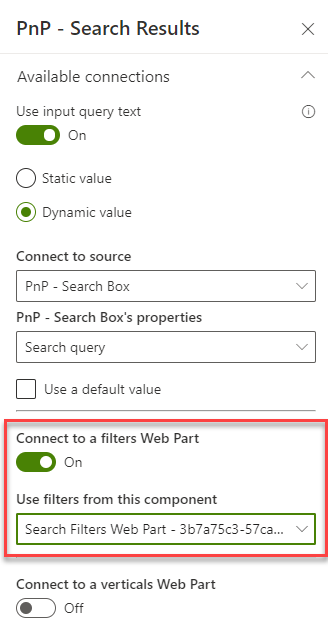

# Scenario 3: Build a page with filters

!!! note
    The PnP Modern Search Web Parts must be deployed to your App Catalog and activated on your site. See the [installation documentation](../installation.md) for details.

## Add a PnP Filters Web Part

Adding filters to your search page takes a few steps.

First, decide on your page layout. One common layout is shown below, with the PnP Search Box in a **One column** page section with a **One-third left** section below, having the PnP Filter Web Part on the left and the PnP Search Results Web Part on the right.

In the image above, you can see the PnP Filter Web Part still "wants" to be configured. This happens in two places: you must connect the PnP Filter Web Part to your PnP Search Results Web Part, and vice versa.

On panel 3 of the PnP Search Results Web Part in the **Connect to a filters Web Part** section, turn on the connection and select the PnP Filter Web Part you've added.

Next, go to the properties for the PnP Filter Web Part and connect ot the PnP Search Results Web Part.

In case you're wondering, the reason you need to make these connections in both Web Part is there are more complex scenarios the Web Parts can support, and those may require multiple connections in the two location. More about those possibilities in other scenarios.

## Add the Managed Properties to the Selected properties

Next you need to add the columns which you would like to use as filters to the PnP Search Results Web Part in the **Selected properties** (Properties panel 1). The **Selected properties** tell the PnP Search Results Web Part which values to ask the search APIs to retrieve for each result. If the value is retrieved, you can use it in your result display, but more importantly for this scenario, the PnP Filter Web Part can consume those values to provide the filter values.

In some cases, you'll use out-of-the-box columns like Created or Author (aka Created By). More often, you'll use Managed Properties you've set up in the [Set up Managed Properties](set-up-managed-properties.md) scenario.

Click on the Selected properties and check off the Managed Properties you'd like to use in your filters. Only check off the Managed Properties you'll actually use; including unnecessary Managed Properties may slow down your page, since unnecessary values will be retrieved.

## Set up the filters

Once you're retrieving the Managed Properties you want to use for filters, you need to set them up in the PnP Filter Web Part.

In the PnP Filters Web Part properties, click on the **Edit** button

In this panel, you can add each filter you'd like to provide to your users and select a template to use for displaying it. See the [PnP Filters Web Part documentation](../usage/search-filters/index.md) for the specifics.

In this example, we're setting up filters for **Created** and **Created By**. Note we are using appropriate templates based on the type of data in each Managed Property.

Save your page, and your users will now be able to filter their search results based on the filters you have chosen.
