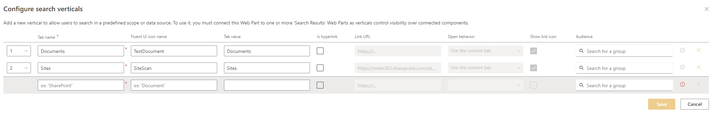
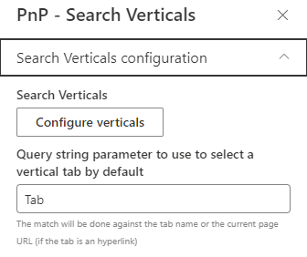
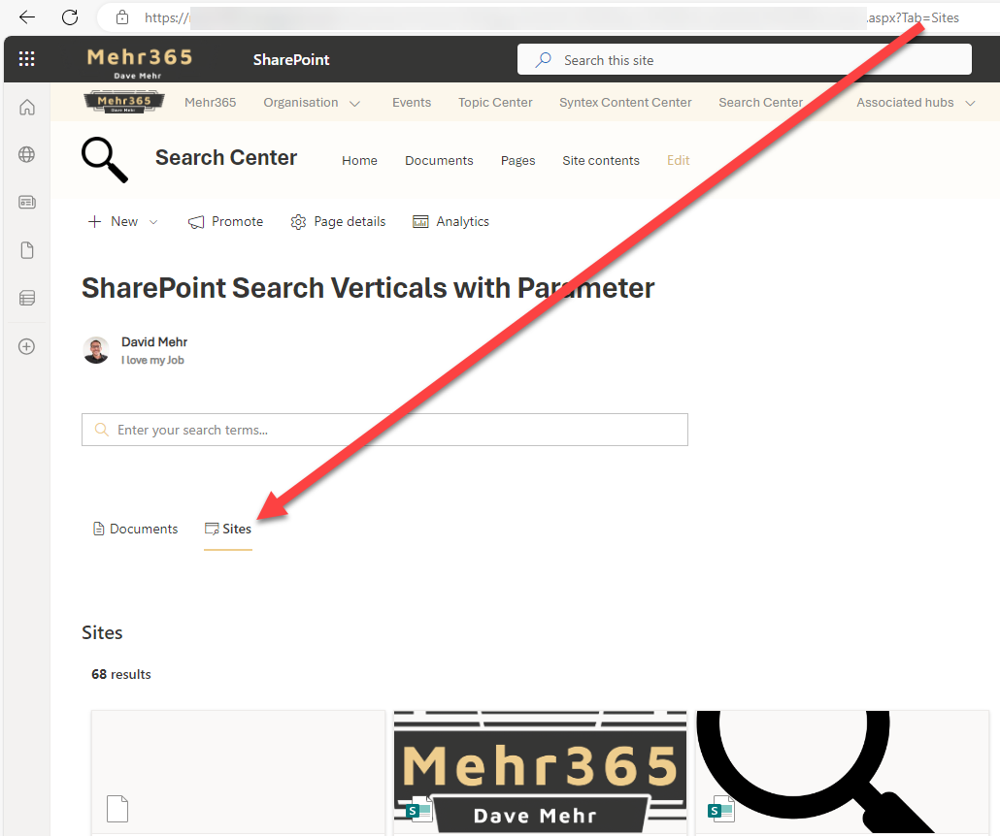

# Search verticals with query string parameter

!!! note
The PnP Modern Search Web Parts must be deployed to your App Catalog and activated on your site. See the [installation documentation](../installation.md) for details.

This scenario describes how you can use query string parameters in search verticals and how you can directly open a vertical with the query string parameter from a url.

## Create a new SharePoint page
Create a new search page and connect the results webpart with the verticals webpart.

## Configure search verticals
Configure the search verticals of your choice with not too long and a useful, clear, "Tab value". I like the icons for an better visual experience for the users.

### Configure query string paramter
By default you have a "v" as search query parameter. I like a specific, more meaningful, parameter like "tab".  

## Open verticals with query parameters
After the configuration you can add the query string parameter to the url and open the specific search vertical direct from a link in page content or from the SharePoint navigation.

Sample URL with query string parameter
https://<TENANT>.sharepoint.com/sites/<SITE>/SitePages/>SEARCH-PAGE>.aspx?Tab=Sites

