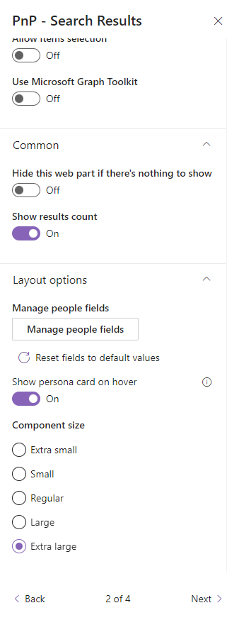

# Using the PnP Modern Search Results web part as a Department Web Part

!!! note
    The PnP Modern Search Web Parts must be deployed to your App Catalog and activated on your site. See the [installation documentation](../installation.md) for details.

Occasionally we get the request to display the members of a department on a modern SharePoint web page. Using the People Web part is out of the question as this web part only shows a static list of people, and we want the listing to show the members of the Department at any given time.
  
This scenario describes how to use the PnP Modern Search Results web part as a Department Web Part. It's a basic configuration for a useful Department web part, and you can change the many options to make it suit your needs. You can even customize the Layout template. 

## Find the unique ID for the department
The list of departments is store in the Term Store so locate the department you want to show, and note the Unique identifier.

## Create a new SharePoint page
To add the Search Web Parts, you must first create a new modern SharePoint page. We will be configure this new page as a search page with the PnP Modern Search Web Parts.

## Add PnP Search Results Web Part
On the newly created page, add the PnP Modern Search Results Web Part. 

## Configure Search Results 
Use the SharePoint Search as source. Change the <b>Result Source Id/Scope|Name</b> to LocalPeopleResults
 In the <b>Query template</b> you enter <i>owstaxIdSPShDepartment:"THE_ID_FROM_THE_TERMSTORE"</i>.  If you feel very brave you can use a query like <i>Department=Marketing</i>. The result will be the same....for now. Down the road the department will most likely change name a number of times, and each time you will have to update the query. When using the unique ID we don't have do anything.  

### Layout configuration 
There is a predefined people layout available for the people search. Use <b>People</b> as Search Results layout.

In the section Layout options you can manage the people fields, that will be showing in the results. If you would like to show a people hover card, then activate this option, but you need to activate API access for Microsoft Graph in your SharePoint admin center. Select a component size for your results.

Update the Web part title to a value of your chosing , like "Marketing", and you are done.

## Solution
After the configuration you have a useful Department web part incl. Hover card. 

