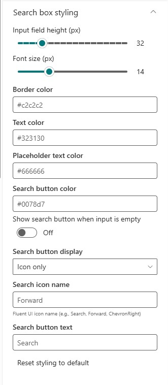
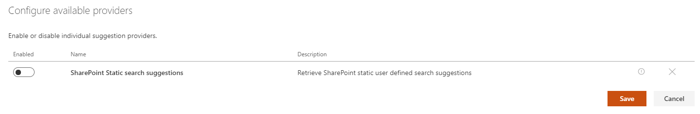

# Search box Web Part

The 'Search box' Web Part allows users to enter free text search queries connected to a 'Search Results' Web Part.

{: .center}

{: .center}

## Configuration

### Search box settings

{: .center}

| Setting | Description | Default value |
| ------- |---------------- | ---------- |
| **Placeholder text** | The placeholder text to display in the search box. | _"Enter your search terms..."_
| **Query input transformation template** | Query that will be sent to the page as URL fragment (`#`) | Search box keyword entered by the user.
| **Send the query to a new page** | Sends the search query text to a new page. From here you can select the page URL, the open behavior and send method (URL fragment '#' or a query string parameter). The input value can be transformed before sending it to another page. `{inputQueryText}` is replaced with the value from the search box and [other tokens](../search-results/tokens.md) are also supported. | False.
| **Reset query on clear** | Sends a new search query request when the search box is cleared. | False.

### Search box styling

{: .center}

The search box styling section allows you to customize the visual appearance of the search box to match your branding and design requirements.

| Setting | Description | Default value |
| ------- |---------------- | ---------- |
| **Font size** | Controls the font size (in pixels) for both the input text and search button. This provides a unified font size across the entire search box. | _14px_
| **Input field height** | The height (in pixels) of the search input field. | _32px_
| **Border color** | The border color of the search box. | _Theme primary color_
| **Border radius** | The border radius (in pixels) for rounded corners. | _2px_
| **Background color** | The background color of the search input field. | _White_
| **Text color** | The color of the text entered in the search box. | _Theme text color_
| **Placeholder text color** | The color of the placeholder text when the search box is empty. | _Theme secondary text color_
| **Search button color** | The background color of the search button. | _Theme primary color_
| **Show search button when input is empty** | Display the search button even when the search input field is empty. | False
| **Search button display** | Choose how the search button appears: Icon only, Text only, or Both (text with icon). | _Icon only_
| **Search icon name** | The Fluent UI icon name to display on the search button (e.g., Search, Forward, ChevronRight). See [Fluent UI Icons](https://developer.microsoft.com/en-us/fluentui#/styles/web/icons) for available icons. | _Search_
| **Search button text** | The text to display on the search button when using "Text only" or "Both" display modes. | _"Search"_
| **Reset styling to default** | Reset all styling options to their default values. | N/A

### Query suggestions

{: .center}

The query suggestions allows users to easily find relevant query keywords based on their entry:

{: .center}

| Setting | Description | Default value |
| ------- |---------------- | ---------- |
|**Enable query suggestions**| Enable or disable query suggestions. | False.
|**Configure available providers** | Enable or disable the suggestions providers available for this Web Part. By default, only the _"SharePoint Static search suggestions"_ is available (disabled by default). 

 To add values for this provider, refer to the following [documentation](https://docs.microsoft.com/en-us/sharepoint/search/manage-query-suggestions) (caution: it can take up to 24h for changes to take effect). Multiple providers can be enabled at once.
|**Number of suggestions to show per group**| The number of suggestions to show per group. | 10.

### Connections

{: .center}

Optionally, you can set a default query text coming from an other dynamic data source on the page. For instance, connect the search box to a page environment variable like a query string parameter. The value retrieved from a connected data source will be displayed automatically at page load in the text box if present and broadcasted to any other Web Parts connected to the search box Web Part (ex: a 'Search Results' Web Part) resulting to a cascading effect.
