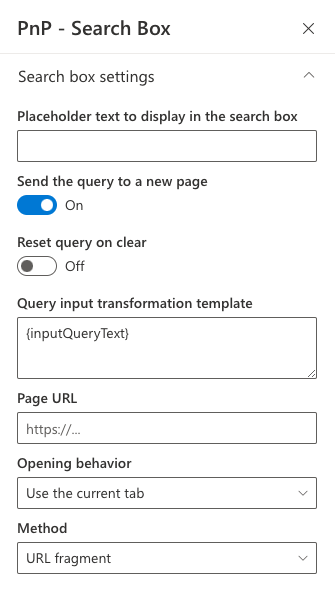

# Search box Web Part

The 'Search box' Web Part allows users to enter free text search queries connected to a 'Search Results' Web Part.

{: .center}

{: .center}

## Configuration

### Search box settings

{: .center}

| Setting | Description | Default value |
| ------- |---------------- | ---------- |
| **Placeholder text** | The placeholder text to display in the search box. | _"Enter your search terms..."_
| **Send the query to a new page** | Sends the search query text to a new page. From here you can select the page URL, the open behavior and send method (URL fragment '#' or a query string parameter). The input value can be transformed before sending it to another page. `{inputQueryText}` is replaced with the value from the search box and [other tokens](../search-results/tokens.md) are also supported. | False.

### Query suggestions

{: .center}

The query suggestions allows users to easily find relevant query keywords based on their entry:

{: .center}

| Setting | Description | Default value |
| ------- |---------------- | ---------- |
|**Enable query suggestions**| Enable or disable query suggestions. | False.
|**Configure available providers** | Enable or disable the suggestions providers available for this Web Part. By default, only the _"SharePoint Static search suggestions"_ is available (disabled by default). 

 To add values for this provider, refer to the following [documentation](https://docs.microsoft.com/en-us/sharepoint/search/manage-query-suggestions) (caution: it can take up to 24h for changes to take effect). Multiple providers can be enabled at once.
|**Number of suggestions to show per group**| The number of suggestions to show per group. | 10.

### Connections

{: .center}

Optionally, you can set a default query text coming from an other dynamic data source on the page. For instance, connect the search box to a page environment variable like a query string parameter. The value retrieved from a connected data source will be displayed automatically at page load in the text box if present and broadcasted to any other Web Parts connected to the search box Web Part (ex: a 'Search Results' Web Part) resulting to a cascading effect.
