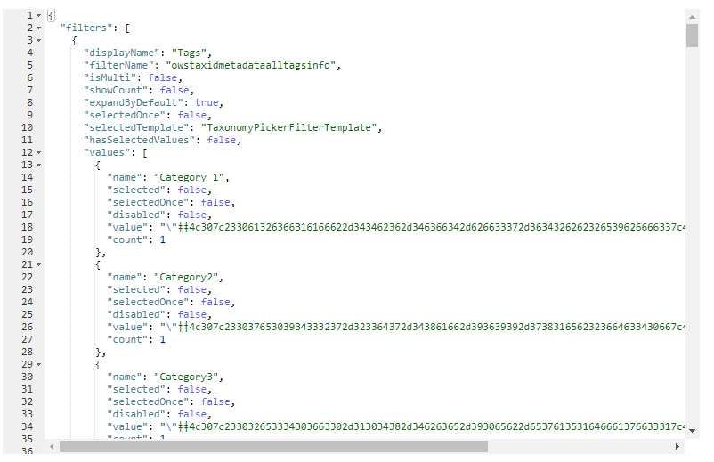

The 'debug' layout allows you to see all relevant data used by filter templates during render.

{: .center}

The template context object exposes the following properties:

```json
{
    "filters": "<Current filters to display in the UI (selected/unseslected)>",
    "selectedFilters": "<The current submitted filters>",
    "instanceId": "<The Web Part instance ID>",
    "theme": "<Current theme variables>",
    "strings": "<Localized strings that can be used in the Web Part>",
    "selectedOnce": "<Flag indicating if a filter value has been selected at least once by the use>",
    "properties": "<The filter Web Part properties>"
}
```


