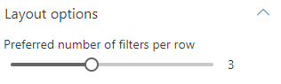

Display filters as an horizontal bar. For instance, it fits nicely with 'Combo' filter templates.

{: .center}

#### Layout options

{: .center}

| Setting | Description | Default value 
| ------- |---------------- | ----------
| **Preferred number of cards per row** | Specifiy the **preferred** number of filters to display per row **when the required width space is available**. The Web Part will always adjust the number of possible filters to display depending the available width. It means that if you set this value to '3' but you display the Web Part in small column, only 1 filter will be displayed. | 3.