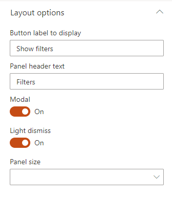

Display filters as an side panel. Useful to gain space on the page.

{: .center}

#### Layout options

{: .center}

| Setting | Description | Default value 
| ------- |---------------- | ----------
| **Button label to display** | The label to display to open the panel. | "Show filters".
| **Panel header text** | The label to display to in the panel header. | "Filters".
| **Modal** | If enabled, the panel will be modal (you can't select elemtns outside the panel). | True.
| **Light dismiss** | If enabled, dismiss the panel when click outside. | True.
| **Panel size** | The filter panel size to display. | Small (right).