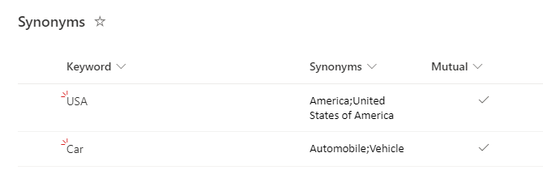
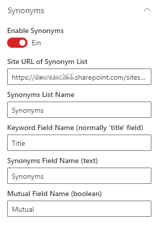

Synonyms functionality/configuration is available for both SharePoint Search and Microsoft Search data sources.

If this function is enabled, the query terms are expanded with synonyms configured in an external SharePoint list.
Depending on a 'mutual' flag the synonyms are expanded in one direction only (keyword --> synonyms) or mutual (keywords <--> synonyms <--> synonyms).

The synonyms are managed in an external SharePoint list which need the following requirements/columns (the column names are not fixed, you have to specify them in the configuration):

| Field Name | Type | Description | Default value |
| --------| ----------- | ---------------|---------------|
|**Keyword** | Text | The main keyword for the synonyms. This is typically the 'Title' field of the list.
|**Synonyms** | Multiline Text | All synonyms separated by semicolon (;)
|**Mutual** | Boolean | Flag how synonyms should be expanded (false: unidirectional, true: mutual)| true

{: .left}

**All users which have access to the search center/page will also need to have read access to the synonyms list.**

**Mutual means bidirectional expansion between the keyword and among ALL synonyms! If you want only bitdrectional expansion between keyword and one synonym you have to configure separate entries for each combination.**

**Multiple synonyms are separated by semicolon (;). Multiple word synonyms are handled/expanded as standing terms.**

Example: USA;United States of America;America --> ('United States of America' will be handled as "United States of America")

To enable the synonym functionality/expansion you have to configure the following settings ind the webpart config:

| Setting | Description | Default value |
| --------| ----------- |---------------|
|**Enable Synonyms** | Enables or disables the synonyms feature/expansion.|off
|**Site URL of Synonym list** | The URL of the site where the synonyms list is stored.
|**Synonyms List Name** | Name of the synonyms list (technical name).
|**Keyword Field Name** | Name of the field which contains the keyword (technical name)|This is typically the 'Title' field of the list.
|**Synonyms Field Name** | Name of the field which contains the keyword (technical name).
|**Mutual Field Name** | Name of the field which contains the unidirectional/mutual flag (technical name).

{: .left}