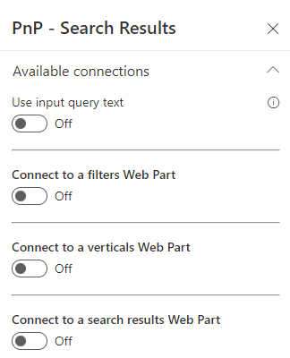
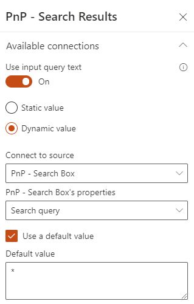
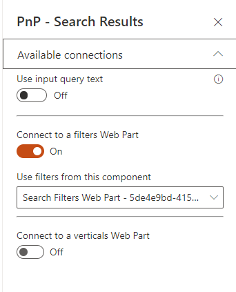

# Connections

The 'Search Results' Web Part can be used alone but also connected to other Web Parts:

{: .center}

## Input query text

The input query text can be either static or dynamic. In all cases, this value can be used using the `{inputQueryText}` token. See [tokens](../tokens.md) for more information.

**Static value**

It corresponds to a free text keywords that you want to pass to your data source:

{: .center}

This value will be applied **every time** to your data source.

**Dynamic value**

You can connect a dynamic value from the page environment (ex: a query string parameter, the top bar search box, etc.) or a search box already added to the page.

{: .center}

Optionaly, you can set a default query text **when there is no value for the connected source** (ex: an empty search box at page load). 

## Filters Web Part

{: .center}

## Verticals

{: .center}

When you connect the Web Part to a Verticals one, you must specify on which vertical the Web Part content should be displayed.

{: .center}

This mechanism allows to build a complete search center using verticals tabs. 