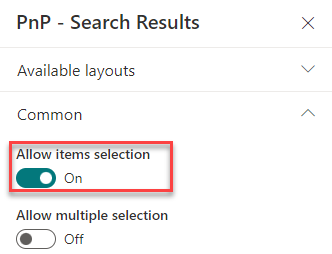
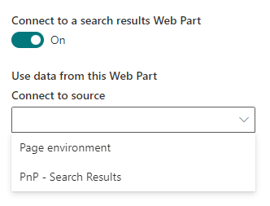
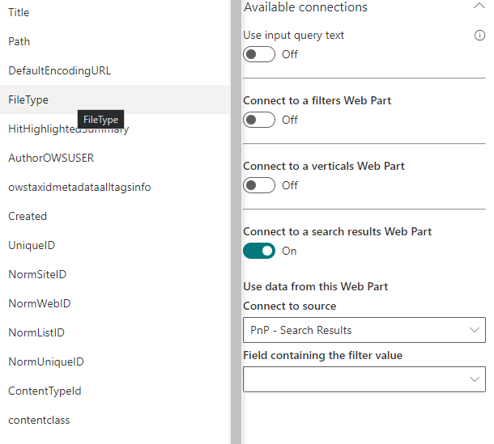
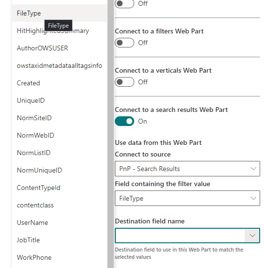
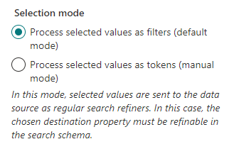
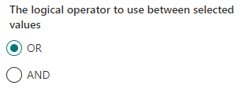

### How to configure item selection?

#### Source Web Part configuration

1. In a Search Results Web Part where you want to select items from, go to the second property pane configuration page and enable the **Allow item selection** flag:

{: .center}

2. Specify if you want to allow only single or multi selection.
3. Make sure some results are displayed in the Web Part by setting a default query.

#### Target Web Part(s) configuration

1. In a Search Results Web Part where you want to filter values, go to the third configuration page and enable the **Connect to a data results Web Part** flag. 

3. From here, select the previous Web Part as source.

    {: .center}

3. Select the **source** field to use as filter value.

    {: .center}

    !!! note
        If you don't see any fields in the dropdown list after selection a source Web Part, it could be because:

        - The source Web Part doesn't have any results displayed yet so we can't guess what are the available exposed fields. In this case, you can either type the field name **manually** in the dropdown and press 'Enter' or display results in the source Web Part to list all its available fields.
        - The source Web Part doesn't allow item selection. In this case, you can't add any field.

4. Select the **destination** field to filter the current Web Part results.

    {: .center}

    !!! note
        If you don't see any fields in the dropdown list for target fields, it is because the Web Part doesn't display any result yet. In this case, you can either type the field name **manually** in the dropdown and press 'Enter' or display results in the source Web Part to list all available fields.

5. Select the selection mode.

    {: .center}

    !!! note
        - **Process values as filters**: the values will be sent as regular filters, just like they were selected in the <i>Search Filters</i> Web Part. In this mode, the selected source field **must be a valid filter for the current data source**. For instance if the data source is SharePoint Search or Microsoft Search, the field **must be a valid refinable managed property**. 
        - **Process values as tokens**: the values will be sent manually in the data source query using token `{filter.source_field.valueAsText}` to craft a valid query. This scenario can be useful for instance if:
            - You use SharePoint Search or Microsoft Search data sources and you don't want to use a Refinable managed property as filters.

        **Examples**

        _SharePoint Search KQL (Single Value)_
        
        `Title:{filters.Title.valueAsText}`  will be translated to `Title:docx`

        _SharePoint Search KQL (Multi Values)_  
        **OR condition**: `{|Title:{filters.Title.valueAsText}}` will be translated to `(Title:docx) OR (Title:pdf)...`  
        **AND condition**: `{&Title:{filters.Title.valueAsText}}` will be translated to `(Title:docx) AND (Title:pdf)...`   

6. Select the logical operator to use between selected filter values if applicable (default mode only).

    {: .center}

!!! info "Filtering general behavior"

- If the source selected item field is `null` ou `empty`:
    * It will be replaced by the FQL expression `string('')` expression if the mode is **Process values as filters**
    * It will be resolved as an empty string if the mode is **Process values as tokens**.
- Duplicate values are trimmed (ex: user select items with the same filter values).
- Filter values should be 'string' values. All other types will be ignored (ex: 'objects' from JSON response).
