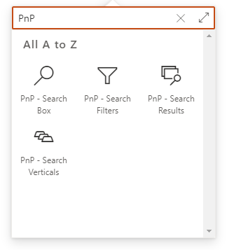

# Search Results Web Part

The _'Search Results' Web Part_ is the fundamental building block of whole global solution. Its purpose is basically to get data from a specifc source and render them in a specific native or custom layout based on Handlebars and web components.

This Web Part can be used **alone** or **connected to other Web Parts** to add dyanmic interactions (filters, search box or verticals). To use the Web Part on a SharePoint page:

1. Edit your SharePoint modern page.
2. Search for the _'PnP - Search Results'_ Web Part and add it to your page:

{: .center}

{: .center}

## Configuration

The search results Web Part configuration is divided into four parts each corresponding to a property pane page:

1. [**Data source**](./data-sources/index.md): From where to retrieve the data. Includes the [slots configuration](./slots.md) and [tokens usage](./tokens.md).
2. [**Layouts**](./layouts/index.md): How to render them.
3. [**Connections**](./connections/index.md): How the Web Part will be connected to others in the page.
3. [**Extensibility**](../../extensibility/index.md): How the Web Part will be connected to others in the page.