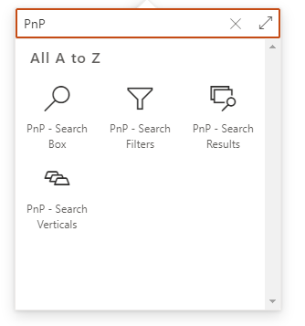
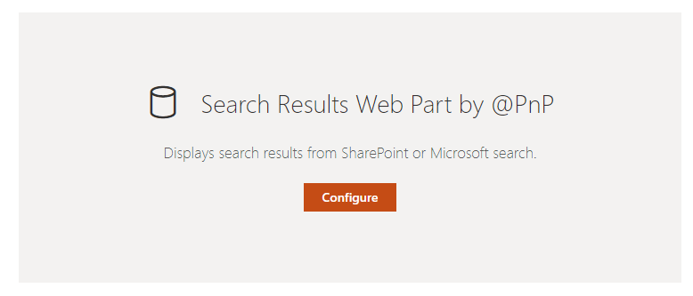

# Search Results Web Part

The _'Search Results' Web Part_ is the fundamental building block of whole global solution. Its purpose is basically to get data from a specifc source and render them in a specific native or custom layout based on Handlebars and web components.

This Web Part can be used **alone** or **connected to other Web Parts** to add dyanmic interactions (filters, search box or verticals). To use the Web Part on a SharePoint page:
1. Edit your SharePoint modern page.
2. Search for the _'PnP - Search Results'_ Web Part and add it to your page.

{: .center}

{: .center}

### Which version to choose: _'PnP - Search Results'_ vs _'PnP - Search Rollup'_

Two preconfigured variants of this Web Part are available in the Web Part picker. They share the **same codebase, features, layouts, data sources and configuration options** — they differ only in how SharePoint loads them on the page.

| Variant | When to use it | Behavior on the page |
| --- | --- | --- |
| **PnP - Search Results** | You **might want to connect this Web Part to other Web Parts** on the same page (a Search Box, Search Filters, Search Verticals, or another Search Results for dynamic filtering / item selection). Connections are optional — you can leave them unconfigured — but the Web Part remains *able* to participate in them. | Registers as a SharePoint dynamic data source/consumer as soon as the page loads, so it must be initialized eagerly — its bundle is downloaded and its data source query is issued during the page's initial load, even if the Web Part is far below the fold. |
| **PnP - Search Rollup** | You are using the Web Part **standalone** — typically a content roll-up (latest news, recent documents, page hit highlights, etc.) where you know it will not need to react to or feed any other Web Part, and you do not need to drive the query from a SharePoint page-environment value (URL fragment, query-string parameter, page search query, etc.). | Opts out of dynamic data connections (`allowWebPartConnections: false`). This lets SharePoint **defer-load the Web Part** until it actually scrolls into the viewport, so its JavaScript bundle, dependent chunks and underlying search query are not fetched at all on initial page load. |

#### Why this matters for performance

SharePoint Framework only defer-loads a Web Part when it is certain no other component will try to read from it. As soon as a Web Part registers itself as a dynamic data source/consumer, SPFx is forced to initialize it eagerly on page load to make the connection available — defeating any below-the-fold lazy-loading optimization.

The _'PnP - Search Rollup'_ variant exists precisely to opt out of that registration. The practical impact on a page with a roll-up below the fold:

- The Web Part's JavaScript bundle and its dependent chunks (data source, layout, templating engine, etc.) are **not downloaded** until the user scrolls the rollup into view.
- The data source query (SharePoint Search, Microsoft Search, etc.) is **not executed** on initial page load — saving an API round-trip, search throttling capacity and bandwidth for every visitor who never scrolls to it.
- Initial page render, Largest Contentful Paint and Total Blocking Time all improve, because the page no longer waits on (or competes with) the roll-up's resources during the critical load phase.

#### What the Rollup variant can and cannot consume

It's important to distinguish two very different ways the Web Part can be parameterized at runtime — only one of them is disabled by the rollup variant:

| Input mechanism | Where it's configured | Works in _Search Results_ | Works in _Search Rollup_ | Why |
| --- | --- | --- | --- | --- |
| **SPFx dynamic data — other Web Parts** (Search Box, Filters, Verticals, dynamic filtering / item selection) | _Connections_ property-pane page | ✅ Yes | ❌ No | Requires registering as a dynamic data source/consumer; SPFx must initialize the Web Part eagerly to wire the connection. |
| **SPFx dynamic data — page environment** (URL fragment binding, `?param=` binding via the dynamic property picker, `PageContext:SearchData:searchQuery`) | _Connections_ → "Use input query text" → _Dynamic value_ | ✅ Yes | ❌ No | Same reason — these are SPFx dynamic data sources too. |
| **Tokens** in Query text, Query template, refiners, sort, etc. — including `{QueryString.<name>}`, `{Page.<field>}`, `{Site}`, `{User.<prop>}`, date tokens, `{Me}`, … | Wherever the property pane accepts a value | ✅ Yes | ✅ Yes | Tokens are resolved by the built-in `TokenService` at render time directly from `window.location.href`, the page context and the current user — they do **not** go through SPFx dynamic data, so the Rollup's lazy-load benefit is preserved. |

> **TL;DR:** The Rollup variant gives up SPFx **Web Part connections** and SPFx **dynamic page-environment bindings**, but it keeps the full **token system** — including `{QueryString.q}`, `{QueryString.dept}`, etc. So a URL-driven search results page (`?q=foo`, `?category=news`, …) still works perfectly with the rollup variant — just use a token instead of a dynamic property binding. See [Tokens](./tokens.md) for the full list.

If you later decide a roll-up needs to be connected to a filter or search box, simply switch to the _'PnP - Search Results'_ variant — all properties and templates are compatible. While you are editing a _'PnP - Search Results'_ Web Part that is not connected to anything on the page, the Web Part will also surface an inline warning suggesting you switch to the rollup variant.

## Configuration

The search results Web Part configuration is divided into four parts each corresponding to a property pane page:

1. [**Data source**](./data-sources/index.md): From where to retrieve the data. Includes the [slots configuration](./slots.md) and [tokens usage](./tokens.md).
2. [**Layouts**](./layouts/index.md): How to render them.
3. [**Connections**](./connections/index.md): How the Web Part will be connected to others in the page.
4. [**Extensibility**](../../extensibility/index.md): How the Web Part will be connected to others in the page.

## Styling

### Results styling

The results styling section allows you to customize the visual appearance of the results container to match your branding and design requirements.

| **Setting** | **Description** | **Default value**
|------------|---------------- | ----------
| **Results background color** | The background color of the results container. | _Transparent_
| **Results border color** | The border color of the results container. | _Theme primary color_
| **Results border thickness** | The thickness of the results container borders (in pixels). | _1px_
| **Reset styling to default** | Reset all styling options to their default values. | N/A

### Web part title styling

The title styling section allows you to customize the visual appearance of the web part title and configure an optional action link on the right side of the title row. By default, the title follows the current SharePoint theme styling. Font family, font size, and font color can be overridden in the web part settings.

| **Setting** | **Description** | **Default value**
|------------|---------------- | ----------
| **Title font** | The font family to use for the web part title. | _Segoe UI_
| **Title font size** | Controls the font size (in pixels) for the web part title. | _16px_
| **Title font color** | The color of the web part title text. | _Theme primary color_
| **Show title** | Shows or hides the title row for the Search Results web part. | _On_
| **See all text** | The action text displayed on the right side of the title row. | _Empty_
| **See all URL** | The destination URL for the action link. | _Empty_
| **Open in new tab** | Opens the action link in a new browser tab. | _Off_
| **Reset title styling to default** | Reset all title styling options to their default values. | N/A

## Common Settings

These settings are available across all PnP Modern Search web parts:

- [**Audience Targeting**](./common/audience-targeting.md): Control web part visibility based on user group membership.
- [**Paging**](./common/paging.md): Configure pagination for data display.
