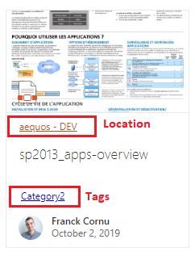
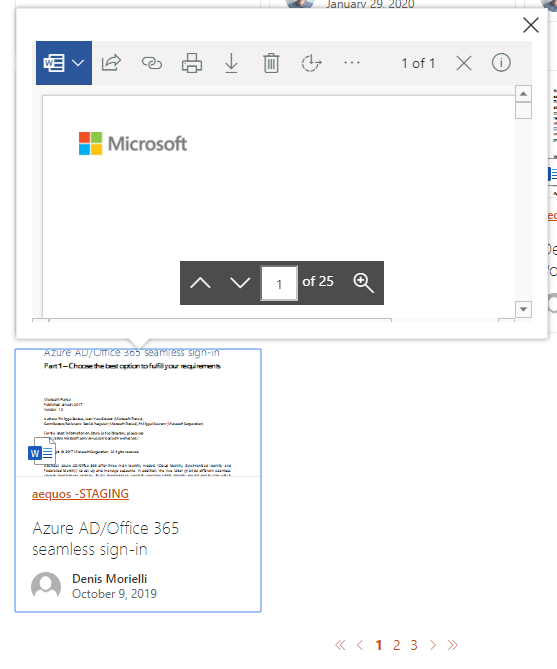

The 'cards' layout allows you to display items as tiles, just like the native 'Highlighted Content' SharePoint Web Part.

{: .center}

| Setting | Description | Default value 
| ------- |---------------- | ---------- |
| **Manage card fields** | Allows you to define you own values for card placeholder fields. By default, the document card fields come with predefined mappings but you can set your own. 

 As a field value, you can choose either a field property value (from the list or as free text) and without any transformation or use an Handlebars expression by clicking on the checkbox next to it. In this case, all helpers from the main template are available. Also, if the field doesn't have the **'Allow HTML'** indication flag enabled, it means the value will be always interpreted as text, regardless if you set an HTML value. Otherwise, your value will be interpreted as HTML for those fields (ex: '_Location_' and '_Tags_' placeholder fields). For HTML fields you can use the special variable `@root.theme` to use theme colors (ex: `@root.theme.palette.themePrimary`) or `@root.slots.<SlotName>` to access slot value. If you don't set a value for those fields (i.e an empty value), they won't appear in the UI: 

.
| **Enable result preview** | If enabled, display a callout with an interactive preview of the document based on the value specified value for the `PreviewUrl` current data source [slot](../slots.md).  

 | False.
| **Show file icon** | Hide or display the file icon for the result card. The file icon is determined using the `FileType` [slot](../slots.md). | True.
| **Compact mode** | Display cards as compact. | False.
| **Preferred number of cards per row** | Specifiy the **preferred** number of cards to display per row **when the required width space is available**. The Web Part will always adjust the number of possible tiles to display depending the available width. It means that if you set this value to '3' but you display the Web Part in small column, only 1 tile will be displayed. | 3.
