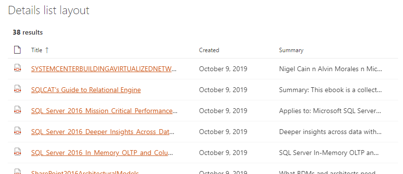

The 'details list' layout allows you to display items as a structured list, the same way as a SharePoint document library or list.

{: .center} 

| Setting | Description | Default value 
| ------- |---------------- | ---------- |
| **Manage columns** | Allows you to build you own table view by adding or removing columns dynamically. For each column, you get the following options: 

<ul><li>**Sort order**: the order of the column in the table.</li><li>**Column name**: the column friendly name to display.</li><li>**Column value**: you can choose here either a field from the data source current results set (from the list or as free text) without any transformation or use an Handlebars expression by clicking on the checkbox next to it. In this case, all Handlebars helpers from the main template are available and you can also add you own HTML markup in the column value. For HTML fields you can use the special variable `@root.theme` to use theme colors (ex: `@root.theme.palette.themePrimary`). You can specify a different field for sorting when using an Handlebars expression by specifying the field from the separate dropdown.   </li><li>**Minimum width in px**: the minimum width of the column in pixels.</li><li>**Maximum width in px**: the maximum width of the column in pixels.</li><li>**Sortable**: allows you to sort column values according to the **data source sort settings**. It means you must first configure the sort setting at data source level with option _'User sort'_ to `true` to see them in the details list columns configuration. Sort is perfromed one column at a time.</li><li>**Resizable**: allows you to resize the column dynamically in display mode.</li><li>**Multiline**: if the column column should be multiline. By default only ellipsis (...) will be display for larger text.</li></ul>
| **Show file icon** | Hide or display the file icon in the first column.
| **Compact mode** | Display the details list in compact mode.
| **Enable grouping** | Display a grouped list, grouped by the specified column.
| **Enable sticky header** | Display the details list with a sticky header that will stay in place when scrolling. Specify the desired height for the view (in pixels) and then specify the desired items per page in _Number of items per page_ under _Paging options_ and all items on the page will be scrollable within the view.
| **Enable download** | Enable download of selected files. Requires _Allow items selection_ to be enabled and supports both single and multiple selection. If single selection is enabled the selected file will be downloaded as is. If multiple selection is enabled the selected files and folders will be downloaded in a single zip file like in SharePoint document libraries. Requires _SPWebUrl_, _ContentTypeId_, _NormListID_ and _NormUniqueID_ to be selected in _Selected properties_.