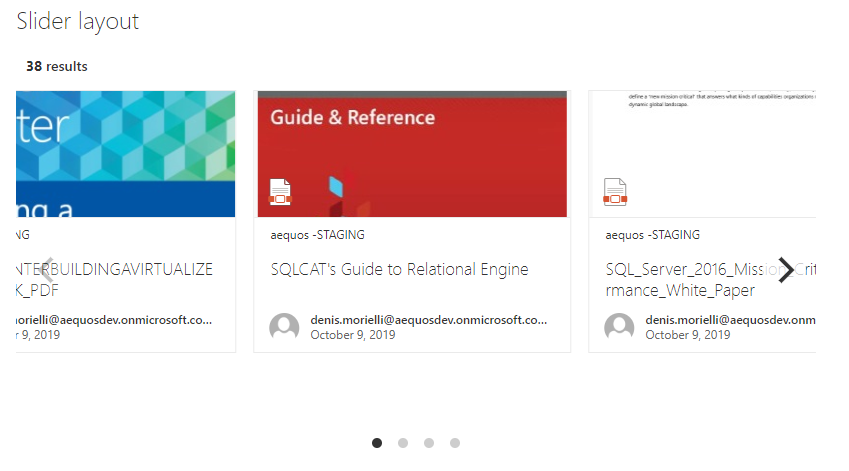

The 'slider' layout allows you to display data as as dynamic slider (i.e caroussel).

{: .center} 

| Setting | Description | Default value 
| ------- |---------------- | ---------- 
| **Auto play** | If enabled, slides move automatically every X seconds. | True.
| **Auto play duration** | Move elements every X seconds. | 3 seconds.
| **Pause on hover** | If enabled, pause the slider on mouse hover. | True.
| **Number of elements to group together in slides** | Groups cells together in slides. | 3.
| **Show page dots** | Enable or disable slider navigation. You can adjust the dots position by updating the `.flickity-page-dots` CSS class. | True.
| **Infinite scrolling** | Enable or disable infinite scrolling on the carousel. | False.
| **Slide height (in px)** | Dynamically set the slides height to adjust your results. | 360px.
| **Slide width (in px)** | Dynamically set the slides width to adjust your results. | 318px.