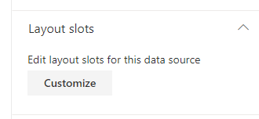
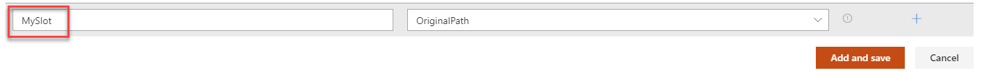

The _'slots'_ are a very important part of this solution and their use becomes very handy when it comes to create your own layouts. The slots feature is available for all data sources, including builtin and custom ones.

{: .center}

#### What is a 'slot'?

> A slot is a mapping between a data source specific field and a placeholder variable used in layout templates.

To illustrate this concept, here are a single card from the 'Cards' layout. You can see how slots apply to the UI:

{: .center}

Slot definitions will be replaced dynamically by the underlying field values you specified in the mappings list. In the end, from a template perspective, an URL is an URL regardless of the source. Slots are used individually depending of the requirements of the chosen layout. 

#### Why I would need them?

They allow you to get your data source (custom or builtin) work with all templates without the need of refactoring them and to adapt your data source specific fields. **Basically, it is a convenient, time saving feature making your templates reusable**.

#### Builtin slots

Here are all the builtin slots the solution provides. 

> Data sources may or may not define all these slots depending the nature of the source.

| Slot name | Description |
| --------- | ----------- |
| **Title** | Typically the title of an item in results.
| **Path**  | The absolute URL of an item. 
| **Summary** | A short description of the item.
| **Date** | A date associated to the item. Can be for instance, the created date, modified date or publishing date.
| **FileType** | The file type. This can be an extension (ex: `docx`) or the complete path of the item including the file extension (ex: `https://mycompany.sharepoint.com/sites/mysite/Shared Documents/MyFile.pdf`). This slot is mainly used to retrieve the correct file icon for the item.
| **PreviewImageUrl** | The image thumbnail URL to display for an item. You can use the builtin `AutoPreviewImageUrl` field here to get a default image if applicable.
| **PreviewUrl** | Same as preview image URL but for the interactive preview of the item (ex: a Word document). You can use the builtin `AutoPreviewUrl` field here to get a default image if applicable. In this case, the Web Part will use a generic Microsoft Graph URL to generate the preview. More information on [supported file types](https://support.microsoft.com/en-us/office/file-types-supported-for-previewing-files-in-onedrive-sharepoint-and-teams-e054cd0f-8ef2-4ccb-937e-26e37419c5e4).
| **Author** | An author associated to the item.
| **Tags** | Tags associated to the item. Can be for instance taxonomy terms.
| **SiteId** | The SharePoint site ID associated to the item. With `ListId` and `ItemId` this value is used to generate the preview URL.
| **ListId** | The SharePoint site ID associated to the item. With `SiteId` and `ItemId` this value is used to generate the preview URL.
| **ItemId** | The SharePoint site ID associated to the item. With `ListId` and `SiteId` this value is used to generate the preview URL.
| **IsFolder** | Indicate if the current item is a folder. The value here should be a true/false value or 0/1.
| **PersonQuery** | Used for the people layout to get information about the current user dynamically. More info [here](https://docs.microsoft.com/en-us/graph/toolkit/components/person).
| **UserDisplayName** | Used by the people layout to display the user name.
| **UserEmail** | Used by the people layout to display the user email.

> A slot can be empty.

#### Define your custom slots

In addition to builtin ones, you can add your own slots and use them in layouts. To do so, first add your slot in the list:

And then use it in your templates using the following Handlebars expression:

    {{slot item @root.slots.<SlotName>}}

 - `slot`: The Handlebars helper name.
 - `item`: The current item containing the field value.
 - `@root.slots.<SlotName>`: The corresponding slot mapping name (ex. `@root.slots.Path` to the URL). 

The slot value will be processed a string in your template.