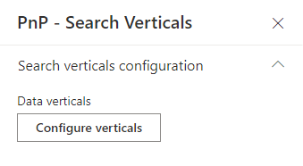

# Search Verticals Web Part

The 'Verticals' Web Part allows to conditionally render a 'Search Results' Web Part according to the selected vertical. It is a simple way to build a complete search center including multiple sources.

{: .center}

## Configuration

The configuration of the 'Verticals' Web Part is fairly simple.

{: .center} 

### Configure verticals

The options for a vertical are as follow:

| **Setting** | **Description** |
|------------|-----------------|
| **Tab name** | The vertical name (i.e. tab) |
| **Tab value** | The vertical value that will be sent to connected 'Search Results' Web Parts. You can use this value using the `{verticals.value}` token. See [tokens](../search-results/tokens.md) for more info. |
| **Fluent UI Fabric icon name** | The optional Fluent UI icon to display for the tab. Refer to [Fluent UI Fabric documentation](https://developer.microsoft.com/en-us/fluentui#/styles/web/icons) to see all available icons. |
| **Is hyperlink** | If checked, the tab will behave as an hyperlink meaning it won't trigger any selected event. |
| **Link URL** | If the tab is an hyperlink, the link URL to use. Tokens `{<TokenName>}` are supported here. See [tokens](../search-results/tokens.md) for more info. |
| **Open behavior** | If the tab is an hyperlink, the opening behavior (new tab or current tab). |
| **Show link icon** |  If the tab is an hyperlink, display or hide an icon next to the tab name indicating the tab is a link (same page or external). |
| **Audience** | Microsoft Entra ID (Azure AD) security groups that this vertical will be visible to. If left empty the vertical will be visible for all users. See note below about limitations. |

### Per-Vertical Audience Targeting

The per-vertical audience targeting allows you to show or hide individual vertical tabs based on Microsoft Entra ID (Azure AD) security group membership.

cat /Users/miksvenson/repos/pnp/pnp-modern-search-v4/docs/usage/search-verticals/index.md! note "Limitations"
    The per-vertical audience picker **only supports Microsoft Entra ID security groups**. It does not support SharePoint groups or individual users. If you need to target SharePoint groups or users, use the web part level audience targeting instead.

**Requirements:**

- At least `User.Read.All` and `GroupMember.Read.All` permissions for the SharePoint Online Client Extensibility Web Application Principal
- Or `Directory.Read.All` permission

**How it works:**

1. In the verticals configuration panel, use the Audience picker to select one or more Entra ID security groups
2. Users who are members of **any** selected group will see the vertical tab
3. Users who are not members of any selected group will not see the tab
4. If no audience is configured, the vertical is visible to everyone
5. In Edit mode, all verticals are visible regardless of audience settings

## Web Part Level Audience Targeting

You can also control the visibility of the **entire verticals web part** based on user group membership. This is 
**Requirements:e per-vertical audience targeting that controls individual tab visibility.

The web part level targeting supports:

- SharePoint groups
- Microsoft Entra ID (Azure AD) security groups  
- Individual users

See [Audience Targeting](../search-results/common/audience-targeting.md) for details on configuring web part level audience targeting.
