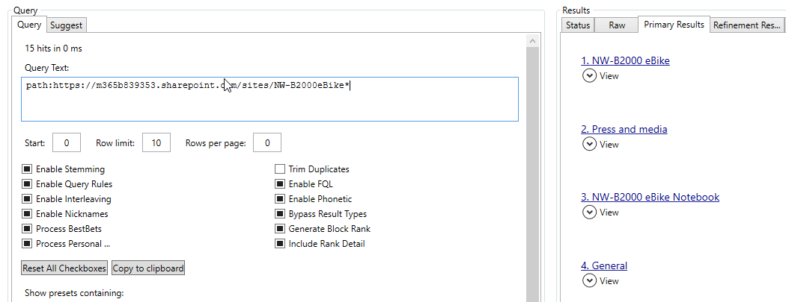
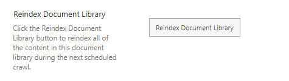

<h1>Please verify your issue using these tools and methods before creating an Issue in the repository </h1>

We DO value your questions and loves to see more and more people starting using PnP Modern Search, however we often see issues raised that has nothing to do with PnP Modern Search but the fact that the problem becomes visible here.

## The most common errors 

* Typos or badly formed KQL queries
* Values not showing up on Managed Properties as expected
* Errors in mapping of Crawled Properties to Managed Properties (especially for Refiners)
* Custom User Profile Properties are mapped incorrectly

We would therefore ask you to verify that the API delivers the results you are expecting before we starting looking for bugs in PnP Modern Search.

<h2>Suggested tools</h2>

<h3><a href = "https://github.com/pnp/PnP-Tools/blob/master/Solutions/SharePoint.Search.QueryTool/README.md">SharePoint Search Query Tool</a>
  (stand alone application) </h3>
  
  Guides for how to use the Query tool are available on the net, see for instance  
  <a href = "https://petri.com/the-must-have-tool-while-working-with-search-and-sharepoint-online/"> The Must Have Tool While Working with Search and SharePoint Online</a> (Jasper Oosterveld)  or  <a href = "https://www.google.com/url?sa=t&rct=j&q=&esrc=s&source=web&cd=&cad=rja&uact=8&ved=2ahUKEwie3Ozbo4z9AhUNwAIHHV3PAhAQFnoECDcQAQ&url=https%3A%2F%2Fwww.koskila.net%2Fusing-sharepoint-search-query-tool-investigate-search-index-issues-sharepoint-online%2F&usg=AOvVaw2huXW4dSemLPbsduasUNXZ">Using SharePoint Search Query Tool</a> (Antti Koskela)  
  
  Video:
  <a href = " https://www.youtube.com/watch?v=SgjweKQ3PeQ&t=60s&pp=ygUNc3AgcXVlcnkgdG9vbA%3D%3D">Useful tools when working with Search Episode 2 Using the SP Query Tool</a>(Kasper Larsen)

  An older video is also availble: <a href = "https://www.google.com/url?sa=t&rct=j&q=&esrc=s&source=video&cd=&cad=rja&uact=8&ved=2ahUKEwiQ_4fypIz9AhVRM-wKHe8_AuIQtwJ6BAgJEAI&url=https%3A%2F%2Fwww.youtube.com%2Fwatch%3Fv%3DBykEEMKNhHs&usg=AOvVaw2KsKUkKWLUOIBLLyFHE4AT">SharePoint Power Hour: Search Query Tool - YouTube</a>(Laura Rogers)
  
  
  <h3><a href = "https://chrome.google.com/webstore/detail/sp-editor/ecblfcmjnbbgaojblcpmjoamegpbodhd">Chrome extention SP Editor.</a>(Chrome extention)</h3> 

Guide:  <a href = "https://www.koskila.net/sharepoint-search-console-now-available-inside-chrome-sp-editor/">SharePoint Search Console – Now available inside Chrome SP Editor!</a>(Antti Koskela)

Video: 
<a href ="https://www.youtube.com/watch?v=c-iwGklLhZ0&t=14s">Useful tools when working with Search - Episode 1: Using the SP Editor</a>(Kasper Larsen)

<a href ="https://www.youtube.com/watch?v=KaIL4ZWDRsk">SP Editor Chrome Extension for SharePoint Administrators and Developers</a>(Denis Molodtsov)

These tools gives you an exellent option to tinker with the search query and inspect the results. This will VERY often give you a clue where the issue is.

##Generic query errors

In this case the query yields no result but you are certain that the name of the library is correct, what gives?

Turns out that the Library has been renamed but the URL is still https://m365b839353.sharepoint.com/sites/NW-B2000eBike  (note the dash)

##The Data is missing

You set up a query on a few specific libraries and <b>knows</b> they contains 30 documents, but only 20 shows up, weird.

There are a number of reasons: 
- One of the libraries is set as not to be searchable 
- Some of the documents have broken permissions and the user account you are using in the Search Tool doesn't have access 
- Only checked in and published files will be indexed 
- and the dreaded: the documents haven't been indexed yet

The three first reasons are fairly easy to check and correct, but that last one is a bit tricky. 
The first step should be to prove or disprove the suspicion that the documents hasn't been indexed yet.   One option is to use PnP PowerShell to query the CrawlLog, see <a href = "https://pnp.github.io/powershell/cmdlets/Get-PnPSearchCrawlLog.html">Get-PnPSearchCrawlLog</a>. Setting the -Filter to the URL of one of the missing documents should resolve that question.  
If the problem IS that the documents haven't been indexed yet, you can request a reindexing, either on a List/Library level or on a Site level.  A forced Full Index as known from On-Premises is not available in SharePoint Online.

##People Search
Your company has added a new property to the User Properties in SharePoint and you are responsible for implementing it in search. You have found the crawled property and mapped it to a RefinableString in order to use it as a filter. You have waited the required 24 hours but the RefinableString is still not showing up. What is wrong?

Most likely you have either forgotten or didn't knew that you MUST change the full-text-index from <i>Default</i> to <i>PeopleIdx</i> in your custom Managed Property and/or RefinableString otherwise it will show up in the wrong index, and be of no use.

Follow this <a href = "https://searchexplained.com/how-to-make-sure-your-user-profiles-show-up-in-search/">guide</a>  (SearchExplained) and you shouldn't encounter this problem anymore.

