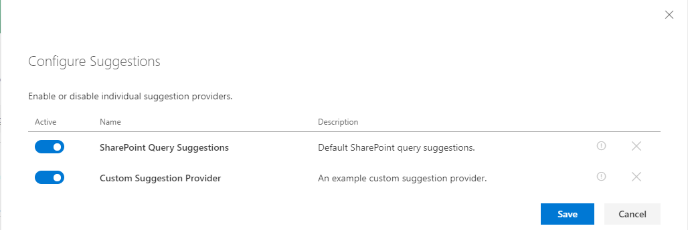

# Search extensibility library - v3
[Table of contents](../index.md)
## Summary - v3
This solution allows you to create and register your own React component (wrapped as HTML web components) to be used in the search results Web Part Handlebars templates. View the sample project [here](https://github.com/microsoft-search/pnp-modern-search/tree/main/search-extensibility-library).

## Used SharePoint Framework Version ##

## Prerequisites

The custom web components are defined in a SharePoint Framework project of type ['Library Component'](https://docs.microsoft.com/en-us/sharepoint/dev/spfx/library-component-overview). You have the choice to update the demo one or start from scratch with a new project. In this case, in the `<your_library_name>.manifest.json` file, make sure the `id` property id is `2501f2fd-d601-4da4-a04d-9f0bd85b1f54`. This identifier is used to load dynamically the library from the Search Results Web Part. Therefore, this value is **mandatory** to make the link. That is the only hook we need on our side.

            {
                // The value should be this id to make the link with the Web Part
                "id": "2501f2fd-d601-4da4-a04d-9f0bd85b1f54" /
                "alias": "MyCompanyLibraryLibrary",
                "componentType": "Library",

                ...
            }

## Create a custom web component

A web component is a custom HTML element that can be used in your templates to implement complex behaviors. We used them here as *"wrappers"* for React components to be able to use them with Handlebars. In this solution, web components are considered **stateless**, meaning they will be entirely recreated when an attribute is changed (coming from the property pane). It means you can still use an inner state in your React components but not rely on the parent context (props) since it will be recreated every time by the Handlebars template.

To create a custom component, follow this procedure:

1. Create a new JSX file that will be used for your layout. (ex: `CustomComponent.tsx`). You can create it anywhere in your project.

2. Implement your component like a regular React component.

        import * as React from 'react';
        import * as ReactDOM from 'react-dom';
        import { BaseWebComponent } from '../models/BaseWebComponent';

        export interface IObjectParam {
            myProperty: string;
        }

        export interface ICustomComponentProps {

            /**
            * A dummy string param
            */
            myStringParam?: string;

            /***
            * 
            */
            myObjectParam?: string;
        }

        export interface ICustomComponenState {
        }

        export class CustomComponent extends React.Component<ICustomComponentProps, ICustomComponenState> {
            
            public render() {

                let myObject: IObjectParam = {
                    myProperty: undefined
                };
                
                // Parse custom object
                try {
                    myObject = JSON.parse(this.props.myObjectParam);
                } catch (error) {
                    myObject.myProperty = null;
                }

                return 
{this.props.myStringParam} {myObject.myProperty}
;
            }
        }

    Because `props` will be passed from an HTML template, they must to use always a `string` type. For complex objects, you will need to pass them as 'stringified' then use the `JSON.parse()` method to use them in your component logic.

3. In the same file, create an other class, this time to define your web component by inheriting the `BaseWebComponent` abstact class`:

        export class MyCustomComponentWebComponent extends BaseWebComponent {
        
            public constructor() {
                super(); 
            }
        
            public async connectedCallback() {
        
                let props = this.resolveAttributes();
                const debugView = <CustomComponent {...props}/>;
                ReactDOM.render(debugView, this);
            }    
        }

    The `resolveAttributes` method will transform custom element HTML attributes to React component props. By convention, web component attributes have to be passed using **camel case** to be tranformed into React component props.

    > **All custom web components must use the prefix `data-` for attributes (ex: `data-my-parameter`) in the html comsumer. However, the `data-` part won't be included after the resolution by the `resolveAttributes` method.**

For instance: a `preview-image` HTML attribute becomes `previewImage` prop.

4. In the main entry point class (ex: `MyCompanyLibraryLibrary.ts`), extends the `IExtensibilityLibrary` interface and register your custom components this way:

        
        import { MyCustomComponentWebComponent } from "../CustomComponent";
        import { IComponentDefinition } from "../../models/IComponentDefinition";
        import { IExtensibilityLibrary } from "../../models/IExtensibilityLibrary";

        export class MyCompanyLibraryLibrary implements IExtensibilityLibrary {

            public getCustomWebComponents(): IComponentDefinition<any>[] {
                return [
                {
                    componentName: 'my-custom-component',
                    componentClass: MyCustomComponentWebComponent
                }
                ];
            }
        }

    > **Custom web component tag names must be lowercase with at least one dash separator `-` (ex: `my-custom-component`.**

5. In a custom Handlebars layout, reference your component like this, leveraging the Handlebars context values:

        <my-custom-component data-my-string-param="{{MyStringProperty}}" data-my-object-param="{{JSONstringify MyObjectProperty 2}}"></my-custom-component>

6. Bundle `gulp bundle --ship` and package your library `gulp package-solution --ship` and upload it either in the global or a site app catalog.

## Create a custom query suggestion provider
A query suggestion provider allows you to fetch and display custom content or person suggestions. There is a default provider built-in which retrieves suggestions from SharePoint, however you may add additional providers using the approach outlined. In additional to dynamic suggestions as the user is typing, your provider may also surface "zero query" suggestions. These are displayed  when the search box has focus without any search text or if the search text is less than 2 characters.

To create a custom suggestion provider, follow this procedure:

1. Create a new TypeScript class that implements the `BaseSuggestionProvider` abstract class. You can create it anywhere in your project.
2. Implement the required methods and properties like the example below.
    
        import { BaseSuggestionProvider } from '../models/BaseSuggestionProvider';
        import { ISuggestion } from '../models/ISuggestion';

        export class CustomSuggestionProvider extends BaseSuggestionProvider  {
            public static readonly ProviderName: string = 'custom-suggestion-provider';
            public static readonly ProviderDisplayName: string = 'Custom Suggestion Provider';
            public static readonly ProviderDescription: string = 'An example custom suggestion provider.';

            public async onInit(): Promise<void> {
                // initialization logic
                // this._ctx // <-- SPFx Webpart Context
            }

            public get isSuggestionsEnabled(): boolean {
                return true;
            }

            public get isZeroTermSuggestionsEnabled(): boolean {
                return true;
            }

            public async getSuggestions(queryText: string): Promise<ISuggestion[]> {
                // fetch suggestions
            }

            public async getZeroTermSuggestions(): Promise<ISuggestion[]> {
                // fetch zero term suggestions
            }
        }

3. In the main entry point class (ex: MyCompanyLibraryLibrary.ts), register your custom query suggestion provider like the example below.

        import { IExtensibilityLibrary } from "../../models/IExtensibilityLibrary";
        import { ISuggestionProviderDefinition } from "../../models/ISuggestionProviderDefinition";
        import { CustomSuggestionProvider } from "../CustomSuggestionProvider";

        ...
        
        export class MyCompanyLibraryLibrary implements IExtensibilityLibrary {

            public getCustomSuggestionProviders(): ISuggestionProviderDefinition<any>[] {
                return [
                    {
                        providerName: CustomSuggestionProvider.ProviderName,
                        providerDisplayName: CustomSuggestionProvider.ProviderDisplayName,
                        providerDescription: CustomSuggestionProvider.ProviderDescription,
                        providerClass: CustomSuggestionProvider
                    },
                ];
            }
        }

### Configure Suggestion Providers
When one or more custom query suggestion providers are made available via the extensibility library, an additional configuration pane becomes availabe in the Search Box web part settings. From the panel you can enable or disable individual suggestion providers.

## Create a custom query modifier

A query modifier allows you to manipulate the user's search query before it is sent to SharePoint. You can define multiple query modifiers in the extensibility library. However, **only one at a time can be selected in the search results WP** depending your requirements. The modifier receives the query text (from search box or the static value specified in the search results WP), query template and result source ID (from search results or search verticals if configured) as parameters. The modifier returns an object with the updated query text and query template. This capability allows you to inject additional terms or criteria to the user's search query such as spelling corrections or translations. You can use the sample [Search Query Enhancer function](../search-query-enhancer/getting-started.md) as a starter to use Microsoft Cognitive services to do so.

To create a custom query modifier, follow this procedure:

1. Create a new TypeScript class that implements the `BaseQueryModifier` abstract class. You can create it anywhere in your project.
2. Implement the required methods and properties like the example below.
    
        import { BaseQueryModifier } from '../models/BaseQueryModifier';
        import { IQueryModifierInput, IQueryModification } from '../models/IQueryModification';

        export class CustomQueryModifier extends BaseQueryModifier  {

            public static readonly DisplayName: string = 'Sample Query Modifier';
            public static readonly Description: string = 'Adds a filter to the query so that only word documents are returned.';

            public async onInit(): Promise<void> {
                // this._ctx // SPFx Webpart Context
            }

            public async modifyQuery(query: IQueryModifierInput): Promise<IQueryModification> {
                // e.g. Always return docx files
                const newQueryText = `${query.queryText} fileextension:docx`;

                // Leave query template unchanged
                const newQueryTemplate = query.queryTemplate;

                return {
                    queryText: newQueryText,
                    queryTemplate: newQueryTemplate
                } as IQueryModification);
            }
        }

3. In the main entry point class (ex: MyCompanyLibraryLibrary.ts), register your custom query modifier like the example below.

        import { IExtensibilityLibrary } from "../../models/IExtensibilityLibrary";
        import { IQueryModifierDefinition } from "../../models/IQueryModifierDefinition";
        import { CustomQueryModifier } from "../CustomQueryModifier";

        ...
        
        export class MyCompanyLibraryLibrary implements IExtensibilityLibrary {

            public getQueryModifier(): IQueryModifierDefinition<any> {
                return {
                    displayName: CustomQueryModifier.DisplayName,
                    description: CustomQueryModifier.Description,
                    class: CustomQueryModifier
                };
            }
        }

### Configure Query Modifier

When a query modifier is made available via the extensibility library, an additional configuration sections becomes visible in the Search Results web part settings. Here you can select the query modifier to apply to this search box. **Only one provider a time can be selected in the search results WP**.

