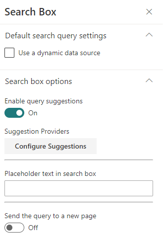

# Search Box - v3
[Table of contents](../index.md)

#### Default Search Query Settings

Setting | Description
-------|----
Use a dynamic data source | You can set a default query text coming from am other data source. This case is particularly useful when you want to put a search box Web Part on the front page redirecting to an other page with the same query. Use the query string parameter 'q' from the built-in 'Page Environment' data source.

#### Search box options

Setting | Description
-------|----
Enable query suggestions | The search box supports by default query suggestions from SharePoint search. Refer to the following [article](https://docs.microsoft.com/en-us/sharepoint/search/manage-query-suggestions) to know how to add query suggestions in your SharePoint tenant (caution: it can take up to 24h for changes to take effect). You can also add your own custom suggestions providers using following this [procedure](../../search-extensibility-library/getting-started#create-a-custom-query-suggestion-provider).
Send the query to a new page | Sends the search query text to a new page. On that page, use an other search box Web Part configured with a dynamic data source as the default query. This Web Part uses the URL fragment '#' to pass the entered keywords. Make sure you use this data source property in your targeted components to retrieve the query.
Placeholder text | The placeholder text to display in the search box.

#### Search query enhancement

**The search query enhancement feature was removed since the 3.11.0 release. If you need to use such a feature, you must now use the [Query Modifier feature](../../search-extensibility-library/getting-started#create-a-custom-query-modifier) and the [Search Query Enhancer function](../search-query-enhancer/getting-started.md)**

---