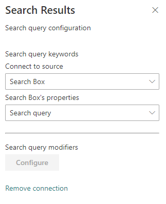
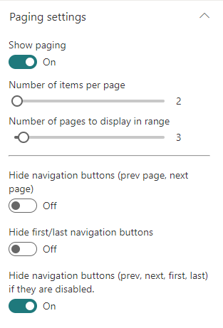
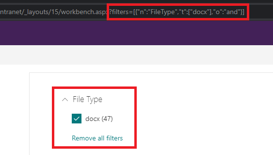

# Search Results - v3
[Table of contents](../index.md)

| Page 1 | Page 2 | Page 3 |
| ------ | ------ | ------ |
|  |  |  

#### Search Query Configuration

Setting | Description
-------|----
Search query keywords | Here you choose to use a static search query or a query coming from a data source. It is recommended to use the associated Web Part coming with this sample. The search query is in KQL format so you can use search query variables (See this [post](http://www.techmikael.com/2015/07/sharepoint-rest-do-support-query.html) to know which ones are allowed). You can only plug one source to this Web Part.



#### Search Settings

Setting | Description
-------|----
Query template | The search query template in KQL format. You can use search variables here (like Path:{Site}).
Result Source Identifier | The GUID of a SharePoint result source.
Sort order | The initial search results sort order, where you can use one or multiple properties to sort by. **By default, results are sorted by created date (ascending) and size (descending). Remove these values to reset default sorting**
Sortable fields | The search managed properties to use for sorting. With SharePoint Online, you have to reuse the default ones to do so (RefinableStringXX etc.). The order is the same as they will appear in the sort panel. You can also provide your own custom labels using the following format RefinableString01:"You custom filter label",RefinableString02:"You custom filter label",... If no sortable fields are provided, the 'Sort' button will not be visible.
Connect to a search refiners Web Part | If enable, select the search refiners Web Part to use on the current page to get selected filters. It is a 2 ways connection so don't forget to connect the targeted search refiners to the search results Web Part as well.
Connect to a search verticals Web Part | If enable, select the search verticals Web Part to connect to.
Enable Query Rules | Enable the query rules if applies. Turn this options  'on' to display your SharePoint Promoted results (links only) and make result blocks available to custom renderers.
Include OneDrive results | Include OneDrive results if applicable. Turn this option 'on' to make users' personal OneDrive results available to custom renderers. Read more [here](https://docs.microsoft.com/en-us/sharepoint/support/search/private-onedrive-results-not-included).
Selected properties | The search managed properties to retrieve. You can select them from a predefined list or add them as free text if not listed. Then, these properties are available in your Handlebars template with the syntax (`item.property_name` or `property_name` inside the `{{#each}}` loop). The Web Part needs the following managed properties to get it work (`"Title,Path,Filename,SiteLogo,PreviewUrl,PictureThumbnailURL,ServerRedirectedPreviewURL,ServerRedirectedURL,HitHighlightedSummary,FileType,ServerRedirectedEmbedURL,ParentLink,owstaxidmetadataalltagsinfo,SPSiteUrl,SiteTitle,IsContainer,IsListItem,HtmlFileType,SiteId,WebId,UniqueID,OriginalPath,FileExtension,NormSiteID,NormListID,NormUniqueID,Created,contentclass,DefaultEncodingURL,Author,AuthorOWSUSER"`). **It you remove them, they will be re-added automatically on the next page refresh**.
Refinement filters | The default refinement filters to apply to the query. Unlike URL `filters` params, these won't select the default values in the Search Filters WP if connected.
Enable taxonomy values localization for refiners and results | If set, the Web Part will try to translate the taxonomy term IDs to their corresponding label according to the curent UI language. Refer to the [Taxonomy values dynamic translation](#) section of this page.
Language of search request | The language to use for the search request. By default the search request will be made using the current UI language.
Synonyms | Ability to define synonyms for the search querytext. Synonyms can be configured in a two-ways mode.

#### Paging settings



Setting | Description
-------|----
Show paging | Displays or not the paging control at the bottom.
Number of items per page | Corresponds to the number of search results to retrieve per page.
Number of pages to display in range | The number of page digits to display in the range. 
Hide navigation buttons | If set, hide the previous and next page buttons.
Hide first/last navigation buttons | If set, hide the last and first navigation buttons.
Hide navigation buttons | If set, hide the previous, next, first and last if disabled (i.e. no page available).

#### Styling Options

Setting | Description
-------|----
Web Part Title | Shows a title for this Web Part. Set blank if you don't want a title.
Show blank if no result | Shows nothing if there is no result. If a WP title is set, this will be hidden as well.
Show result count | Shows the result count and entered keywords.
Result Layouts options | Choose the template to use to display search results. Some layouts are defined by default but you can create your own either by clicking on the **"Custom"** tile, or **"Edit template"** from an existing chosen template. In custom mode, you can set an external template. It has to be in the same SharePoint tenant. Behind the scenes, the Office UI React controls are used. Custom code templates will also automatically be displayed here upon registration. See the [templating documentation](./templating.md) for more information about templating.
Result types | Allows you to set a custom template at item level according to a specific condition (ex: FileType equals 'pdf').

##### Miscellaneous: Taxonomy values dynamic translation

The search results Web Part supports automatic translation for taxonomy based filters and result metadata according to current site language. To get it work, you must map a new refinable managed property associated with *ows_taxId_<your_column_name>* crawled property and turn on the *'Localization Enabled'* toggle in the search results property pane:


When you enable this flag, you can still use the original property value for whatever reason by using the following property format in your Handlebars template: `<propertyName> + TaxId` (ex: `owstaxidmetadataalltagsinfo` will contain the translated terms and `owstaxidmetadataalltagsinfoTaxId`) will contain the original value of the managed property).

---

#### Out of the box query variables

The following out of the box [query variables](https://docs.microsoft.com/en-us/sharepoint/technical-reference/query-variables) are supported/tested:

##### Site and site collection properties
|**Query variable**|**Definition**|
|:-----|:-----|
|**{Site}** or **{Site.URL}**  <br/> |URL of the site from where the query was issued. For example, this value can be used to query content of the managed property Path.  <br/> |
|**{Site.ID}**  <br/> |GUID of site from where the query was issued. This value corresponds to the value of the managed property SiteID.  <br/> |
|**{Site.LCID}**  <br/> |Numeric value of the locale as specified by the Regional Settings in the Site Settings on the Site from where the query was issued.  <br/> |
|**{Site.Locale}**  <br/> |Language of the Site from where the query was issued in ll-cc format — for example, en-us.  <br/> |
|**{Site.&lt;property&gt;}**  <br/> |Any property from the property bag of the site (SPWeb) from where the query was issued, including custom properties.  <br/> |
|**{SiteCollection}** or **{SiteCollection.URL}**  <br/> |URL of site collection from where the query was issued. For example, this value can be used to query content of the managed property Path.  <br/> |
|**{SiteCollection.ID}**  <br/> |GUID of site collection from where the query was issued.  <br/> |
|**{SiteCollection.LCID}**  <br/> |Numeric value of the locale as specified by the Regional Settings in the Site Settings on the Site Collection from where the query was issued.  <br/> |
|**{SiteCollection.Locale}**  <br/> |Language of the Site Collection from where the query was issued in ll-cc format — for example, en-us.  <br/> |
|**{SiteCollection.&lt;property&gt;}**  <br/> |Any property from the property bag of the root site (SPWeb) in the site collection (SPSite) from where the query was issued, including custom properties.  <br/> |

##### URL token and request properties
|**Query variable**|**Definition**|
|:-----|:-----|
|**{URLToken.&lt;integer&gt;}**  <br/> |A value from the URL of a page. The integer represents the position of the value in the URL as counted from right to left. For example, for the page http://www.contoso/audio/mp3/1010101, the query variable {URLToken.1} will query for the last value in the URL, 1010101. The query variable {URLToken.3} will query for the third last property in the URL, audio. You can query for values up to the ninth last position in a URL.  <br/> |
|**{Request.&lt;PropertyName&gt;}**  <br/> |A value from the current http request - for example, {Request.Url}.  <br/> |

##### User properties
|**Query variable**|**Definition**|
|:-----|:-----|
|**{User}** or **{User.Name}** <br/> |Display name of the user who issued the query. For example, this value can be used to query content of the managed property Author.  <br/> |
|**{User.Email}**  <br/> |Email address of the user who issued the query. For example, this value can be used to query content of the managed property WorkEmail.  <br/> |
|**{User.PreferredContentLanguage}**  <br/> |Language as specified as Preferred Content Language in the profile of the user who issued the query.  <br/> |
|**{User.PreferredDisplayLanguage}**  <br/> |Language as specified as Preferred Display Language in the profile of the user who issued the query.  <br/> |
|**{User.&lt;property&gt;}**  <br/> |Any property from the user profile of the user who issued the query — for example, SPS-Interests, including custom properties.  <br/> |

##### Other properties
|**Query variable**|**Definition**|
|:-----|:-----|
|**{Today+/- &lt;integer value for number of days&gt;}**  <br/> |A date calculated by adding/subtracting the specified number of days to/from the date when the query is issued. Date format is YYYY-MM-DD. For example, this value can be used to query content of the managed property LastModifiedTime.  <br/> |
|**{SearchBoxQuery}** or **{searchTerms}** <br/> |The query value entered into a search box on a page.  <br/> |
|**{CurrentDisplayLanguage}**  <br/> |The current display language based on MUI in ll-cc format.  <br/> |
|**{CurrentDisplayLCID}**  <br/> |Numeric value of the current display language based on MUI in ll-cc format.  <br/> |

#### Custom query variables

The following custom query variables are supported:

|**Query variable**|**Definition**|
|:-----|:-----|
|**{Page.&lt;FieldName&gt;}** <br/> | The value of a field on the page from where the query was issued. For example, if the page from where the query was issued contained a site column named "ContentOwner," specifying {Page.ContentOwner} would allow you to query for the value of "ContentOwner." FieldName is the internal name of the field. When used with taxonomy columns, use `{Page.<FieldName>.Label}` or `{Page.<FieldName>.TermID}` <br/> |
|**{CurrentYear}**  <br/> | Todays's date four digits, 2018 <br/> |
|**{CurrentMonth}**  <br/> | Today's month, 1-12 <br/> |
|**{CurrentDate}**  <br/> | Today's date, 1-31 <br/> |
|**{QueryString.&lt;ParameterName&gt;}** <br/> | A value from a query string in the URL of the current page. For example, if the URL of the current page contains a query string such as ItemNumber=567, you could obtain the value 567 by specifying {QueryString.ItemNumber}. <br/> |
|**{QueryString.&lt;ParameterName&gt;}** <br/> | A value from a query string in the URL of the current page. For example, if the URL of the current page contains a query string such as ItemNumber=567, you could obtain the value 567 by specifying {QueryString.ItemNumber}. <br/> |
|**{PageContext.&lt;ParameterName&gt;}** <br/> | A value from the legacyPageContext object on the page. For example, if the legacyPageContext object of the current page contains a property "hubSiteId": "166aa115-7ae7-4c21-9e02-9e0c8872be28", you could obtain the value 166aa115-7ae7-4c21-9e02-9e0c8872be28 by specifying {PageContext.hubSiteId}. The property name is case sensitive!<br/> |
|**{TenantUrl}**  <br/> |URL of the tenant (root site)<br/> |

#### Use the 'OR' operator

To deal with mutli valued properties (like taxonomy multi or choices), you can use the 'OR' operator syntax `{|<property><operator><multi_valuesporperty>}`. The search query will be expanded like this:

    ((<property><operator><value_1>) OR (<property><operator><value_2>) OR (<property><operator><value_3>) ...)

**Examples:**

- Using an user profile multi values taxonomy property: `{|owstaxidmetadataalltagsinfo:{User.SPS-Hashtags}}`
- Using a page multi values taxonomy property: `{|owstaxidmetadataalltagsinfo:{Page.myTaxonomyMultiColumn.TermID}}`
- Using a page multi values choice property: `{|RefinableStringXX:{Page.myChoiceMultiColumn}}`

At any time, you can see the resolved query using the 'Debug' layout an inspecting the `queryModification` property.

#### Best bets

This WP supports SharePoint best bets via SharePoint query rules:


#### Filters deep links

You can pre-select refinement filters by using the `filters` URL query string parameter. They can be used with or without the search filters Web Part but need at least a search results Web Part on the page. The URL parameter format is as follow:

`?filters=[{"n":"<property-name>","t":["<condition1>","<condition2>",...],"o":"<operator>"}]`

Where:

- `n`: the refiner managed property name (ex: `RefinableStringXX`)
- `t`: the condition tokens. This must be an array even with a single value. Raw text values and [FQL expressions](https://docs.microsoft.com/en-us/sharepoint/dev/general-development/fast-query-language-fql-syntax-reference) are allowed here.
- `o`: the operator to use between condition values (optionnal).

> **Pre-selected filters are only applied at page load**.

> Provided refinement filter values are independant from the search filters Web Part configuration.

> URL params refinement filters take priority over default refinement filters set in the search results Web Part options. 

##### Examples

**Use free text values**
```
?filters=[{"n":"FileType","t":["docx"]}]
```

**FQL expressions with multiple values**
```
?filters=[{"n":"FileType","t":["equals('docx')","equals('pptx')"],"o":"or"}]
```

> If the targeted refiner template doesn't support multi values, only the first matching value will be selected by default.

**Date intervals**
```
?filters=[{"n":"Created","t":["yearAgo"]}]
```

Valid values are `yesterday`, `weekAgo`, `monthAgo`, `threeMonthsAgo`, `yearAgo`, `olderThanYear`.

**Date range**
```
?filters=[{"n":"Created","t":["range(2019-09-01T04:00:00.000Z,max)"],"o":"or"}]
```

**Taxonomy values**
```
?filters=[{"n":"owstaxidmetadataalltagsinfo","t":["IT","string('Governance')"],"o":"or"}] // Only the 'Governance' results will show up since 'IT' is tokenized to HEX

?filters=[{"n":"owstaxidmetadataalltagsinfo","t":["string('IT')","string('Governance')"],"o":"or"}] // 'IT' and 'Governance' results will show up
```

**Persona**
```
?filters=[{"n":"RefinableString05","t":["string('Franck')"],"o":"or"}]
```

**Filter containing substring value**
```
?filters=[{"n":"FileType","t":["ppt*"]}]

OR 

?filters=[{"n":"FileType","t":["string('ppt*')"]}]
```

**Use multiple refiner properties**
```
?filters=[{"n":"Created","t":["yearAgo"],"o":"or"},{"n":"FileType","t":["equals('docx')","equals('pptx')"],"o":"or"}]
```

##### How default selected values are set in the search filters WP?

If a search filters Web Part is connected to a search results WP, the refinement values will be automatically selected at page load according to this mechanism:



- When the provided condition IS NOT an FQL expression (ex: "t":["docx"]), the value is converted to HEX and matched with the refinement results retrieved from the search engine. This token is then used to determine default selected state.
- When the provided condition IS an FQL expression (ex: `"t":["equals('docx')","equals('pptx')"]`), the value is left untouched and matched with the refinement results by determining the common substring values and determine default selected state. It means in this case, mutliple refinement results can match a single provided condition (ex: `'Franck*'` will match `'Cornu, Franck'` or `'Franck Cornu'` so they will both selected by default).